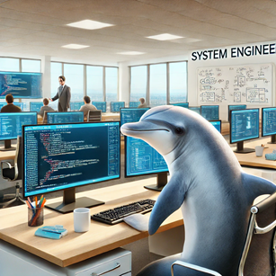

## 自己紹介

私とはどんな人間なのかあまり書いたことがなかったので、今回自己紹介をして固定ページに載せてみようと思います。

### 自己紹介\_現在の仕事

私は現在データサイエンティスト的な仕事をしています。AWSとPythonをメインに作業をしています。

もともとSASで書かれていたコードをPythonへ移行するOSS化を行っていて、そのまま運用・保守を行っています。

今は障害の対応や改修をメインに行っています。

### 自己紹介\_経歴と使用技術紹介

それ以前の経歴としては、以下のような感じです。

| 作業期間 | 概要 | 使用した言語 |
| --- | --- | --- |
| 8か月 | 決済システムの保守・運用 | Java |
| 6か月 | 決済システムのテスト | Java   PostgreSQL |
| 3か月 | スクレイピング、データ加工・分析の基礎を学習 | python |
| 12か月 | 特定の客層に向けたメールデータの加工 | SAS |
| 3か月 | pythonを使用したスクレイピングとSQLを使用したデータ加工 | python   PostgreSQL |
| 3年8か月(予定)   ※現在3年5か月 | SASの処理をpythonへ移行   システムの自動化についてはAWSで実行 | python   AWS(※1) |
| 5か月(予定)   ※副業 | データ基盤のバッチ処理の修正と改修 | python   prefect   BigQuery   Github |

#### ※1 使用したAWSサービス

- EventBridge

- Cloud9(2024/07/26にサービス終了のブログが投稿されました、代替のサービスを検討する必要があります。)

- SageMaker

- Fargate

- Glue

- StepFunction

- Athena

- CodeCommit(2024/07/26にサービス終了のブログが投稿されました、代替のサービスを検討する必要があります。)

- CodePipeline

- Lambda

- ECS

- CloudFormation

- SNS

- ECS

- SQS

- S3

- VPC(学習中)

- SageMaker Studio(学習中)

#### 取得している資格

取得している資格としては

- 運転免許

- 統計検定3級

- [G検定](https://www.jdla.org/certificate/general/)

- [E資格](https://www.jdla.org/certificate/engineer/)

### 自己紹介\_職歴とキャリアの選択

実は1社目の会社を退職し、今は2社目です。

1社目の会社はテスト・保守・運用ばっかりだったので、もう少し上流工程をやりたくて退職しました。大体1年半ぐらいですね（笑）

2社目はデータサイエンティスト的な作業をしつつ、設計やコードをメインにしてきました。ただ、分析業務はほぼやらなかったのが残念です。

もちろん、設計やコード、AWSのアーキテクチャを触らせてもらったのはいい経験になりました。それでも業務で分析をやってみたかったとは思います。

ちなみに給料は平均くらいです。

### 自己紹介\_趣味と興味

趣味はゲームやYouTube、料理ですね。一応、読書と筋トレを決まったタイミングでやってます。それから、テニスを昔やってました。

ブログも趣味になりますかね？また、**推し**などはいません。好きなキャラや人はいてもグッズ買ったりライブ行ったりはないので…

投資もやってますがほぼ投資信託に突っ込んでいます。S&P500とオルカンに月5万を半々くらいですね。ただ、海外に行くので全部売らないといけないですね。

### 海外への挑戦

さて、海外に行く理由ですがこれは挑戦とリスクヘッジですね。具体的には、英語力を鍛えつつ、仕事の幅を広げるのがざっくりとした目的です。

海外に行ったときこのブログをどうするか悩んでますが、可能ならニュージーランドの様子とかあげてみたいですね。

### 将来の夢

将来の夢は特に決まってないです。だらだら過ごしたいと思っても退屈で仕事をしそうですし。ただ、気の合う友人と過ごせるのであればだらだらでも楽しそうです（笑）

職業も今はITやってますが変わる可能性もあります。コードを書く分にはこなれてきましたし、最近は生成AIに聞けばある程度はわかりますので。

やるとしたらクラウド系やセキュリティ、AIのモデル構築に挑戦してみたいですね。

ざっくりとこんな人間です。自己紹介というよりは経歴書みたいですね。

### ブログの目的

次にブログを書いてる目的ですね。

メインはアウトプットです。今までインプットはやってきたのですが、アウトプットをする機会がほぼありませんでした。

一応、X(旧Twitter)の趣味垢で日常的なことをポストしたり、スマホゲームの実況動画をYoutubeに上げるくらいはしていました。

ただ、自身に起きた出来事や勉強のことについては触れたことがありませんでした。当然社内発信やどこかのイベントで登壇することもありませんでした。

そこでブログだったらハードルは低いかなということでアウトプットの場としてやることにしました。

最近はSNSで発信をし続けたほうがコスパはいいと思います。稼ぐこともできると思いますので。

私はアウトプットがメインなので、可能なら収益が発生すると嬉しいなぐらいです。

とはいえそれだけでなく、SEOとは何なのか？見やすいサイトはどんなものか？どうすれば収益をあげられるか？サイトをうまく活用する方法はあるのか？等考えることも多いです。

仕事をするうえでいい活用法を見つけてみたいですね。

### まとめ

ここまで読んでいただきありがとうございます。これで以上になります。今後、更新したいことがあれば随時追記していきたいと思います。このブログでは実際に開発をしながらGitに上げたりしていますので誰かの参考になればと思います。例えば[こちら](/posts/2024/04/build-rag-app-part-5/)

引き続きよろしくお願いいたします。ではでは。
