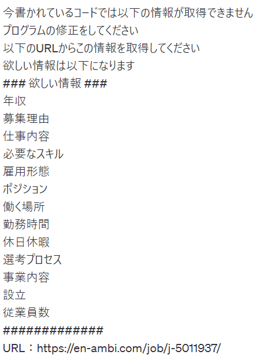
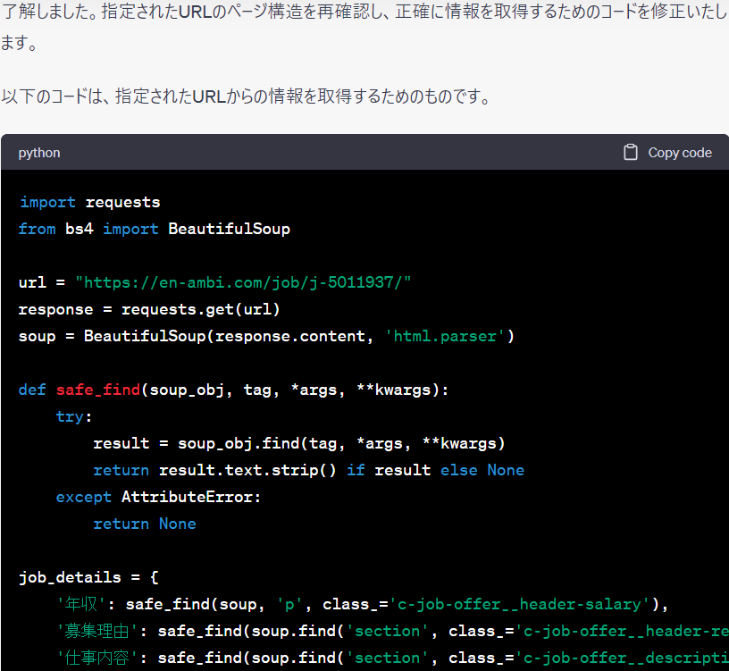
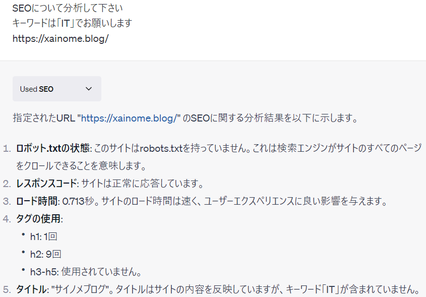

最近chat-gptに課金してプラグインで遊ぶことを覚えました（笑）

chat-gptがリリースされてもうすぐ1年経とうとしていますが、AIの発展はすごいですね

プラグインも1000個近くあるみたいで、全てを把握するのは難しそうですね

いずれChromeの拡張機能のように悪意のあるプラグインができたりしそうですが…

それはさておき私は以下のプラグインを入れて遊んでます

1.Scraper

2.WebPilot

3.Scholer AI

4.SEO

1はスクレイピングをするときに使ってます。URLに載ってる欲しい情報を書き、そのコードを書いてもらい、後でcolabで実行しています

エラーが出ても修正するようお願いしたら修正してもらえるので楽ですね、下の画像のように出してもらってます

Chat-gptは2021年の9月ぐらいの情報しかないのですが2を使えば最新の情報も取得できますので、調べ物があるときにはお勧めです。簡単な情報ならChromeでもいいですが、日本であまり流行ってないゲームや海外の情報であれば日本語訳もしてくれます

3はScholoerという論文を掲載しているサイトで載ってる論文を探してくれます。とはいえあまり使いこなせてないのですが…

4はサイトのSEO対策について教えてくれます。これを見て参考になることがあるかと思いますが、私の場合はoutput優先なのであまり使いこなせないかも…

こんな感じでプラグインを使いこなすと面白いかと思います。他にも株に関する情報だったり地震やゲーム、経済などももわかりますので是非興味があれば触ってみるといいと思います

プログラマーならAPIを使ってプログラムを書いたり、プラグインを作る側にまわったほうがいいんでしょうが、APIを使った開発をやったことがないのでいずれやってみたいですね
