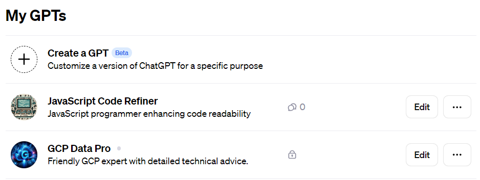
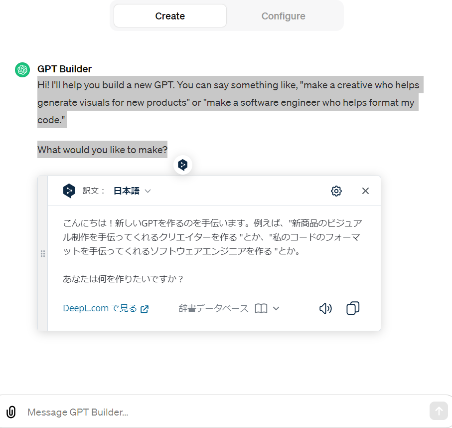
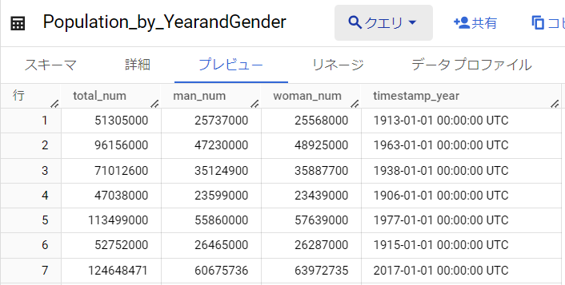
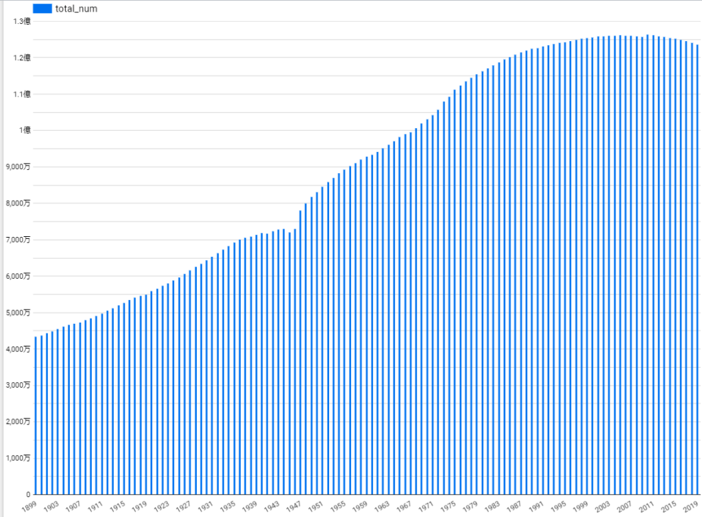

昨今OpenAIのCEOが退任したり、復帰したりと騒がせている状況ですが、私はGPTsをうまく使えないか模索していたりします。

そんな中でGPTsを使ってGCPの構築を手伝ってもらいました。まずはGPTsの設定ですね

GPTsの設定は簡単でした。「Create a GPT」からオリジナルのGPTを作り、ガイドに従ってどのようなGPTを作りたいのか指示を出します。Configureは無視していいです。ファイルについては業界特有の知識などが必要であれば添付するといいかと思いますが、今回は使いません。

私の場合は、GCPの使い方を知りたかっただけですので特にファイルの添付なども不要です。その後は解答の仕方を聞かれたり、アイコンの見た目やGPTの名前を決めて完了になります。

作った後は簡単でひたすら作ったGPTに質問をします。BigQueryとFirestoreの違いは何か？とかcsvファイルのインポートの仕方はどうしたらいいか？とかLokker StudioとBigQueryを連携してレポートを出す方法を教えて等です。

以下は国のデータから人口動態のcsvファイルを取ってきてインポートしたデータになります。それをグラフで可視化してみました。

このようにGPTsを作って質問すれば、簡単にGCPの構築もできますし、試したいことも出てくると思います。IT系であれば特化したGPTは作りやすいですし、専門的な知識をファイルかURLで与えれば専門分野に特化したGCPもできると思います。また、他人が作成したGCPを使うこともできますので興味があれば調べて触ってみるのもいいと思います。では、よい生成AIライフを～
