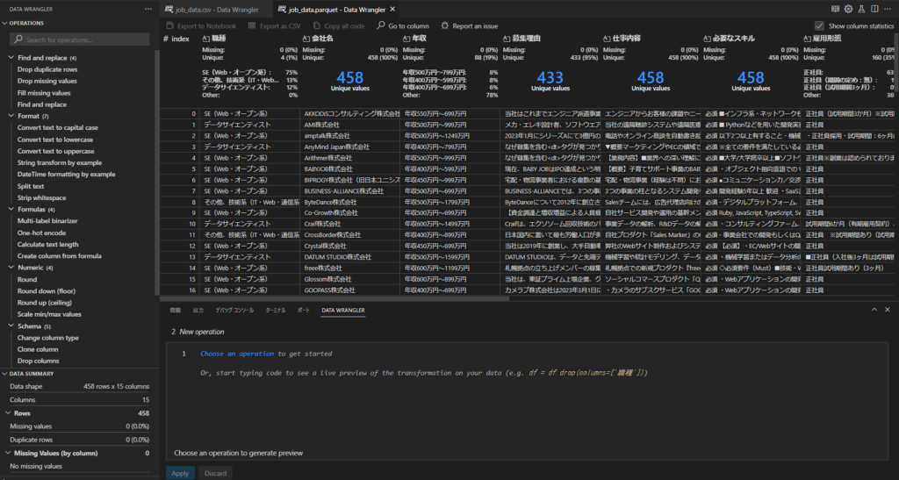

## parquetファイルについて

parquetファイルは非常に優秀なファイルだと思います。

pythonでデータを扱う場合、小規模のデータであればcsvファイルが使われがちですが、私の現場ではparquetファイルが使われています。

### parquetのメリット

メリットとしては

- データが圧縮されるため、ストレージの節約になる

- ファイルを読み込む際、型の指定をしなくても自動で読み込んでくれる

- データを列で読み込むと高速で読み込める

### parquetのデメリット

デメリットとしては

- ファイルを手軽に扱えない(テキストファイルで開いたり、書き換えたり)

個人的にはこのように感じています。

### Data Wranglerについて

これが[Data Wrangler](https://code.visualstudio.com/docs/datascience/data-wrangler)(ラングラー)を使えば手軽に見ることができます！ただし、書き換えたりはできないですが…。

しかも導入手順も簡単！

1. 拡張機能からData Wranglerをインストール

3. 対象のファイルを右クリック > Opne in Data Wranglerをクリック

5. pythonやjupyter notebookのカーネルに接続する

7. 必要なライブラリが足らなければインストールを行う

こうすることで以下のような画面でparquetファイルの中身を見ることができます！(画面黒いと目にいいよね)

csvファイルも同じように見れます

ちなみに上記のデータはスクレイピングで取ってきた求人情報になります(スクレイピングプログラムはChat-GPTに頼みました)。一応利用規約見てスクレイピングに関する規約はなかったので大丈夫かと思いますが、もしやる際は連続アクセスにならないよう2,3秒時間を空けることを勧めます。

### データ操作について

上のカラム名の場所に欠損の数やユニークな値の数、数値であればヒストグラムの分布などが描かれたりします

また左の操作でカラムの操作や欠損値埋め、文字列変換、グループ化など簡単なデータ変換であればこちらで操作できるうえに、コード化ファイルを出力することもできます！

おおまかにデータを見ながら加工をし、そのプログラムを作ってくれる素晴らしい機能をMicrosoftが提供していますのでぜひ活用していきたいですね！
