皆さんは日々の作業の中で提出物などはありますか？

私は月の初めの第1営業日、月の終わりから5営業日前、最終営業日に勤怠の提出があります。忘れがちな私はよく上司から提出していないと言われ、言う側も言われる側もストレスだと思い、Slackに通知が来るようなプログラムを組むことにしました。

連携で使用したアプリは以下の2つになります。

- GAS(Google Apps Script)

- Slack

やることは以下の順でやっていきます。

1. Slackに通知するためのアプリ作成
    - [アプリの作成](#apps)
    
    - [通知の設定](#notice)
    
    - [ワークスペースへのインストールとURL作成](#work)

3. GASにコードを書いて日時実行の設定を行う
    - [コードの作成](#code)
    
    - [実行トリガーの作成](#trigger)

アプリの作成

1つ目ですがまずはSlackのアプリ作成から始めます。[こちら](https://api.slack.com/apps)からアプリ作成ができます。リンク先に飛んだ後、赤枠の「Create New App」をクリックします。

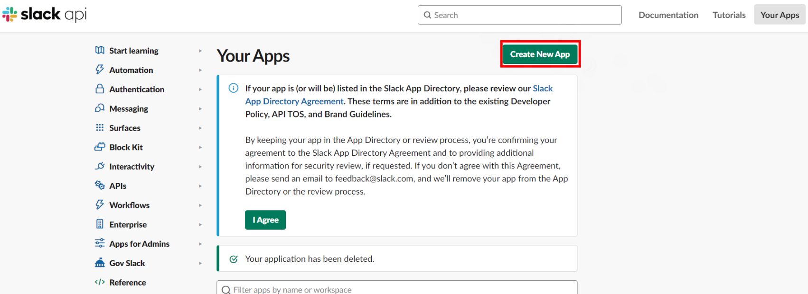

この画面が出たら赤枠の「From scratch」をクリックします。

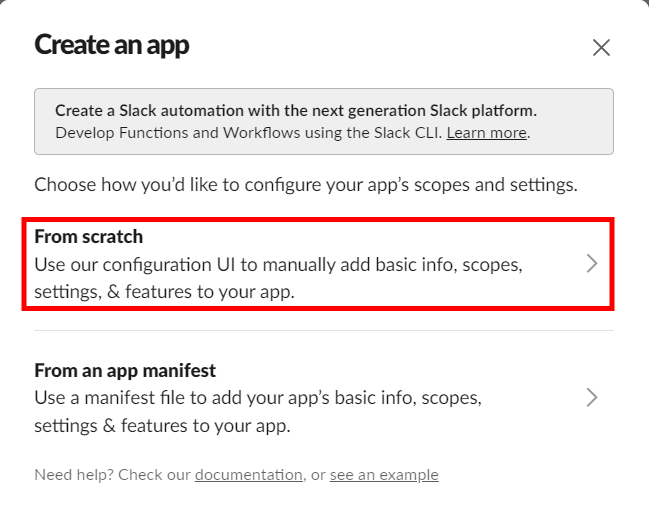

この画面が出たらアプリの名前と使用するワークスペースを設定します。仕事で使ってる人はワークスペースが所属している会社名になったりすると思います。設定が完了したら「Create App」をクリックします。

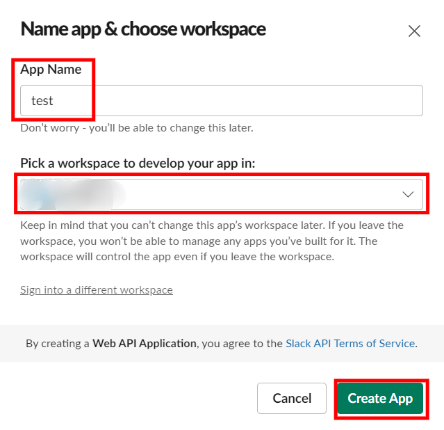

通知の設定

この画面になりますので「OAuth & Permissions」をクリックして、通知の設定をします。

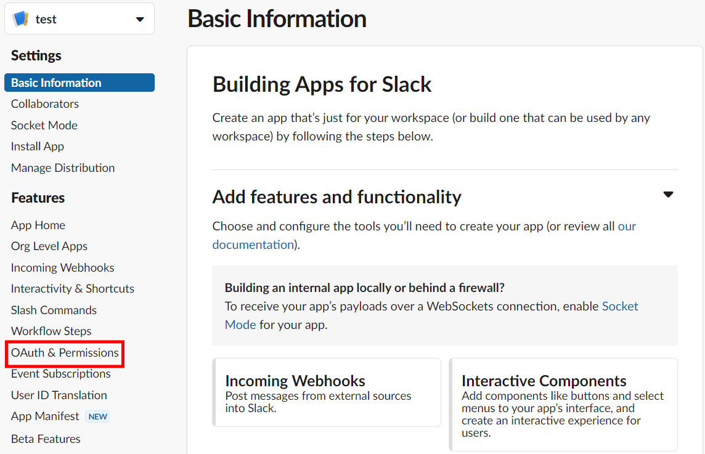

次に、Scopesでアプリに与える権限の設定を行います。「Add an OAuth Scope」をクリックし、「incoming-webhook」を選択します。今回は特定のチャンネル(自身のみ)通知を送る設定なのでこちらを選択します。

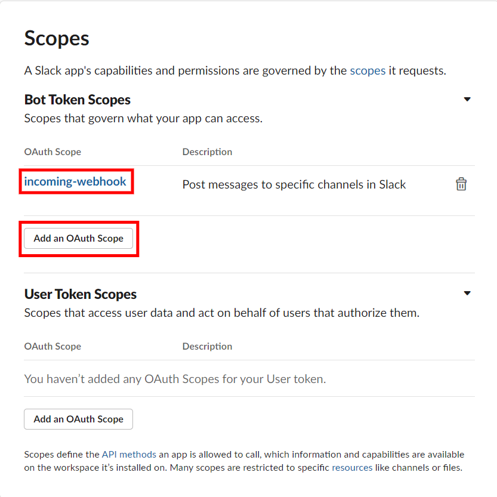

ワークスペースへのインストールとURL作成

同じタブで下の方にスクロールするとこの画面が出ますので「install to Workspace」をクリックします。

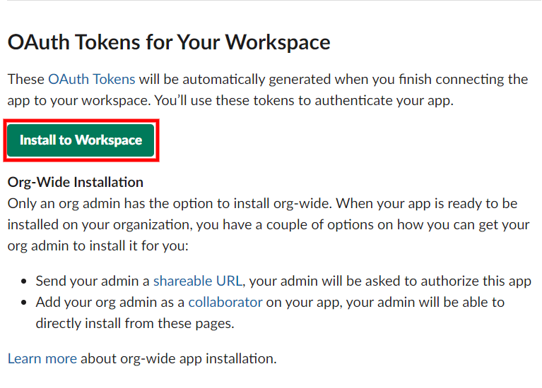

次に、権限が求められますので投稿先を自身のチャンネルに設定して、「許可する」をクリックします。もし、他の人にも通知をしたい場合は、そのチャンネルに設定してください。

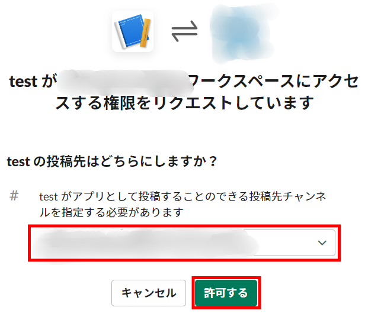

これで通知に必要なURLを設定することができましたので、次はコードの作成に移ります。

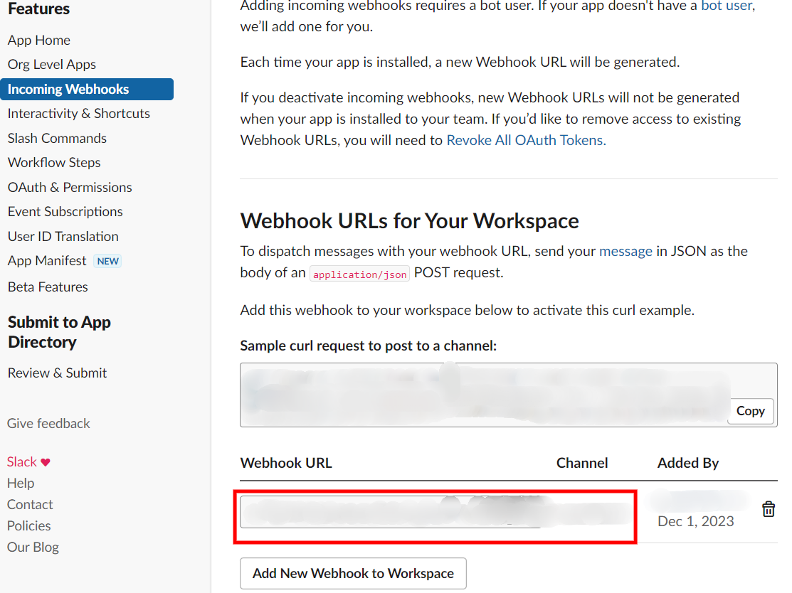

コードの作成

2つめのGASに関しては[こちら](https://qiita.com/ykhirao/items/782e20ab0465533c48f6)を参考にして作り、コードのきれいさを保つため、Chat-GPTに頼みました。1つ目の設定が終わったらwebhook URLをコード内に貼り付けます。

もし、会社で特定の日が休日であればそこも考慮することができます。私は年末年始辺りの日付を入れてます。"specialHolidays"という変数に日付を入れていただけるとできます。

```
// Slackに特定の日の通知を送る関数
function documentAlert() {
  const today = new Date();
  // const today = new Date("2023/12/22"); // テスト用: 

  const monthEnd5Date = getLastDateOfMonth(today);
  const monthEnd1Date = getLastDateOfMonth(today);
  const monthStartDate = new Date(today.getFullYear(), today.getMonth(), 1);

  sendNotificationIfDue(today, monthEnd5Date, -5, today+"、5営業日前になりました。見込み版勤怠の提出をお願いします。");
  sendNotificationIfDue(today, monthEnd1Date, -1, today+"、最終営業日になりました。確定版勤怠の提出をお願いします。");
  sendNotificationIfDue(today, monthStartDate, 1, today+"、第一営業日になりました。自社勤怠と交通費精算の提出をお願いします。");
}

// 営業日計算関数
function dayCount(date, offsetDays) {
  let counter = 1;

  while (counter <= Math.abs(offsetDays)) {
    if (!isHoliday_(date)) counter++;
    if (counter > Math.abs(offsetDays)) break;
    date.setDate(date.getDate() + Math.sign(offsetDays));
  }
  return date;
}

// Slackに通知を送る関数
function slackSend(message) {
  const webhookUrl = "ワークスペースのWebhook URL";
  
  const payload = {
    "text": message
  };

  const options = {
    "method": "post",
    "muteHttpExceptions": true,
    "contentType": "application/json",
    "payload": JSON.stringify(payload)
  };

  UrlFetchApp.fetch(webhookUrl, options);
}

// 休日か否かを判定する関数
function isHoliday_(date) {
  if (isWeekend(date) || isHolidayEvent(date) || isSpecialHoliday(date)) {
    return true;
  }
  return false;
}

// 土日判定
function isWeekend(date) {
  const dayOfWeek = date.getDay();
  return dayOfWeek === 0 || dayOfWeek === 6;
}

// 祝日イベント判定
function isHolidayEvent(date) {
  const calendarId = "ja.japanese#holiday@group.v.calendar.google.com";
  const events = CalendarApp.getCalendarById(calendarId).getEventsForDay(date);
  return events.length > 0;
}

// 特定の休日判定
function isSpecialHoliday(date) {
  const specialHolidays = ["0101", "0102", "0103", "1229", "1230", "1231"];
  const formattedDate = Utilities.formatDate(date, "JST", "MMdd");
  return specialHolidays.includes(formattedDate);
}

// 月末最終日を取得する関数
function getLastDateOfMonth(date) {
  return new Date(date.getFullYear(), date.getMonth() + 1, 0);
}

// 特定の日に通知を送るためのヘルパー関数
function sendNotificationIfDue(today, baseDate, offsetDays, message) {
  const targetDate = dayCount(baseDate, offsetDays);
  if (isSameDay(today, targetDate)) {
    slackSend(message);
  }
}

// 二つの日付が同じ日か判定する関数
function isSameDay(date1, date2) {
  return date1.getDate() === date2.getDate();
}
```

実行トリガーの作成

コードを書いたら次は日時実行の設定になります。トリガー(左タブの時計)という項目を選択します。"トリガーを追加"というボタンがあるのでそれクリックすると次の画像が表示されます。

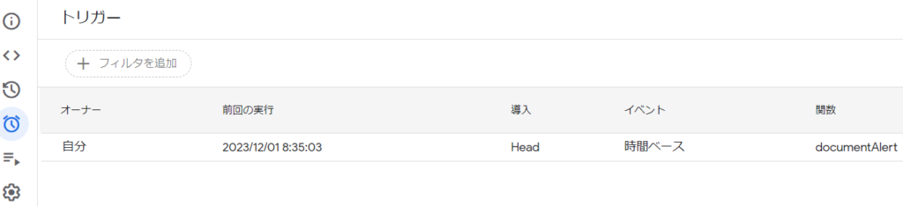

ここでトリガーの設定を行います。実行する関数を選び、実行は毎日を設定します。通知自体は対象営業日のみ来ます。また、始業前に勤怠提出の確認をしたいので8~9時に実行しています。こうすると大体8:35分ごろに通知が来るようになります。

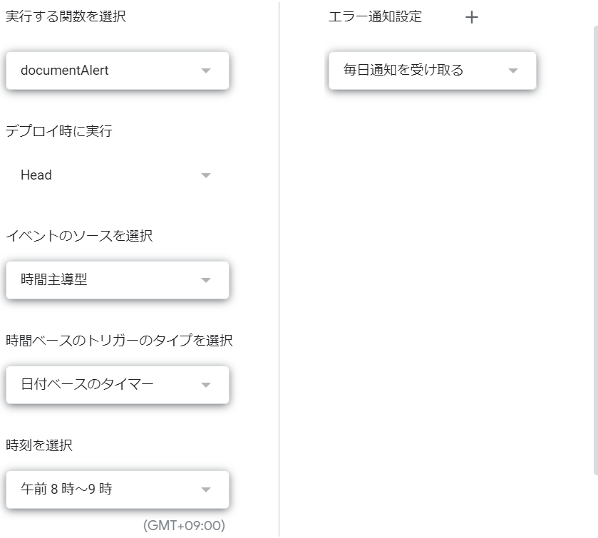

これでこのような通知が対象営業日に来ます。

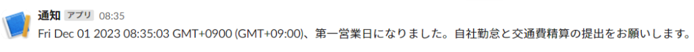

この仕組みを作ったおかげで勤怠の提出を忘れることは減り、上司の評価が上がりました。まあ給与に反映されてるかは別ですが…

皆さんもぜひGASを使って業務効率を上げて、評価や給料、スキルも上げていきましょう！
