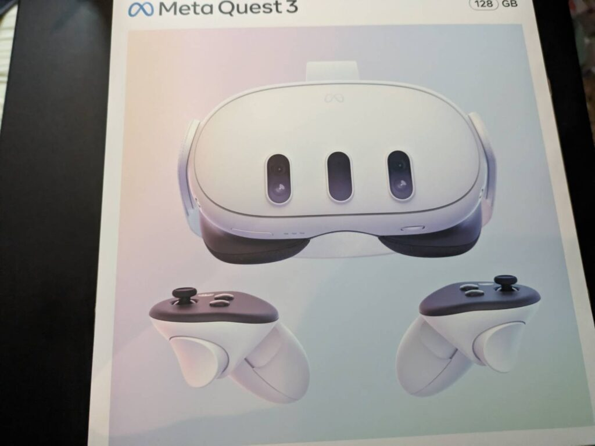
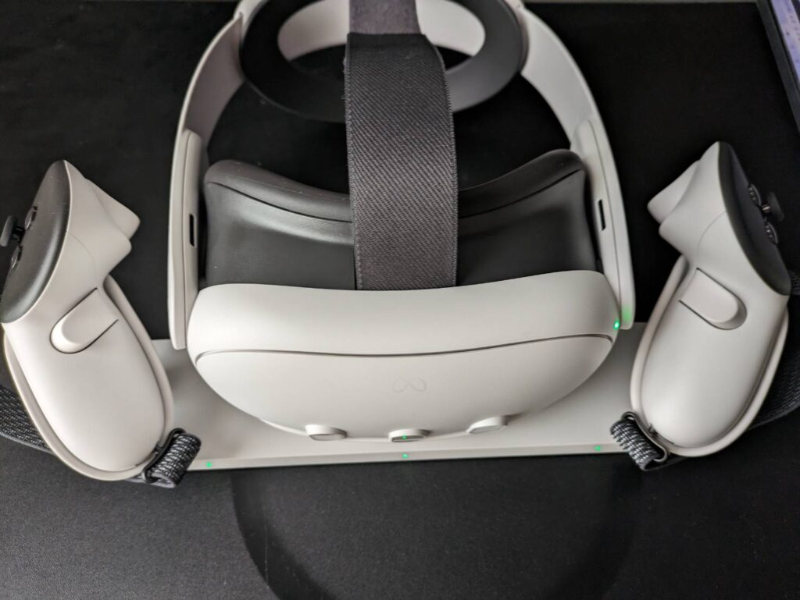

皆さんは年末年始の予定はありますか？年越しそば食べたり、おせち食べたり、お汁粉食べたりすると思いますが、私はVRゲームを遊びつくしてみようかなと思います。

届いたときはこんな感じ、VR本体とコントローラーが付いてきます。

その他のアクセサリを付けて充電したらこんな感じ

Elite ストラップですがバッテリー付きではないので大体2時間遊んだら充電が切れます。充電しながらまたはSteamを有線で遊ぶ人はなくてもよさそうですが

容量は128GBを買いました。必要に応じてダウンロードと削除をすればいいかと思いましたので。

128GBを超えるゲームができませんが、あまりないと信じてます（笑）

VRゲームを始めて勝手がわからなかったのでまずは無料のゲームから遊ぶことにしました。

"Beat Saber デモ版"、"Asgard's Wrath2"、"Republique VR"を遊んでみました

どれもかなり面白くて充電切れるまで遊べますね！"Beat Saber"に関しては製品版を買いました。"Asgard's Wrath2"はmeta quest3を2024/01/27までに買えば無料でできるみたいです。ただ、個人的に酔ったので適度な休憩は必要ですね。

他にもいろいろ面白そうなゲームに目星をつけ、今はセール中なので買ってみようかと思います。

また、VRChatやclusterなど他の人との交流もできるみたいなのでそこも挑戦してみようとは思います。対戦ゲームは苦手なのでやらないですが…

もう一つSteamのVRも試してみたのですが、解像度が悪くゲームがカクカク気味だったので原因を調べてみようと思います。有線LANとQuest Linkを付けたうえでこれだったので…

それでは、メリークリスマス！
