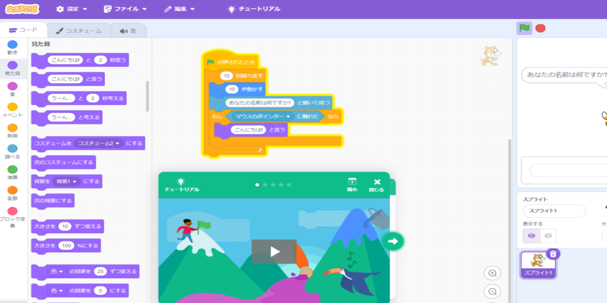
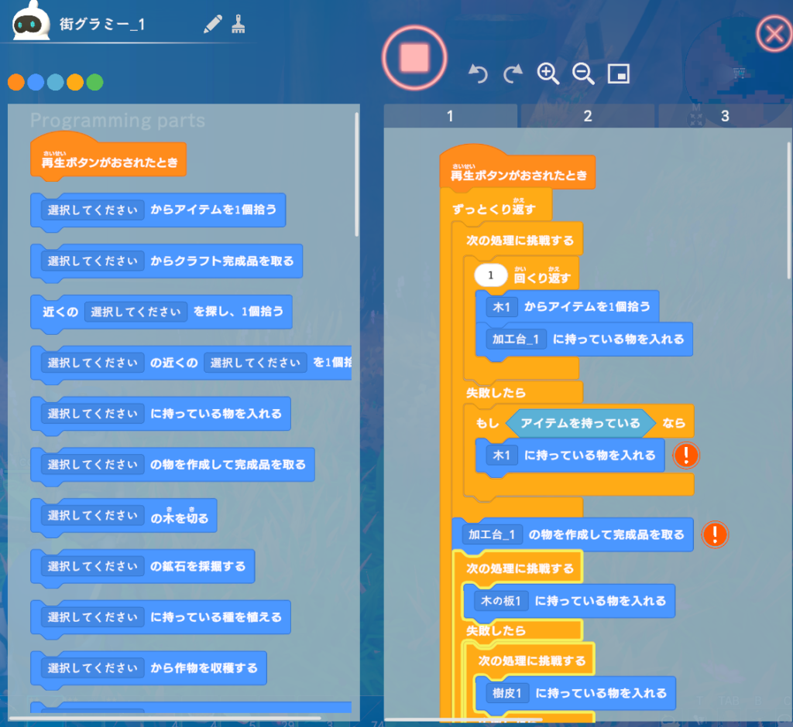
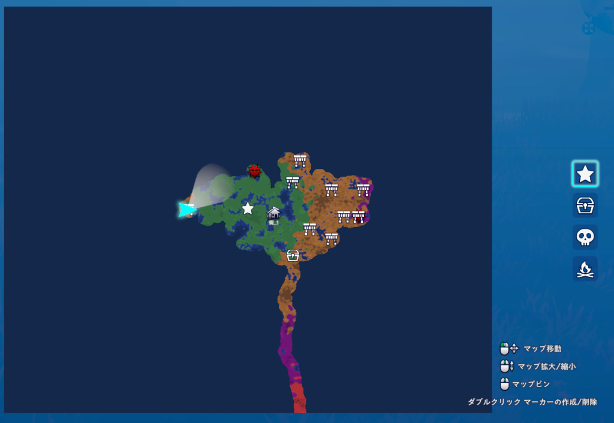

[Scratch](https://scratch.mit.edu/)というプログラミング教材を知っていますか？ゲームやアニメーションをプログラムで作ることができる教材で、以下のような画面で作ることができます。

上の画像に似たようなことがゲーム内でできるのが「Omega Crafter」になります。できることはクラフト系の自動化作業になります。下の画面になります。

このゲームはクラフト系なので基本は素材を集め、武器や防具の強化、拠点の成長などをしつつ、オープンワールドを探索していきます。

また、操作はキーボードとマウスでやるのでコントローラーでゲームをやる人は少し大変かもしれません。まだベータ版なのでできることは多くないのですが、正式版出マップにでる敵の種類や武器の多さ、クラフトできるものが増えるとより楽しいそうです。

また、マイクラが得意な人はこっちも楽しいかと思いますが、私はクラフト系はそこまで得意ではないので自動化もいまいち活かせない感じがしてます。戦闘は割と楽しんでますが…

もし興味があれば正式版が出る前に触ってみるのもいいと思います。Steamで無料プレイができますのでぜひ楽しんでみてください！マップ埋めはやっておきたいなー

