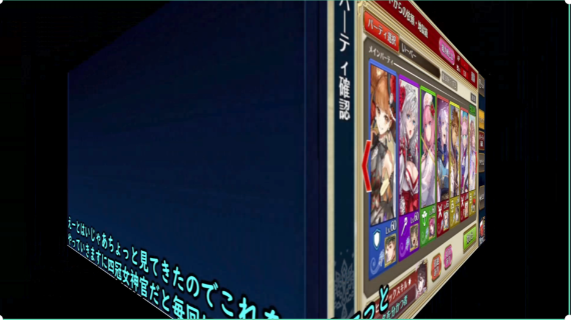
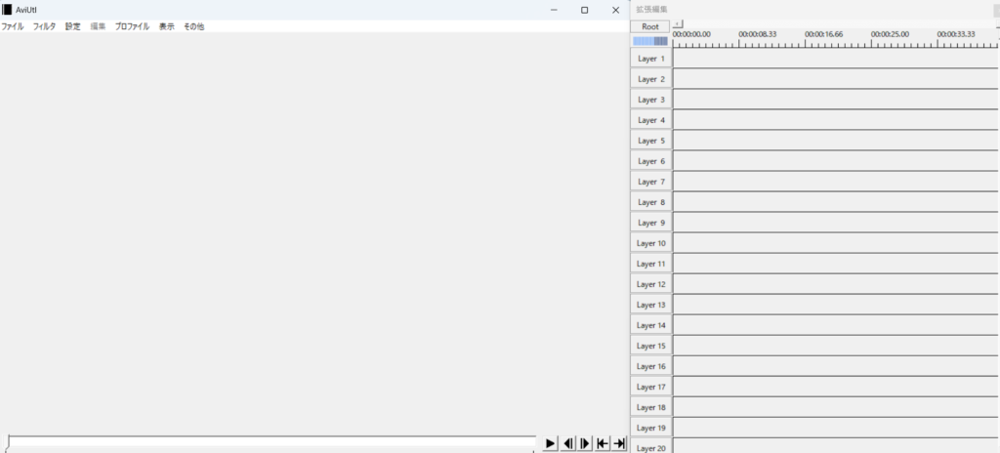

皆さんは動画をどのように作っているか知っていますか？最近はショート系の動画も多い気がしますがスマホで作ってる人も多いと聞きます。

私も2年ほど動画をYoutubeに上げてたりします。完全に趣味の領域なのでチャンネルまではお見せ出来ないですが、ゲームの実況動画になります。カットとシーンチェンジを使ってます。字幕は音声AIによる自動生成なので手動で付けてません。精度は悪いですが…

動画編集といえばAdobe Premiere やFinal Cutが有名ですかね？私は趣味でやってるので完全無料の[Aviutl](https://spring-fragrance.mints.ne.jp/aviutl/)を使っています。このソフトは有志で作られたもので最近は更新がされてないですね。ですが、プラグインが豊富で色んなカスタムができるようになります。

起動するとこんな感じ(プラグインを入れてるので多少異なりますが)

左の画面で録画した画面、右の画面で音声データなどが表示されます。

できることはデフォルトだとできることは少ない上に出力する動画の拡張子も少ないです。プラグインを入れることで".mp4"が使えたり、処理が速くなったり、作業効率があがったりするので調べて入れることを勧めます。

とはいえ、めんどくさい人は有料の物を使ったほうが楽ですし、操作もしやすかったりするので諦めたほうがいい気もします。ただ、情報はかなりでてますので探してみると面白いプラグインや変わった情報も出てきたりするので、自身で試行錯誤するのが好きな人には向いています。

是非、スマホで動画取って、編集してみて、どこかのプラットフォームにアップしてみると楽しみが見えるかと思いますよ！
