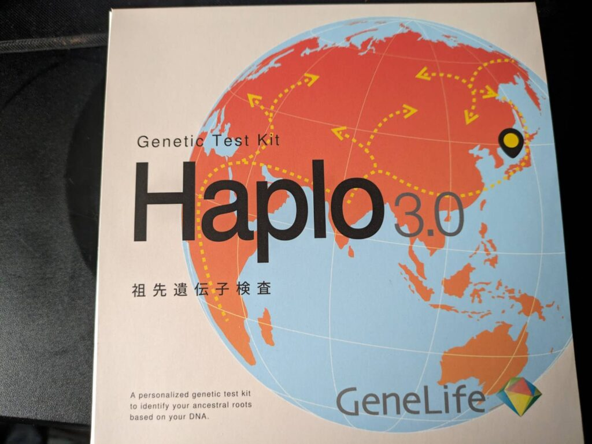
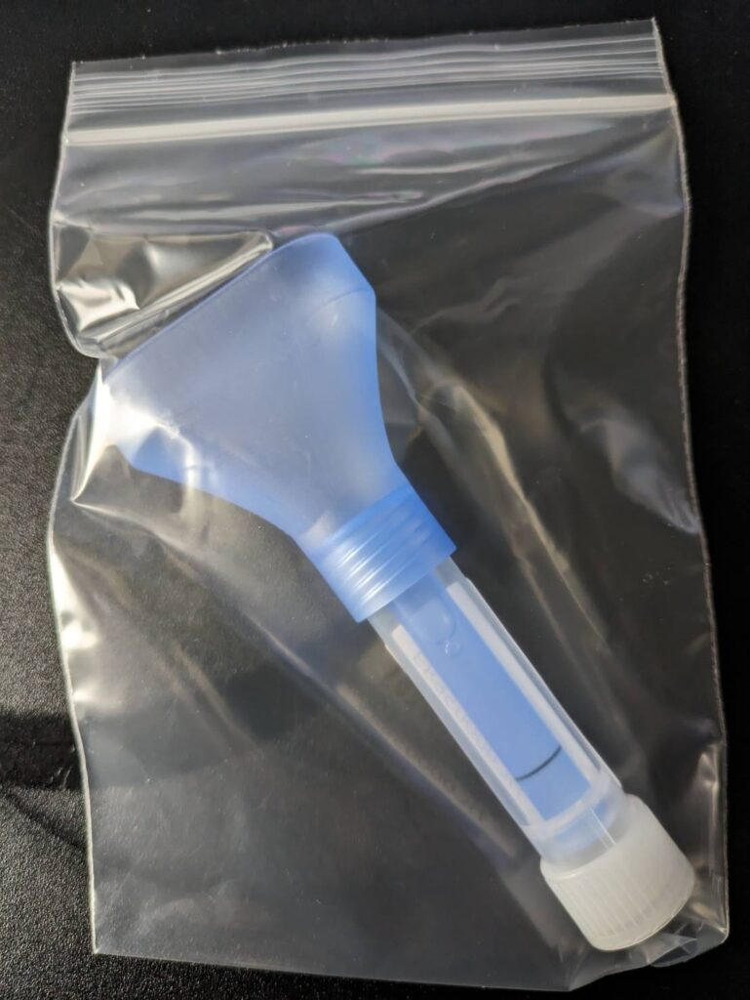

皆さんは遺伝子レベルの自身の特性やご先祖などがどんな人か気になったことはありますか？私はそこまで興味なかったのですが、1度くらいは見てみたいと考えてました。

そこで[GeneLife](https://www.genelife.jp/)という検査キットを目にしました。値段は1万5千円ですが、今は[クリスマスセール(2023/12/21まで)](https://www.genelife.jp/pages/christmas)をやってるみたいで20%オフになってるみたいです。私が注文した時はやってなかった…

また「Haplo3.0」か「Genesis2.0 Plus」を注文すると1万円オフで「Myself2.0」かもう片方を追加で検査することもできるみたいです。

注文するとこのような形で届きます。

この検査では唾液を検査キットに入れて郵送します。結果がでるのは1ヵ月後になるので私は1月くらいになるかと思うので来年が楽しみですね！検査キットはこんな感じ

また15万で6500項目以上の解析をできる[検査キット](https://www.genelife.jp/products/wgs)もあります。検査できるだけじゃなく提携している医療従事者の援助を受けることもできます。いつかここまでやってみたいですね

ちなみに遺伝子の研究結果が変わることがありますが、随時反映されるみたいで、一度検査を受ければ最新の遺伝子研究結果が反映されるみたいです。

数世代のご先祖だったら調べれば出るかもですが、大陸間の先祖や本来の自身の特徴、環境によって変わった性格などもわかりそうなのでもし興味があれば是非是非
