私の現場ではAWSを使っています。全てを1から作ったわけではないですが、StepFunctionやLambda、CodeCommitなど基本的なものは使ってますし、必要に応じて作成したりしています。

ある程度使っていますが、たまたま見つけた記事で興味が出たので"AWSCloudQuest"というサービスを触ってみようかと思います。[こちら](https://explore.skillbuilder.aws/learn/course/external/view/elearning/17553/aws-cloud-quest-cloud-practitioner-japanese-ri-ben-yu-ban)からスキルビルダーのアカウントを作ってサインインしてみましょう！

このサービスはゲーム感覚でAWSの仕組みを理解し、実際に操作して、AWSの認定も取ろうというサービスになります。実際にプレイするとこんな感じになります。初期画面がこちら

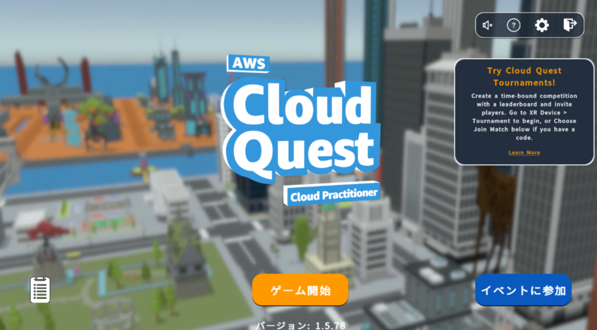

この後、アバターの作成に入ります。アバターを作り終えると街に放り出されます。画面では何もないですが、初めは誘導されますのでそれに従って行動してください。

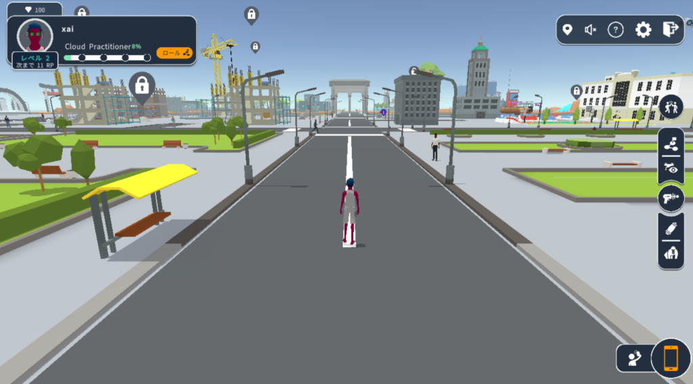

まずは最初の課題ですね。話を聞いて何をするのか把握します。私はAWSを触ったことがあるので多少わかりますが、ここで単語がわからなくても問題ありません。

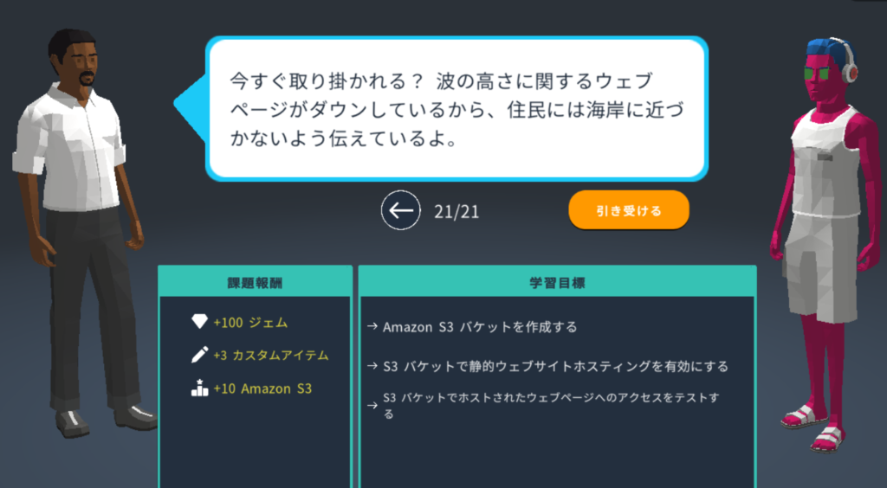

まずは"学習"からです。ステップを進めて内容を確認しましょう。また、左の動画からAWSのコンセプトや使用するサービスについてがわかります。今回はS3についての内容です。

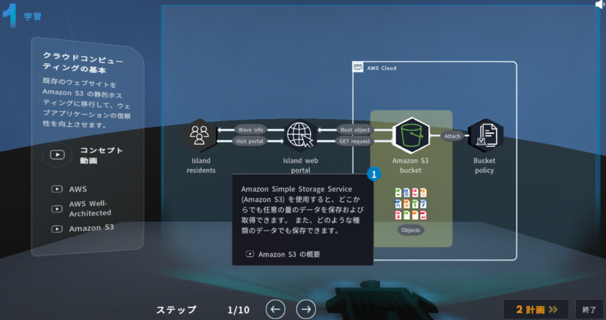

次は"計画"ですね。左の"実践ラボの目標"は実戦で行う内容で、"DIY"は今回の依頼内容になります。これを把握しておきます。

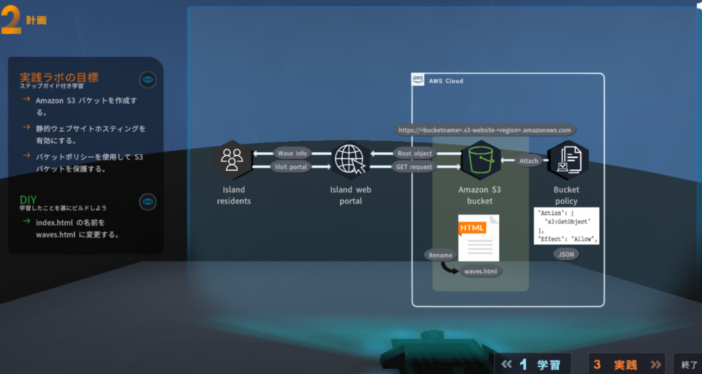

次は"実戦"になります。AWSコンソールを押して、専用のアカウントでAWSにログインしますのでステップを見ながら作業を進めていきます。

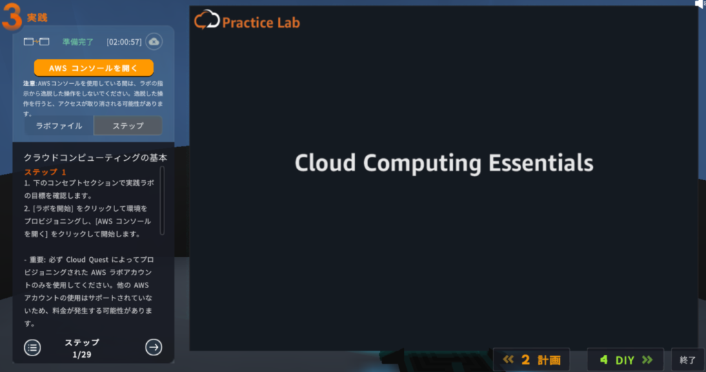

最後に"DIY"になります。これが本来顧客が求めていることなのでこれができればクエスト完了です。先ほどのコンソールからDIYアクティブをしましょう。完了したらバケット名を入力して検証をクリックします。問題なければクリアメッセージが出て終了をクリックします。

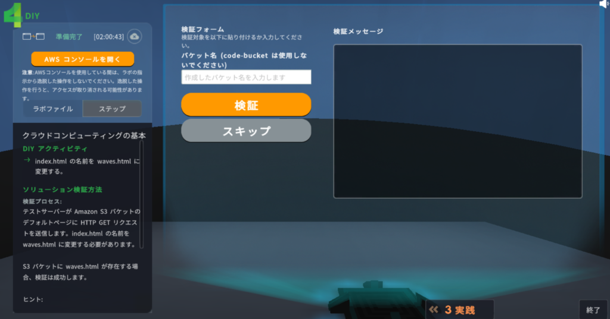

クリアすると報酬を受け取ります。なんかいろいろ解放されたみたいです（笑）。

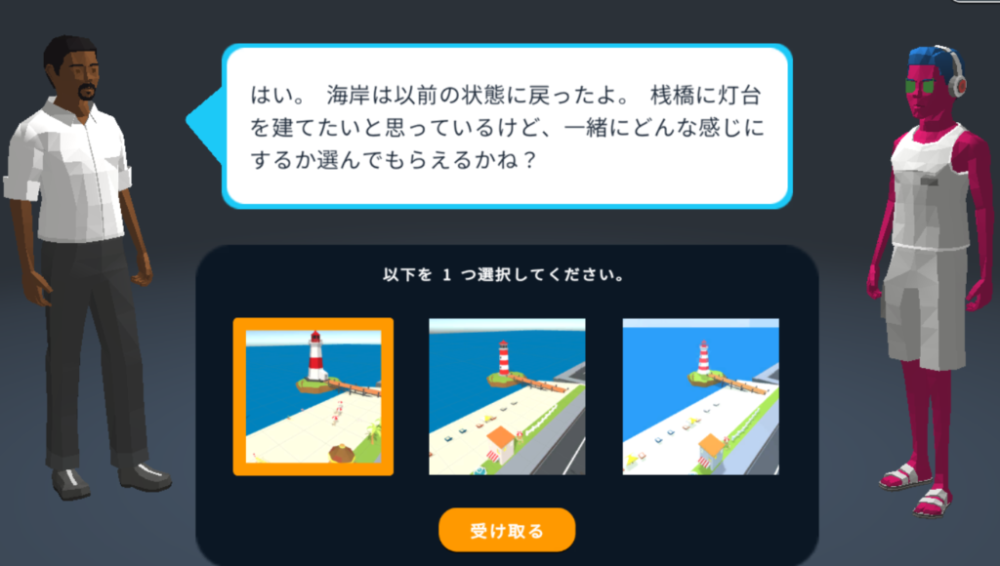

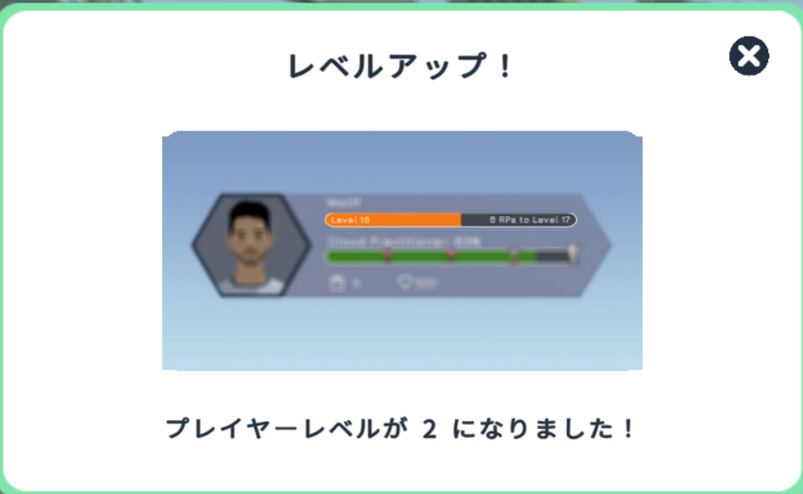

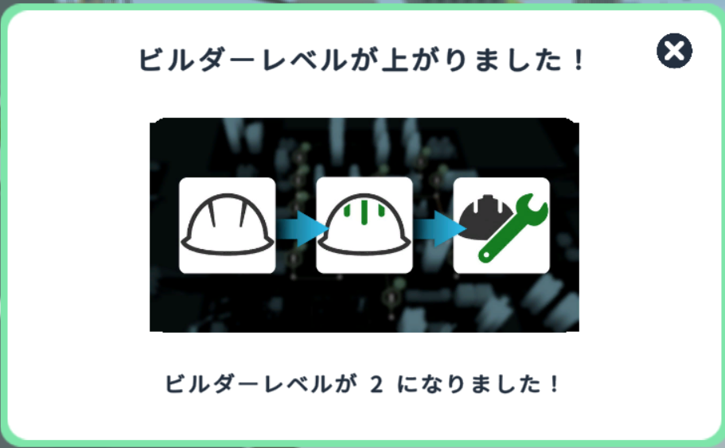

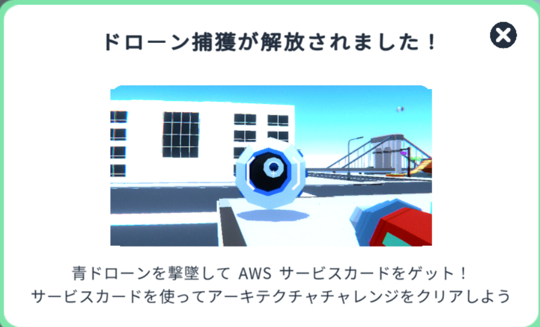

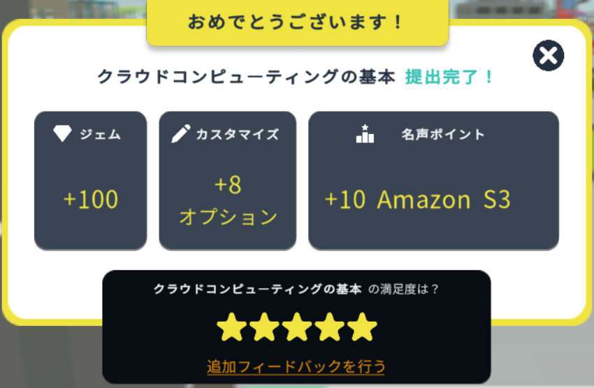

これが終わったら次のクエストが出るのでまたクエストをこなして、街を発展させていくみたいです。

このサービスは一部が無料なので全てこなしたければサブスクに登録する必要があります。私はまだ登録してないですが、もう少し遊んでみて楽しければ登録してみようかと思います。

これを機にスキルビルダーで認定取得するのも面白そうですね。ではでは
