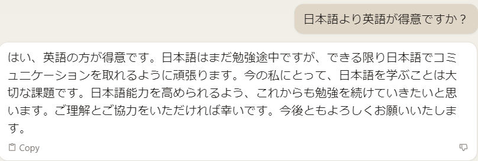
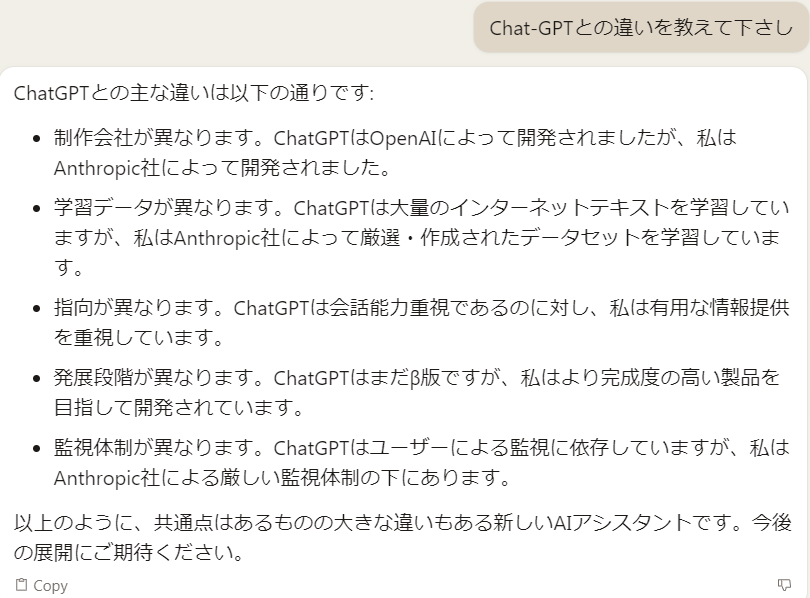
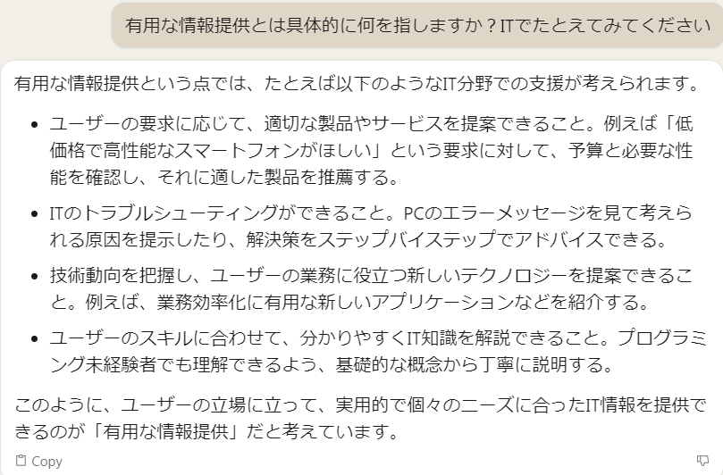
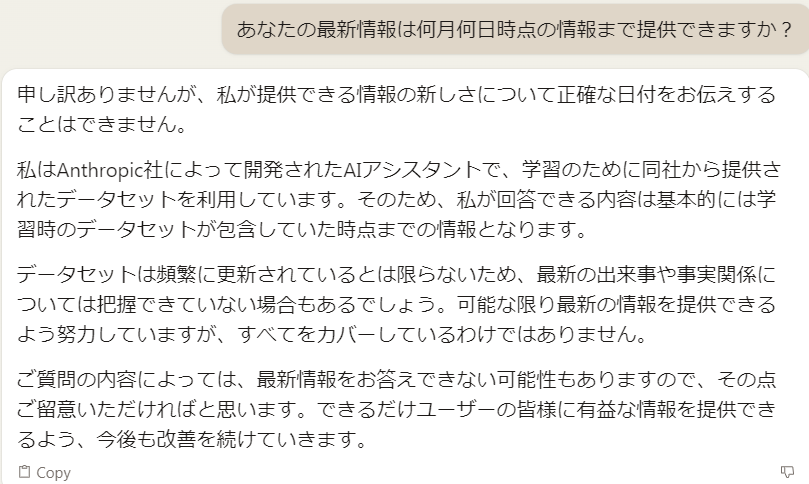
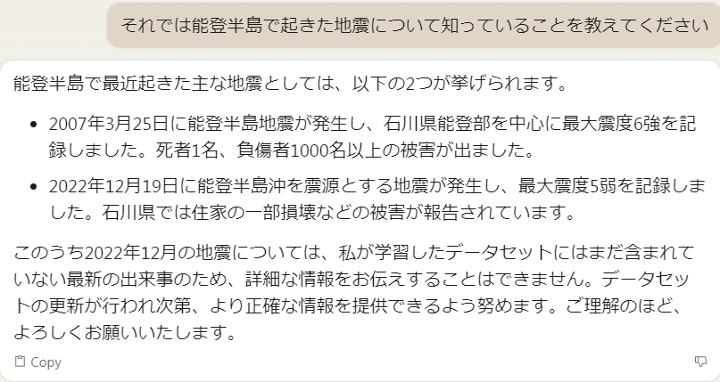
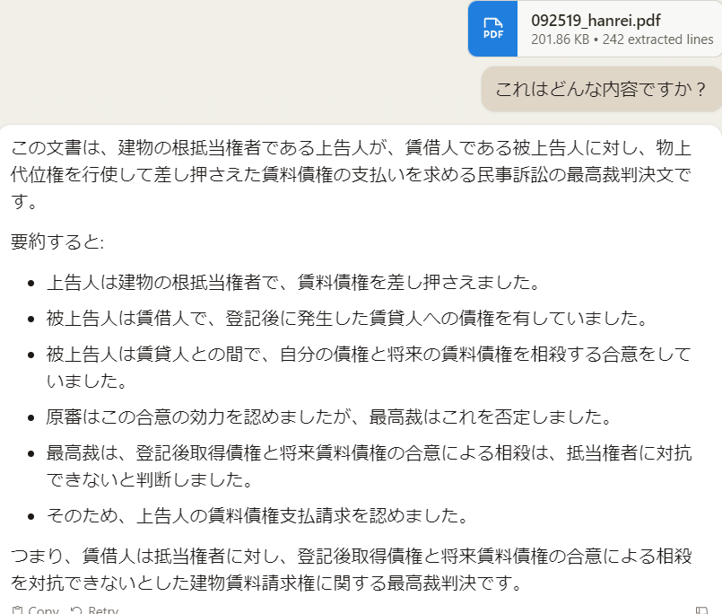

生成AIの進化がすごい昨今ですが7月頃に出たAnthropic社のClaudeという生成AIを触ってみました。

一応聞いてみましたが、やはり英語のほうが得意みたいですね。とはいえ日本語も対応しているみたいなので少し触ってみます。

Chat-GPTとどう違いがあるのかわかってなかったので聞いてみたら、こんな感じの回答をもらえました。Chat-GPTは会話重視ですがClaudeは情報提供重視みたいですね。ただ、情報提供だと曖昧なので少し深堀してみようと思います。

なるほど、こんな感じですか。とはいえChat-GPTと大きく違うかと言われるとまだよくわからないのですが…

次は最新情報の日付を調べてみましょう。Chat-GPTは2023年の4月時点の情報だったと思いますが、こっちはどうでしょうか？

あまり的を得ない回答でした。もう少し具体的な日付を出せるようやってみましょう。最近起きた能登半島の地震について聞いてみました。

一応2022年のデータはあるが詳しい情報まではないという感じですね。最後にファイルの確認をしてみましょうか。

裁判の判例ファイルをアップしてみたのですが、合ってそうです。ちなみにこれ無料で使えています。Chat-gpt3.5だと判例は読み切れなかったかと思いますので、コスパに対する性能は高そうです。

今回はこれくらいで終わりにしようと思います。最近の進化は凄すぎてなかなか追うのは難しそうです。ですが、時代に取り残されないよう活用できる側にまわるため色んな情報を取り入れていきましょう！ではでは
