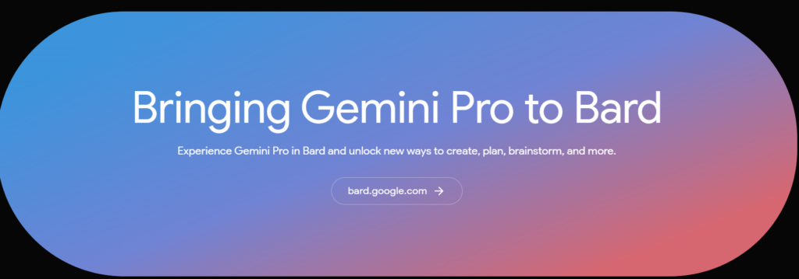
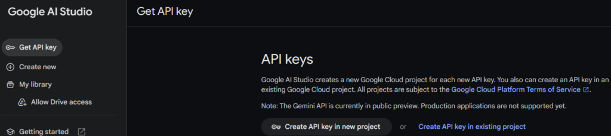
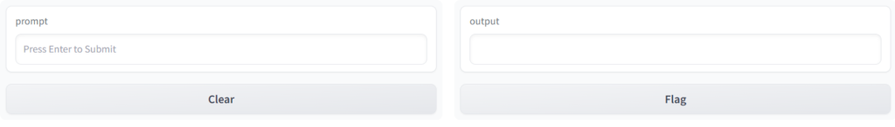
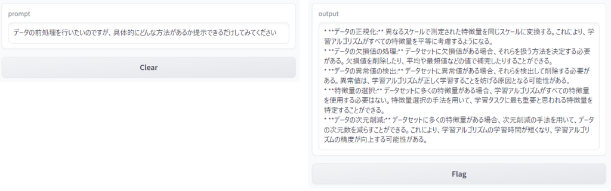

生成AIがどんどん進化していく中でGoogleが新たなモデルを出しました。それが"Gemini-pro"です。

ちなみに[こちら](https://deepmind.google/technologies/gemini/#bard)のページの下の画像リンクからGeminiが搭載されたBardを使うことができます。

チャットボットを作るにはAPIが必要なのでまずはAPIキーを取得します。キーは[こちら](https://ai.google.dev/)から取得できます。画像の"Get API key in Google AI Studio"のリンクをクリックします。

ページが移動したら"Get API key"タブから"Create API key in new project"をクリックすればAPIキーを取得することができます。これでチャットボットの準備ができました。

次にGoogle Colaboratoryを起動します。APIキーの設定とモデルの取得と機械学習webアプリケーションを設定するだけで使うことができます。今回は"Gradio"を使うことにします。他のアプリもありますが、いつか使ってみたいですね。

コードは以下のように設定します。"YOU'RE\_APIKEY"に取得したAPIキーを入れてください。

!pip install gradio  
  
import gradio as gr  
import google.generativeai as genai  
  
\# APIキーの設定  
GOOGLE\_API\_KEY = "YOU'RE\_APIKEY"  
genai.configure(api\_key=GOOGLE\_API\_KEY)  
  
\# Generative AIモデルの初期化  
model = genai.GenerativeModel("gemini-pro")  
  
\# チャットボットの動作を定義  
def chatbot(prompt):  
\# Generative AIモデルを使用して推論を実行  
response = model.generate\_content(prompt)  
return response.text  
  
\# Gradio UIの設定  
iface = gr.Interface(  
fn=chatbot,  
inputs=gr.Textbox(type="text", placeholder="Press Enter to Submit"),  
outputs="text",  
live=True  
)  
  
\# Enterキーで送信されるようにする  
iface.launch(share=True, debug=True)

こうすると次の画面が表示されます。

試しに入力してみます。

なるほど、それっぽい返答が返ってきました。一応うまくいってるみたいです。簡易的なチャットボットの完成です！ﾊﾟﾁﾊﾟﾁ

他のAPIを使ったチャットボットや別のWebアプリ、言語も使ってみたいのでもう少し探ってみようと思います。ではでは
