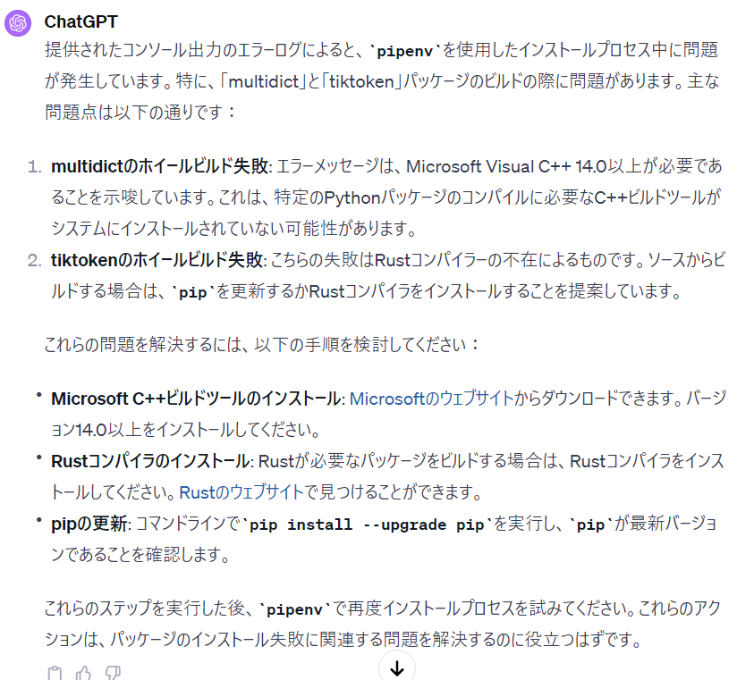
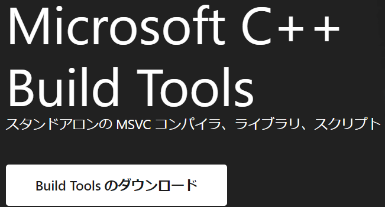
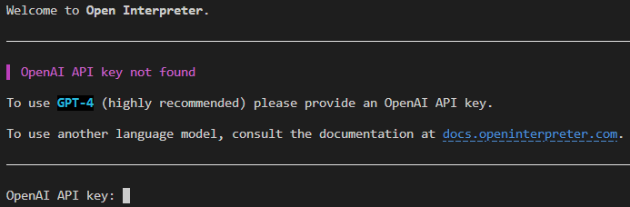

話題としては遅い気がしますが、初めてOpen Interpreterを使いました。そのことについて記載しようと思います。

### Open Interpreterについて

最近社用PCのPythonバージョンを3.12に上げました。なので自身のPCのPythonバージョンも3.12に上げることにしました。また、同タイミングでOpne Interpreterのことを知ったので使ってみようとしました。

私はCode Interpreterのことは知っていたのですが使ったことはなかったです。違いがあまりわからないのですが、Code Interpreterのオープンソース版がOpne Interpreterのようです。

Open Interpreterを実行した際、自動でライブラリをインストールされることがあるみたいです。まずは仮想環境を作ることにしました。

### 仮想環境の作成とライブラリインストール

今回仮想環境で使ったライブラリは"pipenv"になります。特にこれといった理由はないです。Condaでもvenvでもいいとは思います。pipenvの使い方は[こちら](https://qiita.com/y-tsutsu/items/54c10e0b2c6b565c887a)を参考にしました。

Pipenvをインストールし、必要なライブラリをインストールします。初期化しなくてもライブラリのインストール時に勝手に作られるので、意図的にPyhonのバージョンを変えなければ初期化しなくても問題ありません。

もし、ライブラリのインストール時に "RuntimeError: Failed to lock Pipfile.lock {ライブラリ名}" というエラーが出た場合は一度仮想環境を削除して、再度作成するとうまくいくと思います。私の経験談なのでサンプル数1ですが…

仮想環境を作った時はそこのインタープリターを選択しましょう。処理の実行が失敗しますので…

仮想環境ができたのでいよいよOpen Interpreterをインストールします。"pipenv shell"でアクティブ化し、"pipenv install open-interpreter"を実行します。

### Open Interpreterインストール時のエラー対処

右のエラーが出ました。"ERROR: Couldn't install package: {} Package installation failed…"

これだけ見ても原因は変わりませんが、面倒なのでコマンドを実行した後の行から全てコピーしてきてテキストファイルに張り付け、Chat-gptに聞いてみました。そしたら下記の回答が返ってきました。

これ見たときに「Python関係ないのに必要なの？」と思っちゃいました。だってC++とRustですからね。ちなみにRustを聞いたとき浮かんだのはゲームのほうでした（笑）

一応目視でも似たようなエラーが出ているかを確認してみると以下の2つのエラーが見れました。

- error: Microsoft Visual C++ 14.0 or greater is required. Get it with "Microsoft C++ Build Tools": https://visualstudio.microsoft.com/visual-cpp-build-tools/

- ERROR: Failed building wheel for tiktoken、ERROR: Could not build wheels for tiktoken, which is required to install pyproject.toml-based projects

上記2つのエラーを調べてみるとChat-gptから得られた解答と同じだったのでインストールすることにしました。

### Microsoft Visual C++とRustのインストール

Microsoft C++のインストールは[こちら](https://visualstudio.microsoft.com/ja/visual-cpp-build-tools/)からダウンロードしてインストールすれば問題ありません。

次はRustコンパイラです。[こちら](https://www.rust-lang.org/learn/get-started)からインストールできます。ご自身のPCにあったほうを選んでダウンロードとインストールをしてください。

これで"pipenv install open-interpreter"を実行すると成功しました。正直容量が増えるものをダウンロードするのは抵抗がありました。ですが、動かすためには仕方ありませんでした。

インストールができて"interpreter"を実行すると下記のように出力されます。

### Open Interpreterの実行とAPIキーの設定

OpenAIのAPIキーがあれば入力してください。なければEnterを押して構いません。別のモデルが使われます。

ちなみに"interpreter --fast"を使えばchat-gpt3.5を使うようになります。

ただ、めんどくさがりの私はこの画面からAPIキーを入力したくないです。で環境変数に設定して、勝手に読み込んでもらうようにしました。

コマンドプロンプトを開き"setx OPENAI\_API\_KEY apiキー"を入力すると環境変数に設定されます。今後は特にいじらず利用することができます。気になるのであればコントロールパネルから確認してみてください。

環境変数への設定が完了したらVSCodeを再起動しましょう。その後に再度ターミナルを開きます。"interpreter"を実行すると対話画面に映ることができます。

これでようやくOpne Interpreterを使うことができます。もし、Python3.12でOpen Interpreterを使うときの参考になればなと思います。

### 終わりに

おそらくPythonのバージョンを下げれば色々ダウンロードする必要はないかと思います。

どこまで下げたらいいかはわからないです。ですが、仮想環境使ってるので簡単にバージョンの管理もできると思いますので。

これをうまく使って開発を楽に進めようかと思います。後はローカルよりもColabなどでやったほうがいいと思います。データの損失やセキュリティ上の問題があるみたいなので。ではでは
