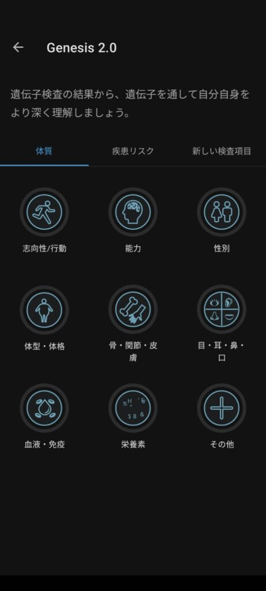
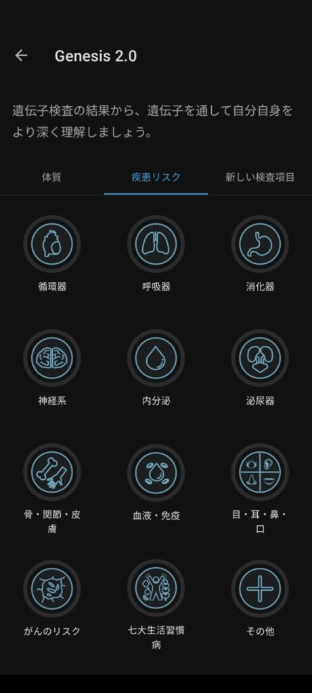

[こちら](https://xainome.blog/?p=127)の記事で遺伝子検査について書いてみました。

その時はHaploというDNAから民族のルーツを知る検査を行いました。実はこちらの検査が返ってきた後、Genesisという体質や疾患リスクを調べる検査とMyselfという遺伝子的な個性と自己分析による結果の比較ができる検査があります。

Haploはセールで買えましたが、実はGenesisとMyselfは1万引きで検査することができます(2検査で合計1万)。更に検査結果が出ていれば料金さえ払えば即座に結果が表示されます。

ちなみにHaploはこんな感じです。人種や移動経路、ゆかりのある苗字、血縁で近い人が表示されるページもあります。

Myselfはこんな感じです。遺伝子で出た結果とアンケートで出た結果がわかります。環境などにより遺伝子結果と変わってる可能性はあります。この結果はGenesisと被っている部分もあります。

最後にGenesisです。体質と疾患リスクがわかります。運動能力や脳の処理の力、性格、性別ごとの病気などが出ます。もちろん可能性の話ですが

能力であれば鍛えることで苦手を克服することができますし、病気も栄養や睡眠を適切に取れればかかりにくくなると思うので、気にしつつも注意していけばいいかと思います。逆にかかりにくくても健康的な生活を送れなければ疾患リスクがあがりそうです。

まだ検査が返ってきて軽く見ただけなので、もう少し調べてみたいですね。ではでは
