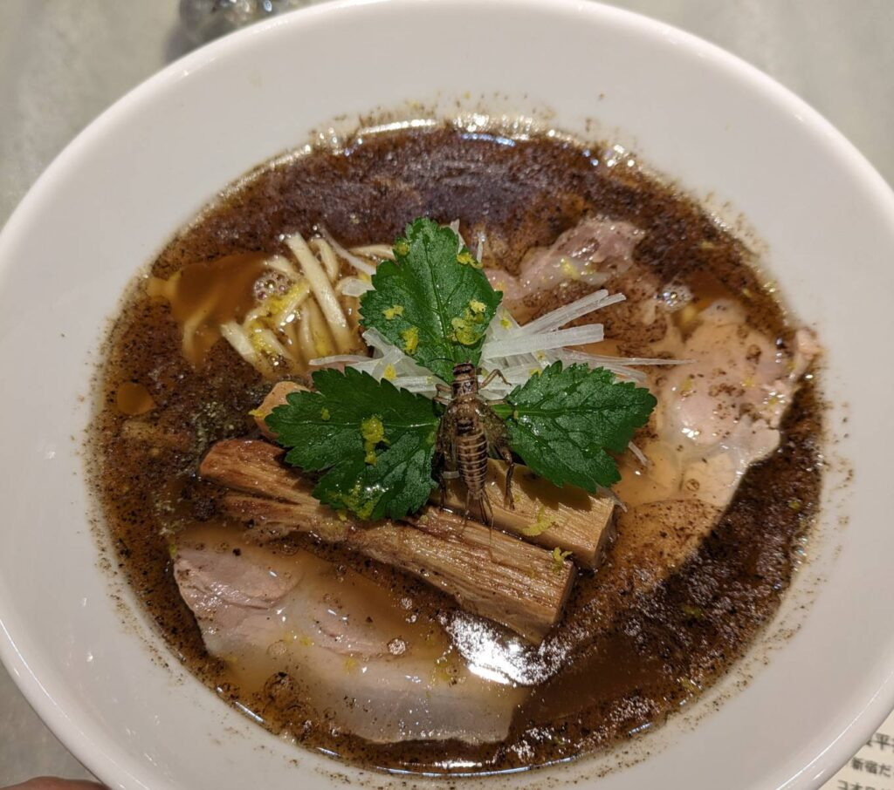

"昆虫食"と聞いて顔をしかめる人は多いと思います。ちなみに私も積極的に食べようとは思いません。某大臣がコオロギなどの昆虫食を進めていましたが、国で進めるのはどんな意図があるんだろうと思っていましたが…

昆虫食のメリットとしては

- 高タンパクで栄養価が高い

- コストが低いので生産しやすい

- 他の動物の飼育に比べて環境に優しい

- 飼料に加工できる

というところだと思います。これだけ聞くと割とよさそうではありますね。デメリットとしては

- 甲殻類などのアレルギーの人は食べられない

- 農薬の規制が必要になる

- **見た目**

調べてわかったのですが農薬の規制は初めて知りました。言われてみると毒物は食物連鎖の上に行くほど凝縮されやすいというのがあるので、昆虫の餌(主に植物)には気を付けないといけないということですね。

またアレルギーは"エビのシッポ"と"ゴキブリの羽"の**成分**が同じと言われるので理解しやすかったです。

見た目はどうしようもないですね。よく提供されるものは素揚げや佃煮が多く、見た目がそのまま出たりするので努力で克服できる気はしません。粉末にすれば別かもしれませんがそれで高タンパク質がとれるのか疑問ですね…

さて[ANTCICADA](https://antcicada.com/)のコオロギラーメンですがこんな感じです。虫が苦手な方は注意してください。

コオロギの素揚げが1匹ですがそれ以外は普通の醤油ラーメンです。味は美味しいですが匂いが少し独特で虫？か土？のような匂いを感じました。

ちなみに合計160匹ほどのコオロギを使っているみたいで、日ごろ餌を厳選して育てたコオロギを出汁と醤油と油にして作ってるみたいです。出汁に使われたコオロギの山を出され「撮っていいよ！」と言われましたが流石に写真に収める気にはなれませんでした（笑）

この店の装飾として飼ってるコオロギやはちみつ漬けにした虫、蛇などが飾ってありました。また店を開業した方は虫の論文も読んでるみたいで、本や絵本が飾ってありました。

ちなみにこのお店は通販もやっていますがラーメンと醤油は売り切れています。見た目ではわかりにくいし、味もいいですからね。また、ラーメンの提供は日曜のみなので普段は食べられません。

私も小さい頃は平気でしたが大人になるとやっぱり無理だと感じますね。籠に入っていたり標本にされているのは問題ないですが、触れられるような状況だと無理だと感じます。生態系とか特徴が面白い虫もいるので興味はあるんですけどね…

ここで最初に戻るのですが昆虫食を食べることのメリットは"**高タンパク**"であることです。しかも少ない量で。

体に良い食事をするのであれば牛、豚、鳥などのタンパク質に加え、食物繊維やビタミン、糖質等たくさんの食物を摂取する必要があります。

タンパク質を昆虫食に変えることで食べる量が減るので、その他の栄養素を取りやすくなる(食べられる量が増える)と考えています。

ただ、出汁にしたり粉末にすると美味しいけど高タンパク質というメリットは失われるのでは？という気がします。かといって素揚げにしたものを食べるのには嫌悪感から難しい。

ここを上手く高タンパク質が摂取でき、なおかつ見た目に嫌悪感を感じにくい料理が提供できればいいんだろうなという気がします。虫の構造を把握し、殻や頭、足などを適切に処理し、タンパク質を消さず提供できるような料理人はどこかに存在するのでしょうか…

皆さんも興味があれば食べてみてください！味は美味しいので後は勇気のみ！ではでは
