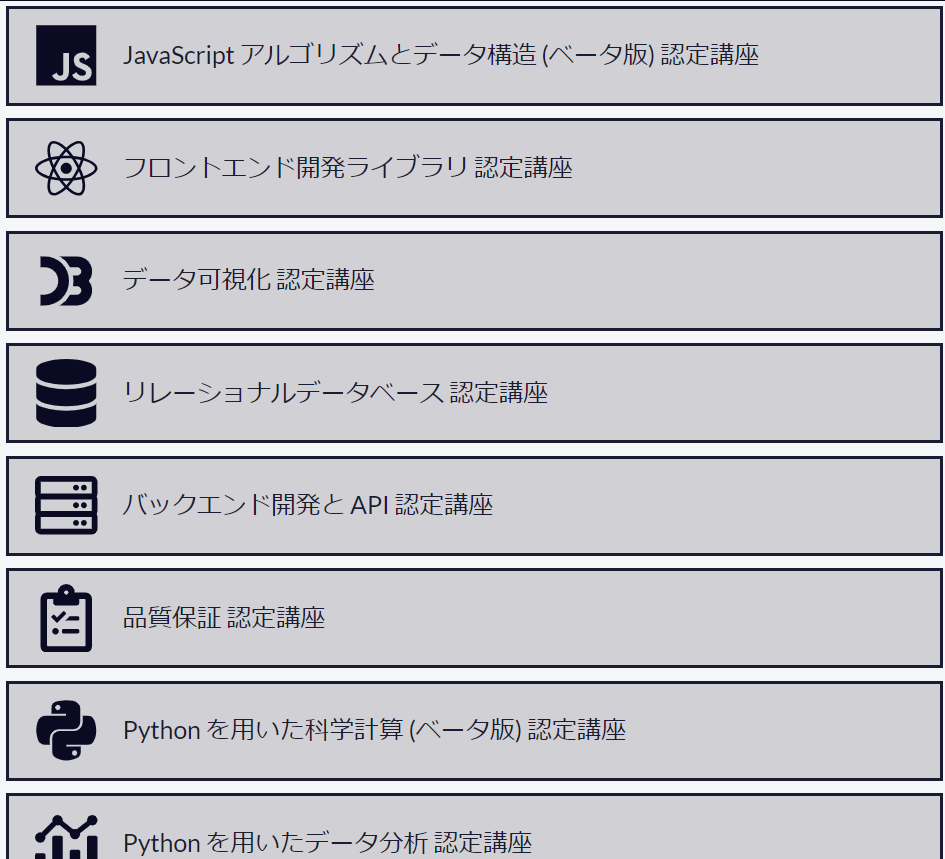
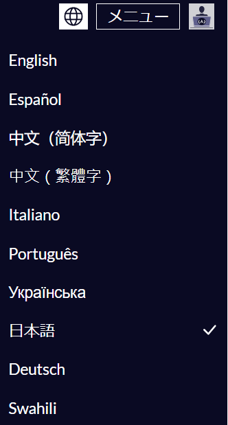
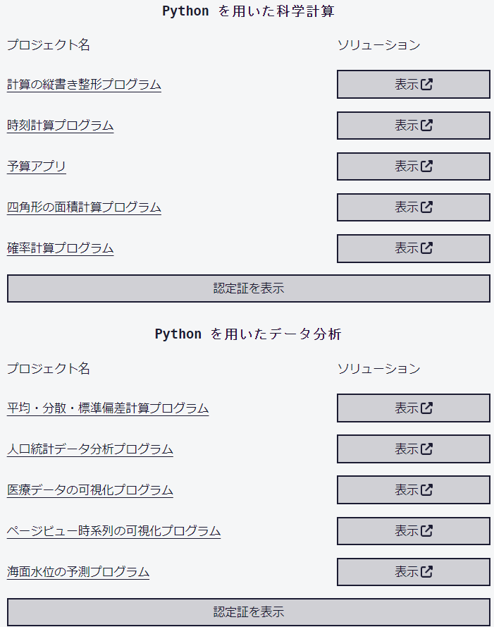
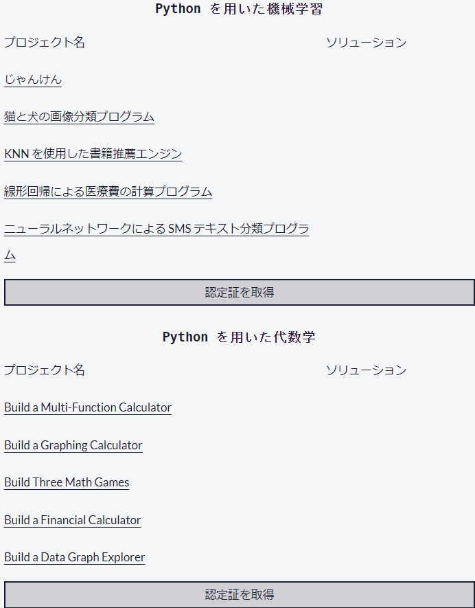
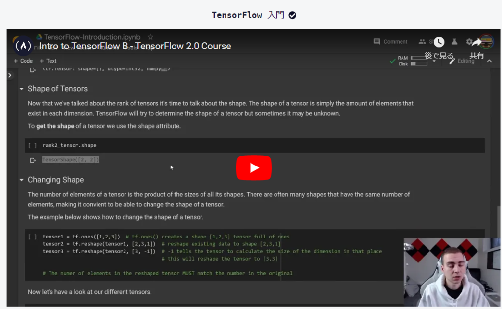
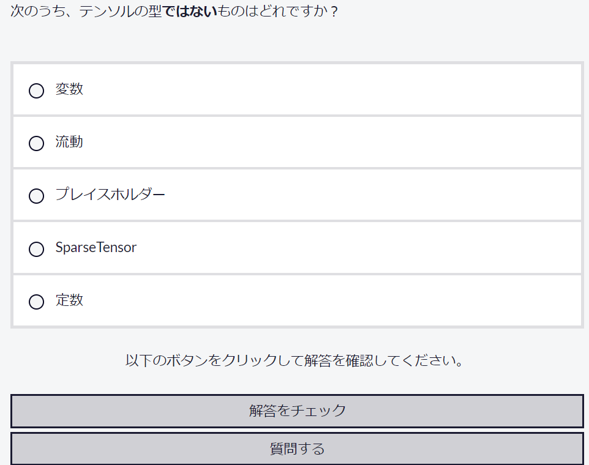

E資格が終わって次に何しようかなと思った時にたまたま目が付いたサイト"**[freeCodeCamp](https://www.freecodecamp.org/)**"をやってみました。

一応無料でできるものでテストに合格できれば認定証がもらえます。このようなサイトや[Coursera](https://www.coursera.org/)などで認定証をもらえますが、どこまで効果があるかはわかりません。

ただし、海外でも十分役に立つかなと思っているので学位とかなければ取るに越したことはないかと思います。日本だけでいいなら不要だと思いますが、私は日本だけで活躍するのは危ういと感じているので、海外でも使えそうなものを探していました。

講座はいろいろありますので気になったものを触ってみればと思います。

基本は英語ですが日本語に変えることもできます。翻訳が怪しい部分もありますが、なんとなくわかります。本格的な翻訳も募集しているみたいです。

私はメインはpythonを使っていますのでpythonに関する認定証を2つ取りました。

今は残りのpythonに関する認定証を取得中です。少し難しいですが…

これが終わったら他のやつも取ってみようと思います。APIやデータベースはできたほうが楽しそうですからね。

問題としてChat-GPTを使っても問題ない気はします。コードをほぼ任せてみましたが合格できましたので。また、Copilotのような機能があるので気にせず、積極的に利用しても問題ないかと思います。コードの中身はしっかりと理解したほうがいいですが…

テストを受ける前に学習をすることもできます。動画での学習と内容チェックですね。

さて、生成AIが出てきてもしかしたらプログラマーやデータサイエンティスなどの業種が将来的になくなるかもしれない時代、さらに日本は少子化により給料も需要も下がるかもしれない時代に突入しているので、今のうちにやれることをやって将来に備えたいですね。

それでは楽しいエンジニアライフを。ではでは。
