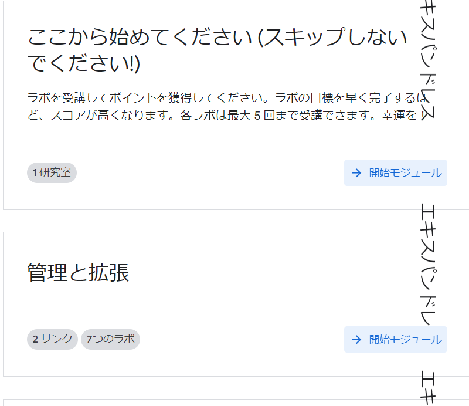
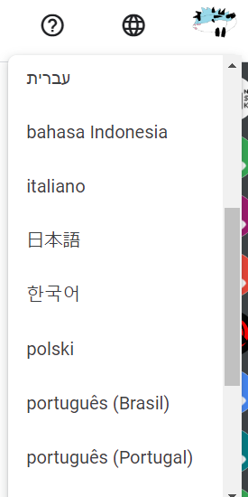
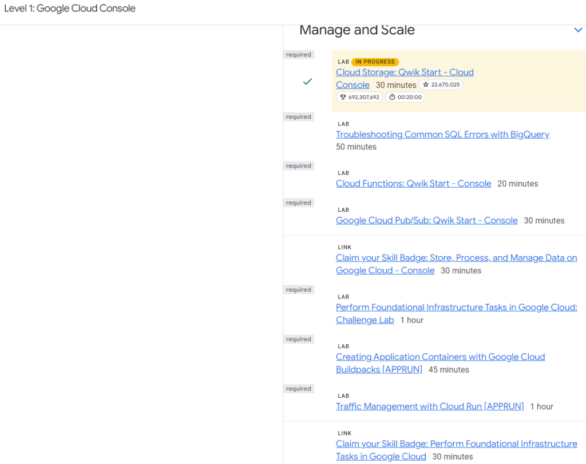

[こちら](https://go.qwiklabs.com/arcade)からゲームに参加することができます。

アクセスコードも画面に出ていますので入力して入ってください。

アクセスコードを入力するとゲームに参加できますので一つ一つ完了していきましょう！

言語の設定はここから変換できますので、気になる方は日本語に変換してください

中身はゲームというよりはGoogle Cloudの使い方を教えてくれるものでした。GCPに使い慣れていないせいか苦戦はしましたが、少しづつ進めてます。クリアするとチェックが付くみたいです。

Level1ではGoogle Storage、BigQuery、CloudFunction等の使い方を学ぶことができます。

今のところ無料で出来ていますのでもう少し進めてみようと思いますが、ゲームという観点ではAWSのほうが楽しいかもしれないですね。街の発展ができますので

AIに関する技術は確かに重要ですが、クラウドを扱う知識はもっと必要になるかと感じます。AIだけでなくサービスの提供にも必要なので知っておいて損はないと思います。

クラウドはAWSかGCPかAzureのいずれかを知っていれば十分な気はしますが、もし興味があれば触ってみると自身の幅が広がるかなと思いますので。ではでは
