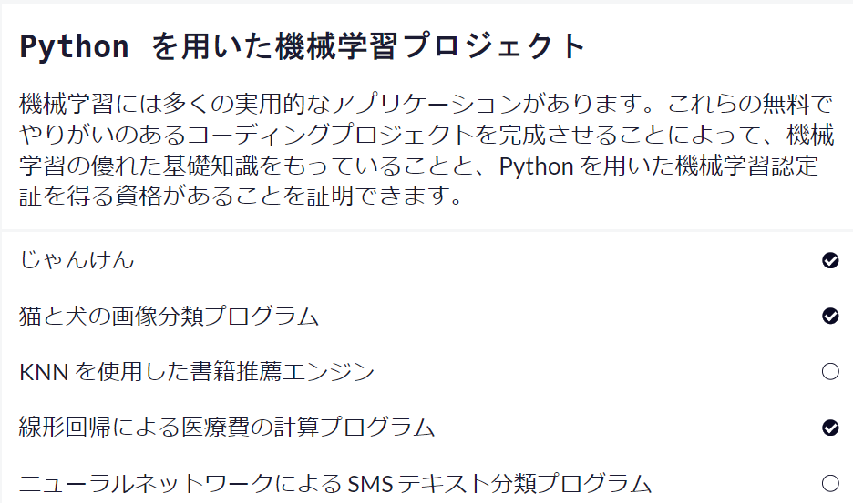
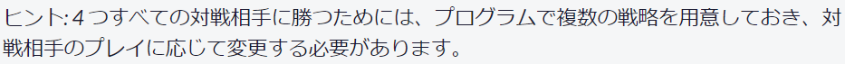
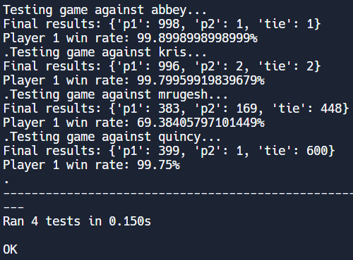

勉強していますか！

私は引き続きfreeCodeCampで認定証を取れるよう頑張っているのですが、なかなか難しくて苦戦しています。

現状機械学習プロジェクトで終わってるのがじゃんけんと画像分類と医療費予測ですね

画像分類と医療費予測はそこまで難しくないのですが、じゃんけんと今やってる自然言語処理は苦戦しています。

じゃんけんは4人のボットに60%以上の勝率を出すことがクリアの条件です。

4人のボットはそれぞれ特徴があって(以下グー: "R"、チョキ: "S"、パー: "P"とする)

- 特定の順でじゃんけんの手を出す

- 前回出したプレイヤーの手に勝つ手を出す

- プレイヤーの過去10回分を集計して1番多く出した手に勝つ手を出す

- 過去2回分("RR"や"PP"等)のパターンを毎回全て記録し、前回出した手＋"次出す手"を過去履歴から一番多い手に勝つ手を出す。(例：過去のパターンで"RR"が8回、"RS"が5回、"RP"が10回だった場合、前回プレイヤーの手が"R"なら"RP"が10回の最多なので"P"に勝つ"S"を出す)

この4人に勝率60%以上出せばいいのですが時間がかかってしまいました。ちなみに最終的には画像のような勝率になってました

1人以外は99%以上の勝率になりました（笑）。3人だけ個別で対応して1人は何もしなくてもテストクリアしたので特に対策はしていません。もしかしたら連鎖マルコフモデルを使えばよかったかもしれませんが、力押しです💪

画像分類と医療費予測はChat-GPTに手伝ってもらいました。とは言え簡単な加工とモデルの作成だけだったのですが、コードの中身を全て解説してもらいながら終わらせました。

残りの自然言語処理問題ですね。書籍推薦アルゴリズムとスパム分類ですね。こちらもChat-GPTに頼って解説してもらいながやったのですがうまくいきませんでした…

なかなか難しいですがもう少しいい方法がないかChat-GPTとキャッチボールしながら探してみようと思います。気晴らしに他の講座をやるのも手ですね！ではでは
