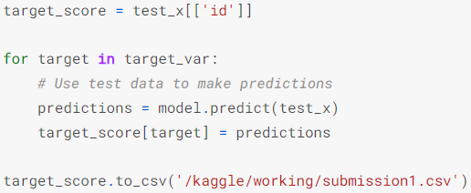
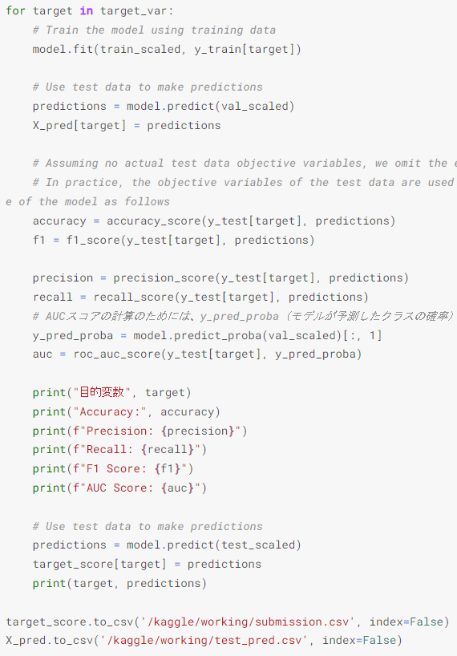
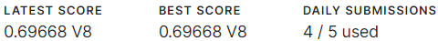
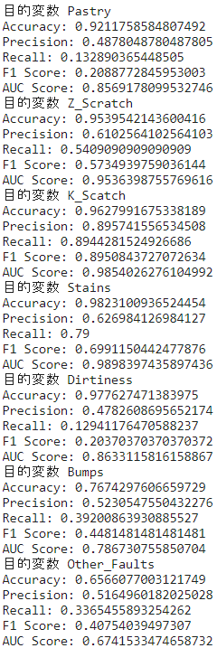
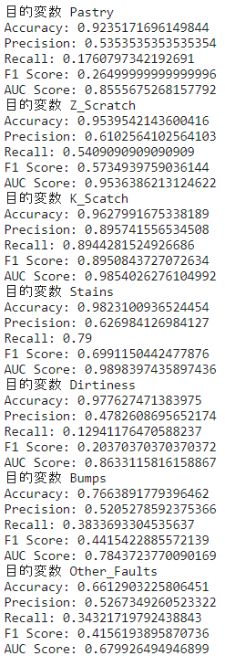

前回から4日ほど空いてしまったのですが、Kaggleでどうやってスコアを上げるか四苦八苦してました。

そもそも前のスコアが低すぎたので少し改善するだけで上がるかなと思ってたのですが、なぜか上がらず少し結果を見てたら自分のコードミスだったというオチです（笑）

前回の予測コードがこちら

で修正したコードがこちら

for文を使って目的変数が変わるたびモデルの学習を行った後、予測を行っています。ちなみに私は訓練データを8:2に分割して実行しています。

前の時は全ての目的変数の学習が終わったとモデル予測を行っていました。本来であれば目的変数1つに対して学習して予測を行うのですが、全て学習した後予測してたので最後の目的変数の学習をしたモデルになってたので、想定していた結果にはならなかったみたいです。

というわけで修正した後のスコアがこちら

すごい！だいぶ上がった！というかこれが普通のスコアっぽい（笑）

よくなったので今度はもう少しデータと向き合いつつ、より良い加工方法とモデルの作り方を見てみようと思います。またDiscussionを見つつ、他の人のNotebookを見てみました。他人のコードをChat-GPTに解説してもらいつつ、不明な点を聞いてみようと思います。

余談ですが何もしないときとワンホットエンコーディングを行った時の結果を見てみます。AUCが上がったものもあれば下がったものもありますね。大幅に改善されたわけではないので、元のデータに対して加工したほうがよさそうです。外れ値とか入ってるかもしれないですね。

というわけでKaggleいろいろ試してるという話でした。ではでは
