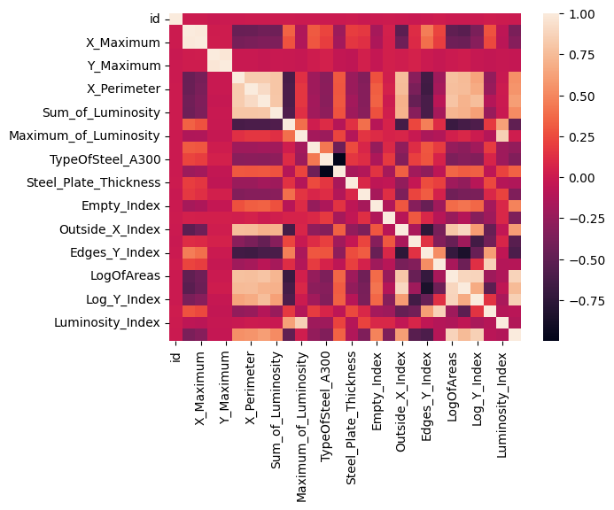
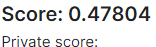

最初の段階で[タイタニック](https://www.kaggle.com/competitions/titanic)を触ることが普通かもしれませんが、[この書籍](https://www.amazon.co.jp/Kaggle%E3%81%A7%E5%8B%9D%E3%81%A4%E3%83%87%E3%83%BC%E3%82%BF%E5%88%86%E6%9E%90%E3%81%AE%E6%8A%80%E8%A1%93-%E9%96%80%E8%84%87-%E5%A4%A7%E8%BC%94/dp/4297108437)でも触れてますがタイタニックは軽く触るくらいでいいと思います。

順位もあまり動かないですし、モチベも続かないと思うので他のコンペに早く参加したほうが楽しい気がします。

私は今開催されている[こちら](https://www.kaggle.com/competitions/playground-series-s4e3/)のコンペに参加しています。こちらのコンペは基となったデータから似たような特徴量を作成したものになります。中身はテーブルデータなうえに "id" と数値データのみなのでとっつきやすいと思います。

とりあえず中を見てみます。

```
<class 'pandas.core.frame.DataFrame'>
RangeIndex: 19219 entries, 0 to 19218
Data columns (total 35 columns):
 #   Column                 Non-Null Count  Dtype  
--- ------ -------------- ----- 
 0   id                     19219 non-null  int64  
 1   X_Minimum              19219 non-null  int64  
 2   X_Maximum              19219 non-null  int64  
 3   Y_Minimum              19219 non-null  int64  
 4   Y_Maximum              19219 non-null  int64  
 5   Pixels_Areas           19219 non-null  int64  
 6   X_Perimeter            19219 non-null  int64  
 7   Y_Perimeter            19219 non-null  int64  
 8   Sum_of_Luminosity      19219 non-null  int64  
 9   Minimum_of_Luminosity  19219 non-null  int64  
 10  Maximum_of_Luminosity  19219 non-null  int64  
 11  Length_of_Conveyer     19219 non-null  int64  
 12  TypeOfSteel_A300       19219 non-null  int64  
 13  TypeOfSteel_A400       19219 non-null  int64  
 14  Steel_Plate_Thickness  19219 non-null  int64  
 15  Edges_Index            19219 non-null  float64
 16  Empty_Index            19219 non-null  float64
 17  Square_Index           19219 non-null  float64
 18  Outside_X_Index        19219 non-null  float64
 19  Edges_X_Index          19219 non-null  float64
 20  Edges_Y_Index          19219 non-null  float64
 21  Outside_Global_Index   19219 non-null  float64
 22  LogOfAreas             19219 non-null  float64
 23  Log_X_Index            19219 non-null  float64
 24  Log_Y_Index            19219 non-null  float64
 25  Orientation_Index      19219 non-null  float64
 26  Luminosity_Index       19219 non-null  float64
 27  SigmoidOfAreas         19219 non-null  float64
 28  Pastry                 19219 non-null  int64  
 29  Z_Scratch              19219 non-null  int64  
 30  K_Scatch               19219 non-null  int64  
 31  Stains                 19219 non-null  int64  
 32  Dirtiness              19219 non-null  int64  
 33  Bumps                  19219 non-null  int64  
 34  Other_Faults           19219 non-null  int64  
dtypes: float64(13), int64(22)
memory usage: 5.1 MB
```

中身は数値データで最後の7カラムが予測対象の列になります。それから欠損値はないみたいなので、欠損値については考えなくてよさそうです。

次は各説明変数の相関を見てみます。



なるほどわからん。こことここの変数の相関はあるんだ～と思うんですがこれをどう扱えばいいのか知識がないので一旦スルーします。あとはユニーク値の確認ですね。

```
[0. 1. 0.5 0.7]
[0 1]
[1 0]
```

この3つ以外はたくさん数値データがあるのでこの辺数だけ気にしておきます。本当はグラフでプロットしてもっと確認したほうがいいですね。

とりあえず予測してみましょう。xgboostモデルのインスタンスを作って、学習と予測をしていきます。以下は予測した変数と正解率、適合率、再現率、F値、AUCを確認していきます。この数値はライブラリで出せます。

```
目的変数 Pastry
Accuracy: 0.9206555671175859
Precision: 0.4777777777777778
Recall: 0.14285714285714285
F1 Score: 0.21994884910485932
AUC Score: 0.8609630331860212
目的変数 Z_Scratch
Accuracy: 0.9562955254942768
Precision: 0.6382978723404256
Recall: 0.5454545454545454
F1 Score: 0.5882352941176471
AUC Score: 0.9565886514148103
目的変数 K_Scatch
Accuracy: 0.9630593132154006
Precision: 0.8947368421052632
Recall: 0.8973607038123167
F1 Score: 0.8960468521229868
AUC Score: 0.9838276101283384
目的変数 Stains
Accuracy: 0.981789802289282
Precision: 0.6209677419354839
Recall: 0.77
F1 Score: 0.6874999999999999
AUC Score: 0.9895833333333333
目的変数 Dirtiness
Accuracy: 0.9791883454734651
Precision: 0.5925925925925926
Recall: 0.18823529411764706
F1 Score: 0.2857142857142857
AUC Score: 0.8646072954321393
目的変数 Bumps
Accuracy: 0.7663891779396462
Precision: 0.5205882352941177
Recall: 0.38228941684665224
F1 Score: 0.44084682440846823
AUC Score: 0.781748645851992
目的変数 Other_Faults
Accuracy: 0.6586888657648283
Precision: 0.5209988649262202
Recall: 0.3402520385470719
F1 Score: 0.4116591928251121
AUC Score: 0.6740674826301974
```

最後にテストデータに予測したデータを結合して提出しました。その時のPublic Scoreが0.5を切ってました（笑）



ちなみにロジスティック回帰で予測すると全ての値が0になるんですが、それを提出したら0.5でしたね。

とりあえずで触ってみて加工の仕方は仕事でやってますが、機械学習のやり方がなんとなくわかったのでもう少しデータの確認を行ったり、Discussionの中身も見てみようと思います。

もう少しスコア上げて頑張ってみます。ではでは。
