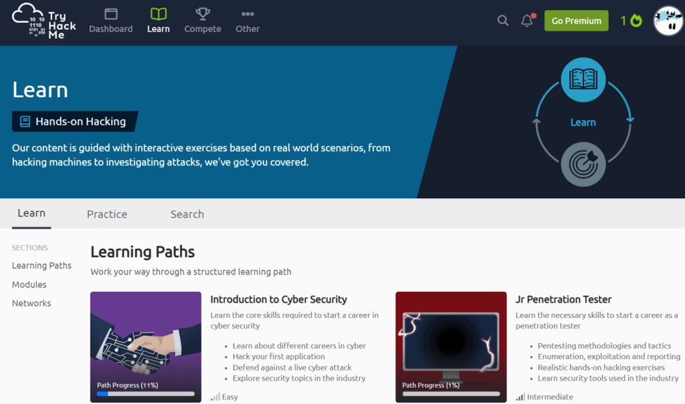
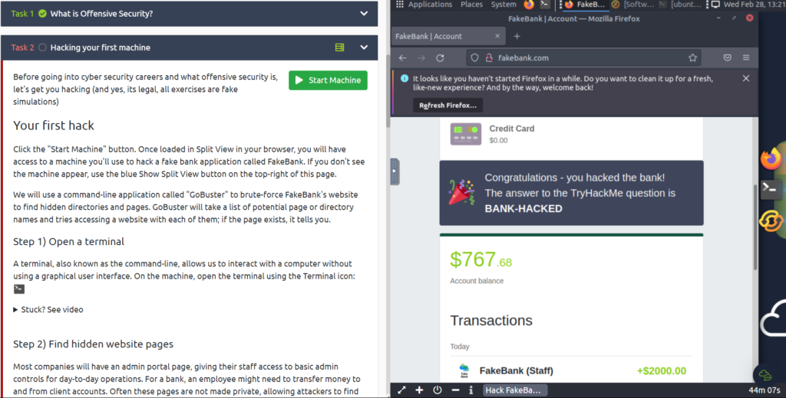

最近のニュースでセキュリティに関する漏洩がよく起きている気がします。

外部からの攻撃はもちろん内部からの漏洩も存在します。内部からの攻撃(人的ミス、スパイ等)は防ぐのは難しそうですが外部からの攻撃であれば大体は防ぐことができると思います。

クラウド等であればセキュリティに関するものもありますが、Webサイト等ではセキュリティに弱い部分もありそうな気はします。

セキュリティについて騒がれているのに私は全く知らなかったので少しは勉強しようかと思って"TryHackMe"というサイトで学習し始めました。[こちら](https://tryhackme.com/)から学べます。

ただ、こちらは全て英語になりますので翻訳しながら少しずつ進めています。学習はこんな感じです。やる内容と進行度、難易度が表示されています。

少し触ってみた内容では以下の画像みたいな感じです。

左の方ではハッキングの内容や手順を動画付きで説明して、右側では実行する環境を作って手順通りに作業していきます。

まだ始めたばっかりなのでわかっていないことや翻訳しながらで大変ですが、少しずつ学んでセキュリティ意識を高めていけたらと思います。

余談なんですが最近物理学が面白いと思い始めました。理系なので物理学に触れたことはありますが、あまり理解できていませんでした。量子力学はAIと同様発展途中ですが、もしかしたら数十年後には必要不可欠になりそうなので、そっちも知っておくとよさそうです。

今はAIみたいな実用段階ではないですが今のうちに知って、ビジネスにも活かせる段階になった時、有利に働き稼ぐ手段が増える！かもしれないですね（笑）ではでは
