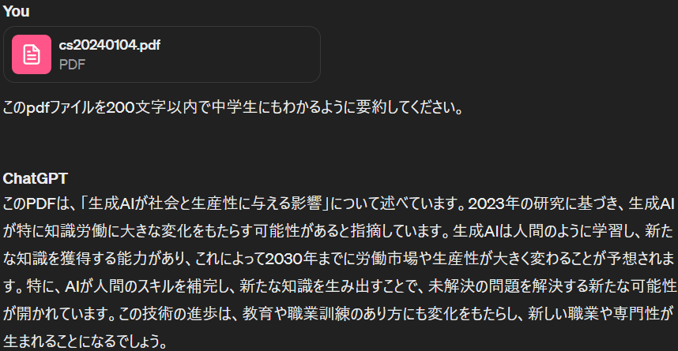
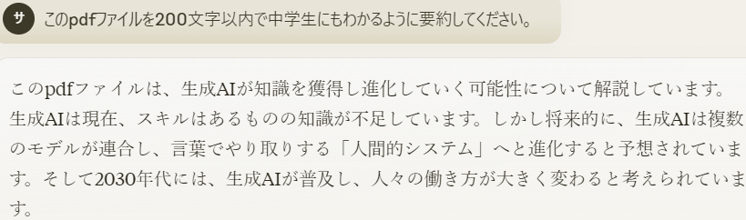

最近Inputが出来てないな～と思ったので色々調べてみたところ[この資料](https://www.nri.com/-/media/Corporate/jp/Files/PDF/knowledge/publication/chitekishisan/2024/01/cs20240104.pdf?la=ja-JP&hash=ED42BFF77381C8AD102B7792B56D2654AD7BC6D5)を見つけました。

ざっくり内容を話すと生成AIが労働へ及ぼす影響や知識の獲得、またその後の働き方について書かれています。せっかくなのでChat-GPTとClaudeにも要約してもらいました。

[こちら](https://www.nri.com/jp/knowledge/publication/cc/chitekishisan/lst/2024/01/04)ではもう少し細かく要約されたものがありますので興味があれば見てください。

現在の生成AIでもいろんな職業に影響を与えていますが、この資料では将来的に膨大な知識が求められる職業にも影響があるという話です。AIを含むエンジニア系全般はもちろん科学者や技術者も対象です。

今のプログラマーだったりデータサイエンティストも頼ったほうがよいものができやすいと思います。私もちょくちょくコードの書き方を聞いたりしてます。

そんな生成AIが所謂 "業務知識" を持つようになったら労働を代替してくれるという話ですね。

とはいえ全てを任せるわけじゃなく最後の確認は必要だと思いますが。

ただ、最後の確認であればPLレベルの人がいれば十分で、ただのプログラマーやデータサイエンティストは不要になるのは間違いなさそうです。

他に必要になるのは人間同士の調整をする役目の人ですかね？営業とかでしょうか

この話を聞くと今のままではいずれ職がなくなるんだなと考えられますね。数年位であれば大丈夫でしょうが、10年20年先もまだ働く気がするのでそうなると先を考えて行動しないといけないですね。

ブルーカラーの職業も最近はロボットが出てきているので代替されそうな気もしますが、人間の体のつくりは割と凄くて8時間動き続けても故障をしないものです。

ただ、ロボットなどの機械は部品が摩擦などで擦れてくるので長期的には向かないらしいです。そう考えたらまだ大丈夫な気はしますね。

一応金属も傷つけられたとしても時間をかけて回復するらしいのですが、動植物ほど早くなさそうです。そう考えるとブルーカラーがいいですかね？農業であれば食べ物も困らなさそうです。酪農もよさそうですがコストが高そうです。不動産とかもいいんですかね？気にはなってるんですが…

そんな感じで将来のことを考えさせられる資料でした。私は将来的に人間は全員ニートになってほしいと思ってるんですが生きてるうちに来ないですかね？ではでは
