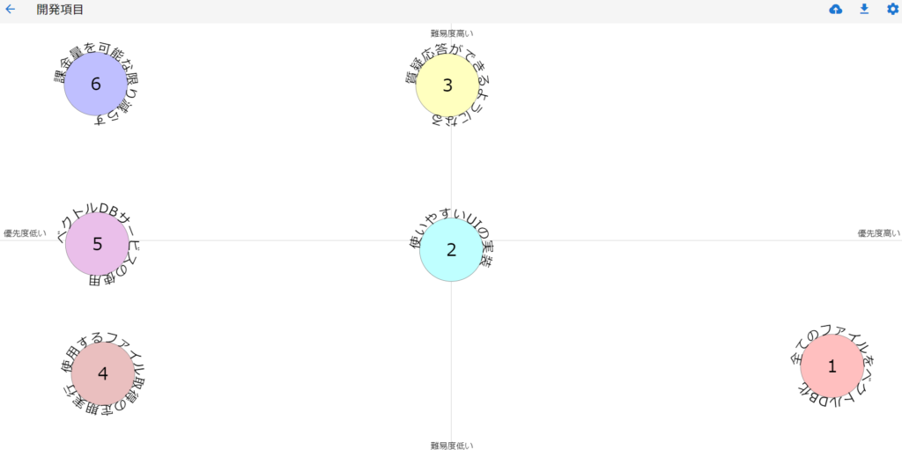

このpartで目標としていた基本形は作れたことになります。簡単な質問で"タイトル"と"内容"が返ってくるものになります。

前回やったのは

- 特殊文字の削除

- 大文字小文字統一

- ベクトル変換

今回行ったのは

- 検索クエリのベクトル化

- コサイン類似度の計算

になります。ベクトル化に関しては前回も行ったので同じものになります。

```
# これが検索用の文字列
QUERY = '保険金が欲しい'
# 検索用の文字列をベクトル化
query = openai.embeddings.create(
    model='text-embedding-3-large',
    input=QUERY
)
# ベクトル取得
query = query.data[0].embedding
```

ちなみにモデルの部分に関しては'text-embedding-3-large'の他に'text-embedding-3-small'もありますのでお好きな方を使ってください。精度はlargeのほうがいいですが料金は下がると思います。

次はコサイン類似度の計算になります。こちらは昔OpenAIでも提供されていたみたいですが、前のバージョンで提供されていたみたいなので他のもので代用します。簡単に自作できますがめんどくさい方はsklearnでも提供されているのでそちらを使ってください。

```
import numpy as np

def cosine_similarity(v1, v2):
    # ベクトルのドット積
    dot_product = np.dot(v1, v2)
    # ベクトルのノルム
    norm_v1 = np.linalg.norm(v1)
    norm_v2 = np.linalg.norm(v2)
    # コサイン類似度
    similarity = dot_product / (norm_v1 * norm_v2)
    return similarity

# 総当りで類似度を計算
results = map(
        lambda i: {
            'title': i['title'],
            'body': i['body'],
            # ここでクエリと各文章のコサイン類似度を計算
            'similarity': cosine_similarity(i['embedding'], query)
            },
        vector_database
)
# コサイン類似度で降順（大きい順）にソート
results = sorted(results, key=lambda i: i['similarity'], reverse=True)
```

これで関連するファイルと内容が取得できます。'result\[0\]'であれば最も関連するもの、'result\[-1\]'であれば関連しないものあるいは反対のものになります。反対かどうかはコサイン類似度の値が負の値になってるかで確認できます。

一応実行した結果は以下のようになります。内容は少し省きますがタイトルと計算した類似度の結果と中身ですね。

```
Query: 保険金が欲しい 
Rank: Title Similarity 
1: 035867_hanrei.pdf 0.3355961974521461 
2: 035876_hanrei.pdf 0.2526928055207382 
3: 035875_hanrei.pdf 0.23447020554097567 
4: 035877_hanrei.pdf 0.19826815015282948 
5: 035920_hanrei.pdf 0.12147105433067582 
====Best Doc==== 
title: 035867_hanrei.pdf 
body: 主文原判決を破棄する。本件を東京高等裁判所に差し戻す。理由上告代理人三澤隆行の上告受理申立て理由第３について１本件は，上告人が，その所有する車両の盗難により損害を被ったと主張して，保険会社である被上告人に対し，保険契約に基づき，車両保険金及び遅延損害金の支払を求める事案である。これに対し，被上告人は，上告人の保険金請求権が時効により消滅したと主張して争っている。２原審の確定した事実関係の概要等は，次のとおりである。1上告人は，被上告人との間で，平成１４年２月７日，被保険自動車をメルセデスベンツ，車両保険金額を６２５万円…
```

これで一通りやりたいことができると思います。もし実際に社内などで実装するならPDFだけでなくxlsx、word、powerpoint、txtなど様々なファイルをベクトル化しないといけないですし、そもそもセキュリティ的に問題ないかというハードルもあるかと思われます。

今回はopenaiのベクトルモデルを使用したので他のモデルか自身で作ってみるのもありかもしれないですね。大変そうですが…

一応まだこの続きを開発していこうと思います。他にやろうとしていることは

- すべてのファイルをベクトルデータベース化する

- WebアプリのようにUIを実装してみる

- ファイル取得だけでなく質疑応答までできるようにしたい(ファイルの中身+LLMの応答)

- 使用するファイル取得の定期実行

- どこかのサービスのベクトルデータベースを利用してみる

- なるべく課金量を減らす(ベクトル化や使用するLLMの変更)

パッと思い浮かぶだけでこんな感じですね。一応整理するためにポジショニングマップを使ってみました。



このポジショニングマップは汎用性が高いうえにシンプルなのでおススメです。ただこれは見にくいのでノートやホワイトボードなどで簡単なものを書くのがいいですね。

まだまだ道半ばですがやれることが増えるのは楽しいので頑張ってみようと思います！ではでは。
