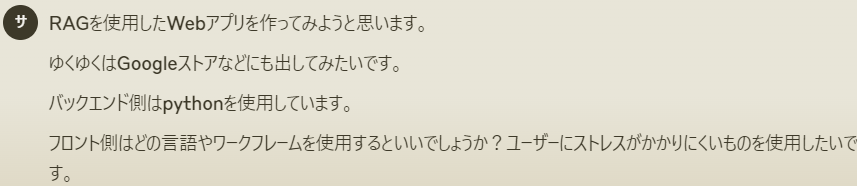
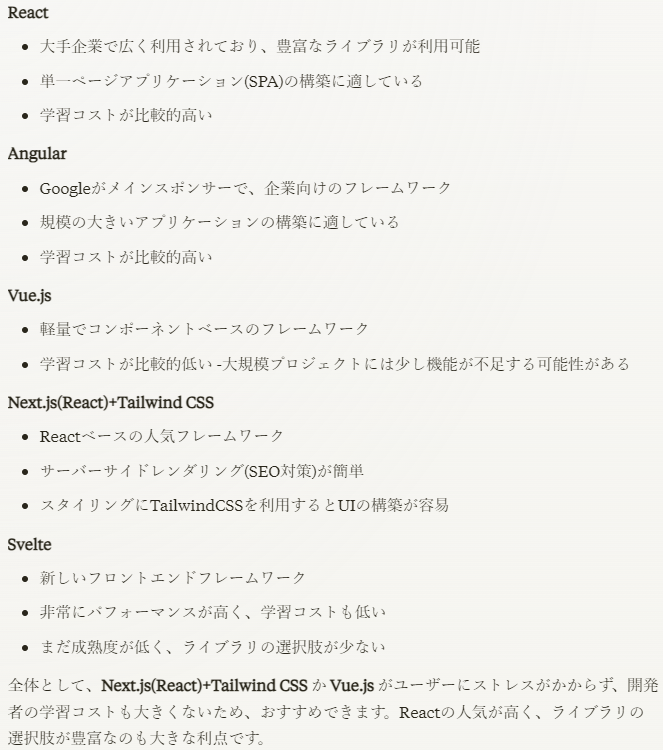
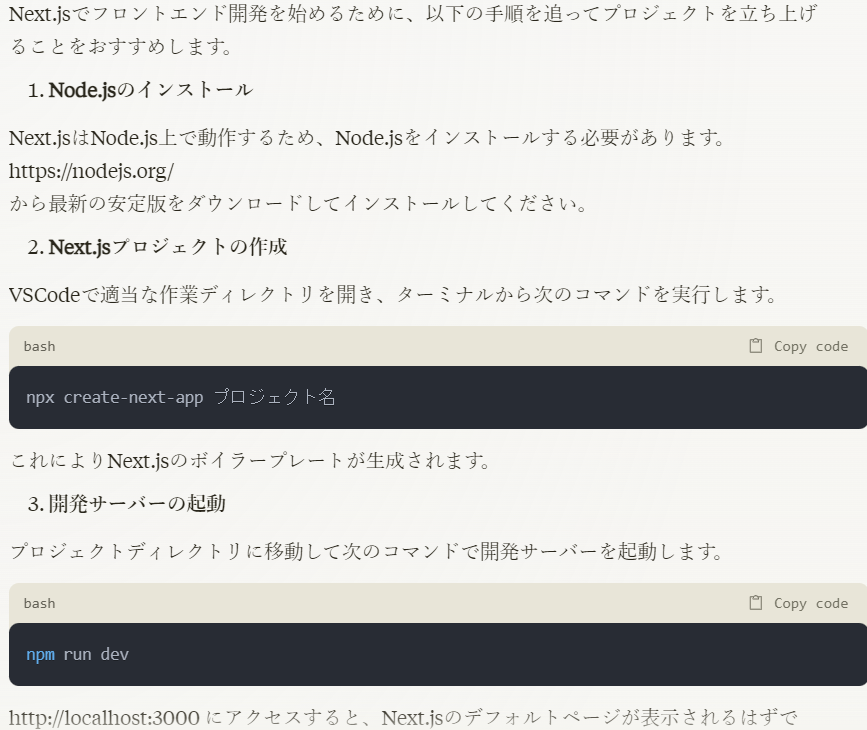
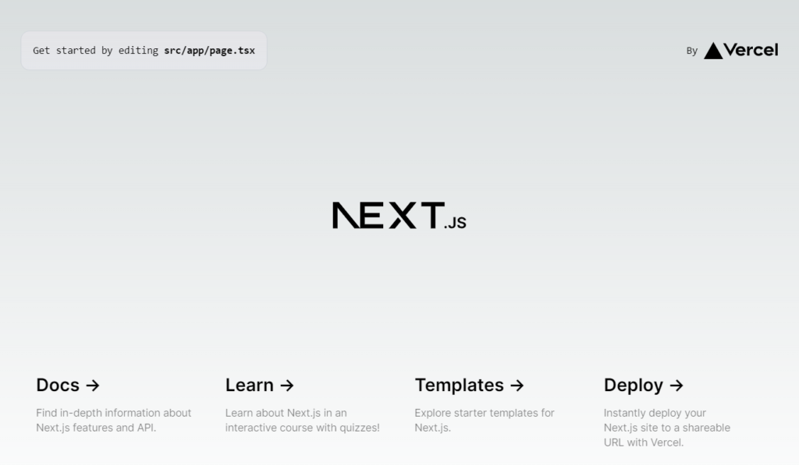

前回で一通り作りたいものが作れたのでこの先はWebアプリ化できないかな～？という緩い感じで進めていこうと思います。

前回行ったのは

- 検索クエリのベクトル化

- コサイン類似度の計算

今回行ったのは

- pdfファイルの全データベクトル化(途中で断念)

- Web画面の作成(一部)

pdfファイルのベクトル化に関しては前回やったのでそれをfor文で回してます。pdfは1つ1つ出力するようにして、後ほど全体を結合しようとしていました。

```
file_path_list = glob.glob(input_pdf+'/*.pdf')
for pdf_path in file_path_list:
    # 前回やったベクトル化
    ・
    ・
    ・
    # JSON形式でベクトルデータベースを保存
    with open(json_save_name, 'w', encoding='utf-8') as file:
        json.dump(vector_database, file, ensure_ascii=False, indent=4)
```

大体2500ファイルぐらいベクトル化したのですが、9$くらいになってました。残り12000ファイルほどあるので少し時間がかかるのと料金も計50$近くになりそうだったのでいったん中断しました。

別の作業としてWeb画面を作っていこうと思ったのでまずは技術の選定からですね。ここに関してはChat-GPTとClaude両方に聞いてみましたが、Claudeのほうを採用しました。こんな感じです。Googleストアと書いたんですが1ミリも予定はないです（笑）



返ってきた回答がこちら



ということでおすすめにしたがってNext.jsにしようと思います。ユーザーのストレスを考えるのは今じゃなくてもいいんですがせっかく自身のスキルにもつながるので選びました。

ちなみにおススメした理由とかわかってなかったのでいくつか聞いてみました。

- なぜNext.js(React)+Tailwind CSS や Vue.js はreactに比べてユーザーにストレスがかかりにくいのですか？

- 単一ページアプリケーション(SPA)とはどういうものでしょうか？

- Flash Of Unstyled Content(FOUC)や、SPAでよくみられるバンク画面の発生とはどういったものでしょうか？

- バックエンドではpythonを使用しているのでpythonフレームワークのflaskやdjangoという選択肢もあったと思いますが、なぜ候補から外れたのでしょうか？

- フロントエンドフレームワークとバックエンドWebフレームワークの違いは何ですか？

そこからいろいろ聞いていた結果、Next.jsとFlask(python)の組み合わせにしようと思います。Webについては全く分からなかったので色々聞いてみました。流れとしては以下の感じです。

1. Web画面から入力を受け取る

3. 画面から受け取った入力を引数としてpythonに渡す

5. pythonで引数をベクトル化しコサイン類似度の計算を行う

7. pdfファイルを全てベクトル化して結合したものを取得して、入力に類似しているファイルのタイトルと内容を取得する

9. 取得したタイトルと内容を画面に表示する

1と5がNext.js、2がflask、3と4がpythonという流れでやる予定で、今回は1をやっていきます。

というわけでまたClaudeに使い方を聞いて進めていきます。



これでインストールとプロジェクトの作成が完了して、デフォルトの画面が表示されるようになりました。こんな感じです。



私はvscodeを使っているのですがターミナルからうまく実行できてないので少し調べる必要がありますね。それから"AppData/Roaming"の中にnpmというファイルが必要なのですが、インストールで作成されなかったので手動で作成したりと少し導入で手間取ってしまいました。

今回はここまでにして次回は簡単な画面を作成していこうと思います。恐らく稚拙な画面になりそうですがまずは作るとこらからです。ではでは。
