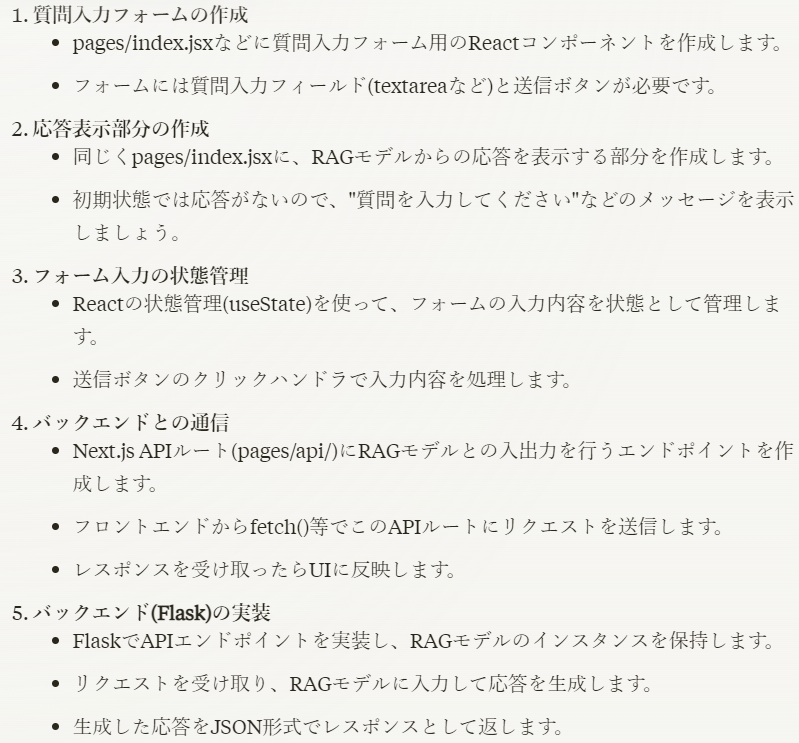
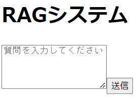
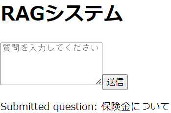
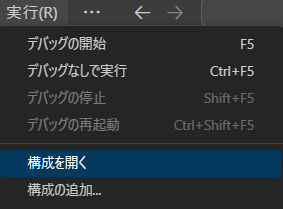

さて前回までやったこととしては

- 全データのベクトル化(途中で断念)

- 画面の作成(Next.jsのインストールと起動)

というところまでやってみました。今回は

- 質疑応答画面の作成

というところまでやってみます。Next.jsは初めて触るので進みが遅々としていますがご了承ください。

さてインストールするタイミングでこのようなことを聞かれました。

- Would you like to use TypeScript? » No / Yes

- Would you like to use ESLint? » No / Yes

- Would you like to use `src/` directory? » No / Yes

他にもいくつか聞かれたので一応Claudeにどんな意味があって導入することのメリットデメリットを聞きながら質問に答えました。大体Yesにしましたが…

さて前回の画面表示まで行けたのでここからどう作業を進めればいいのかわかってなかったので聞いてみました。



ということで質疑応答画面を作っていきます。本格的なデザインは気にせずに簡易的なものを作っていきます。

と言ってもからコード書くのは大変ですし、学ぶのにも時間がかかるので今回もClaudeに手伝ってもらおうと思います。それで最初書いてもらったコードがこちら

page.jsx

```
import QuestionForm from './components/QuestionForm';

const HomePage = () => {
  return (
    <div>
      <h1>RAGシステム</h1>
      <QuestionForm />
    </div>
  )
}

export default HomePage;
```

QuestionForm.jsx

```
import { useState } from 'react';

const QuestionForm = () => {
  const [question, setQuestion] = useState('');

  const handleSubmit = (e) => {
    e.preventDefault();
    // 質問をサブミットする処理をここに書く
    console.log('Submitted question:', question);
    setQuestion('');
  }

  return (
    <form onSubmit={handleSubmit}>
      <textarea
        value={question}
        onChange={(e) => setQuestion(e.target.value)}
        placeholder="質問を入力してください"
        rows={5}
      />
      <button type="submit">送信</button>
    </form>
  )
}

export default QuestionForm;
```

ちなみに上記の書いてる内容はよくわかってないのでこっちはChat-GPTに解説してもらってました。新卒の時の研修で書いたHTMLやJSを思い出します。

ただこれで実行した時下記のようなエラーが出ました。

Error:  
× You're importing a component that needs useState. It only works in a Client Component but none of its parents are marked with "use client", so they're Server Components by default.  
│ Learn more: https://nextjs.org/docs/getting-started/react-essentials  
│  
│  
╭─\[C:…\\view\\src\\app\\components\\QuestionForm.jsx:1:1\]  
1 │ import { useState } from 'react';  
· ────────  
2 │  
3 │ const QuestionForm = () => {  
3 │ const \[question, setQuestion\] = useState('');

このエラーはどうやらNext.js 13で追加された機能によるものでClient Componentとして書いていたのですが、構造としてはServer Componentになっているのでこのようなエラーが出ました。

というわけで修正してもらったものがこちらになります。

page.jsx

```
'use client' // この行を追加

import QuestionForm from './components/QuestionForm';
import { useState } from 'react';

export default function Home() {
  const [question, setQuestion] = useState('');

  const handleSubmit = (submittedQuestion) => {
    setQuestion(submittedQuestion);
    console.log('Submitted question:', submittedQuestion);
  }

  return (
    <div>
      <h1>RAGシステム</h1>
      <QuestionForm onSubmit={handleSubmit} />
      {question && <p>Submitted question: {question}</p>}
    </div>
  )
}
```

QuestionForm.jsx

```
'use client' // この行は削除

export default function QuestionForm({ onSubmit }) {
  const handleSubmit = (e) => {
    e.preventDefault();
    const question = e.target.elements.question.value;
    onSubmit(question);
    e.target.reset();
  }

  return (
    <form onSubmit={handleSubmit}>
      <textarea
        name="question"
        placeholder="質問を入力してください"
        rows={5}
      />
      <button type="submit">送信</button>
    </form>
  )
}
```

実行した結果がこんな画面になります。





簡易的ではありますがそれっぽい画面はできました！一旦これで良しとして次は画面とpythonの受け渡しを行う部分の実装をしていこうと思います。

余談ですが前回軽く触ったvscodeからデバッグを起動できないという問題ですが、解決できました。

[こちら](https://nextjs-ja-translation-docs.vercel.app/docs/advanced-features/debugging)のサイトでいいデバッグ設定があったので是非やってみてください！

実行タブの"構成を開く"または"構成の追加"を開いていただいて上記サイトのlaunch.jsonを記述してください。



```
}
    "version": "0.2.0",
    "configurations": [
      {
        "name": "Next.js: debug server-side",
        "type": "node-terminal",
        "request": "launch",
        "command": "npm run dev"
      },
      {
        "name": "Next.js: debug client-side",
        "type": "chrome",
        "request": "launch",
        "url": "http://localhost:3000"
      },
      {
        "name": "Next.js: debug full stack",
        "type": "node-terminal",
        "request": "launch",
        "command": "npm run dev",
        "serverReadyAction": {
          "pattern": "started server on .+, url: (https?://.+)",
          "uriFormat": "%s",
          "action": "debugWithChrome"
        }
      }
    ]
  }
```

まだまだですが緩く頑張っていきます！ではでは。
