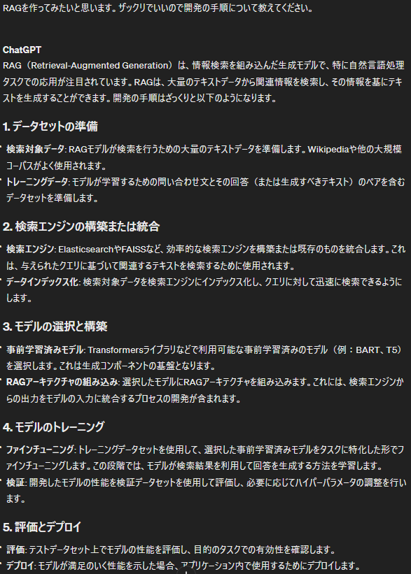
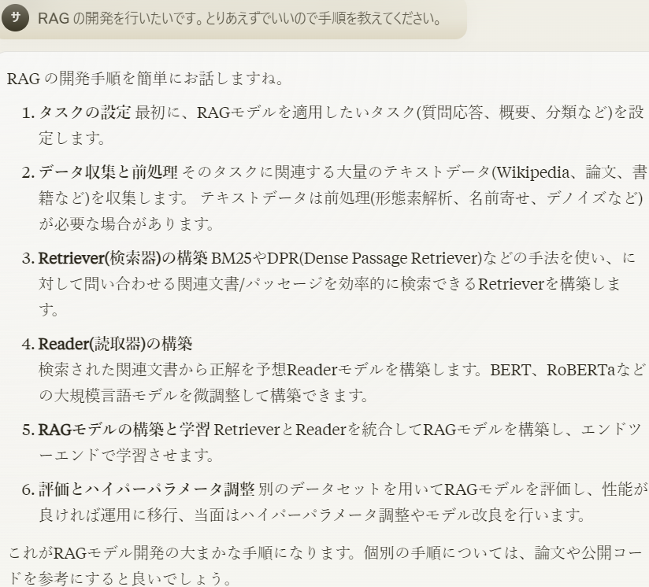
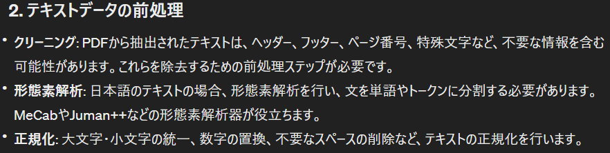
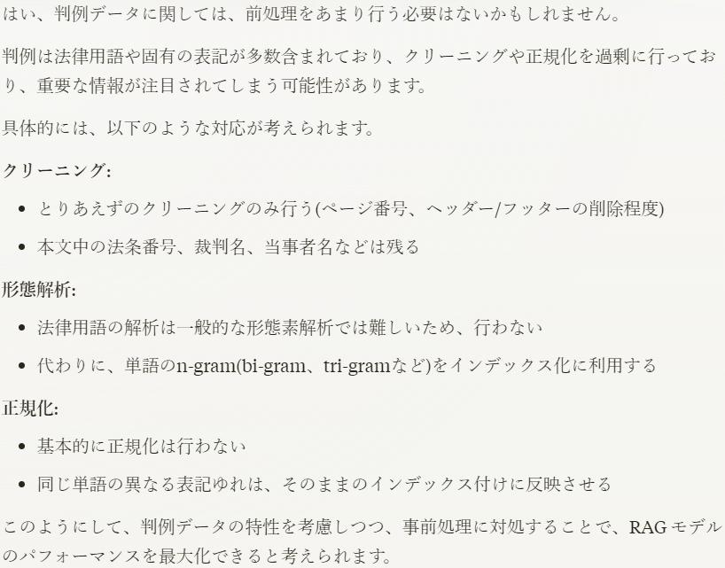
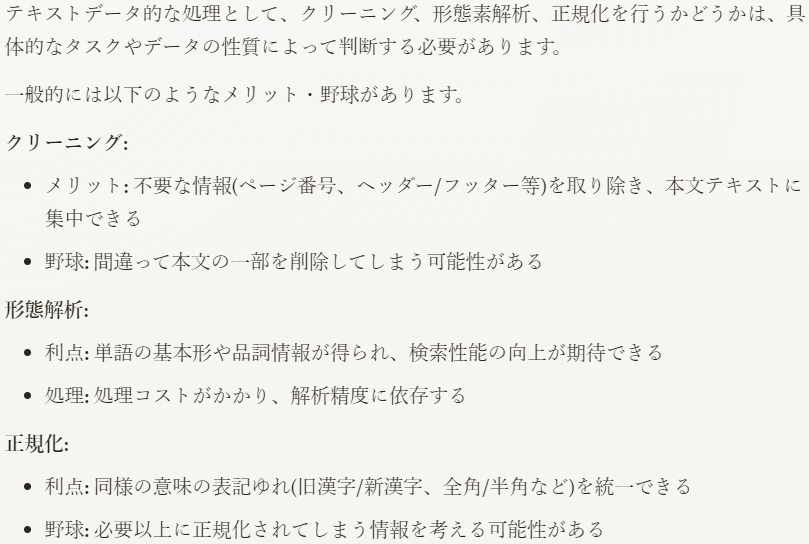

大規模言語モデルが出てきてChat-GPTやGemini、Claudeが出てきましたが、"ハルシネーション"は中々解決できない問題ですね。人間でも勘違いや嘘を堂々と言うことはあるのでどっこいどっこいですが、なるべくなら減らしていきたいですね。

そこで出てくるのが"RAG"になります。RAG（Retrieval-Augmented Generation）は、情報検索を組み込んだ生成モデルで、特に自然言語処理タスクでの応用が注目されています。RAGは、大量のテキストデータから関連情報を検索し、その情報を基に関連するテキストを生成します。

というわけで開発手順をChat-GPTとClaudeに聞いてみました。





大体似たような回答になりました。

1. データセットの準備と前処理

3. 検索エンジンの構築

5. 学習済みモデルの構築

7. RAGモデルの構築(検索エンジンと学習済みモデルを統合)

9. モデルのトレーニング

11. モデルの評価と調整

という流れになりました。

データセットの準備のほうはできています。私は昔作った[こちら](https://github.com/sai-nome/precedent_conjugation)を再利用しようと思いますが、論文やら書籍をダウンロードしたほうが楽だと思います。

というわけでデータセットの準備が終わったので今度は前処理をしていこうと思います。私のデータはPDFになってるので文字を抽出して、不要な文字を削除するところまでやります。

ということでgithubには登録しましたが一部コードをピックアップして

```
# PDFPage.create_pages()を使用してページのリストを取得し、その長さを数える
page_count = len(list(PDFPage.create_pages(document)))

# スペース、タブ、改行を削除
text = text.replace(' ', '').replace('\t', '').replace('\n', '')
# 正規表現を使って他の空白文字を削除
text = re.sub(r'\s+', '', text)
```

簡単ではありますがページ番号の削除と空白削除を行いましたので、とりあえず次のステップに進もうと思います。何をしたらいいかChat-GPTとClaudeに聞いてみました。





Claude曰く形態素解析や正規化は行わなくてもいいみたいなので、一旦インデックスの作成をやっていこうと思います。ただ色々試行錯誤してやった方が精度が上がりそうであればやろうと思います。

ところでClaudeに聞いたときこのような解答が返ってきたことがありました。野球って何でしょうか？（笑）



ということで引き続き開発を進めていこうと思います。この先llamaindeを使うのか他のAPIを使うのか、ベクトルデータベースはどうするのか調べながら考えてみようと思います。ではでは
