土日にKaggleをやらずゲームをやってたのですが早期アクセスが開始されたOmega Crafterで遊んでました。ストアページは[こちら](https://store.steampowered.com/app/2262080/Omega_Crafter/?l=japanese)

ちなみに前回は2面のボスを倒し切れず終わりました。武器の強化は十分だったのですがレベルアップが恐らく足らずクリアできませんでした。ただ世界の端までは見てきました。

今回アーリーアクセスで異なった点や遊んだ内容を少し話していこうかと思います。

そもそもOmega Crafterというゲームの流れとしては

- クラフトとレベルアップ

- ダンジョン？でボスを出現させるアイテムの入手

- ボスを倒して世界レベルの上限を開放する

- 世界レベルを上げる

※世界レベルは"データアナライザー"というものに不要になったアイテム等を与えることでレベルを上げることができます。

という流れになります。ストーリーはほぼないのでひたすらクラフトとアイテムの収集を繰り返していきます。NPCも確認できる範囲ではいません。

そして他のクラフトゲームと異なる点は"グラミー"という存在です。グラミーは指示を出すことで自動で作業を行ってくれます。クラフトはもちろん、農業、鉱業、林業もこなせます。そしてグラミーへの指示がローコードで指示をするというのが特徴です。

このゲームはクラフトゲーム×プログラミング(ローコード)を組み合わせたところが特徴でゲームをやりつつプログラミングを知ることができます。勉強できるとまではいかないかもですが、こんな感じで作って動いてるんだなと知ることはできると思います。

長くなりましたがここまでがOmega Crafterの内容になります。

次に異なった点ですね。世界レベルの上限や敵の種類、クラフトの種類とかは増えていますね。この辺は想定通りかと思います。

これ以外だとスキルが増えていますね。主人公はジャンプ系と落下時ダメ軽減、視野拡大、グラミーは回復系が増えています。このジャンプ攻撃は強く普通の攻撃よりも大きなダメージを与えられます。炎上などの追加攻撃は入らないみたいですが。敵の攻撃を回避しつつ攻撃となることもあります

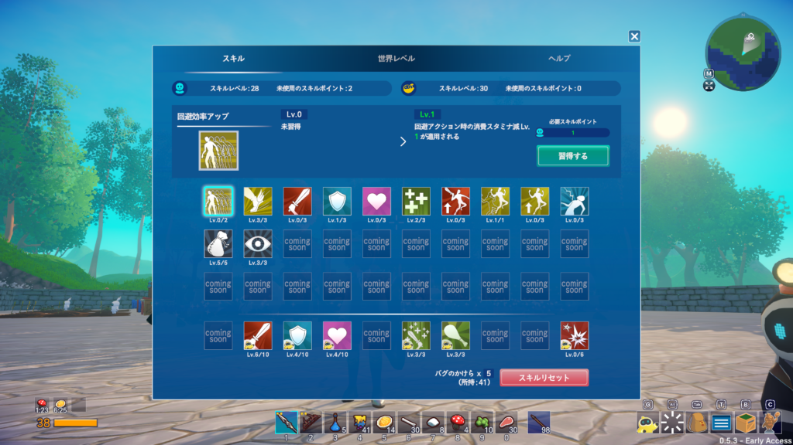

あとは無限レベルアップが多分できなくなったと思います。1つ目のボスを出すための場所に敵をリポップさせるオブジェクトがあるのですが、以前はここでガードしつつグラミーが倒すことで永遠とレベルを上げることができました。今回は気づいたらなくなってたので、できなくなったんだと思います。

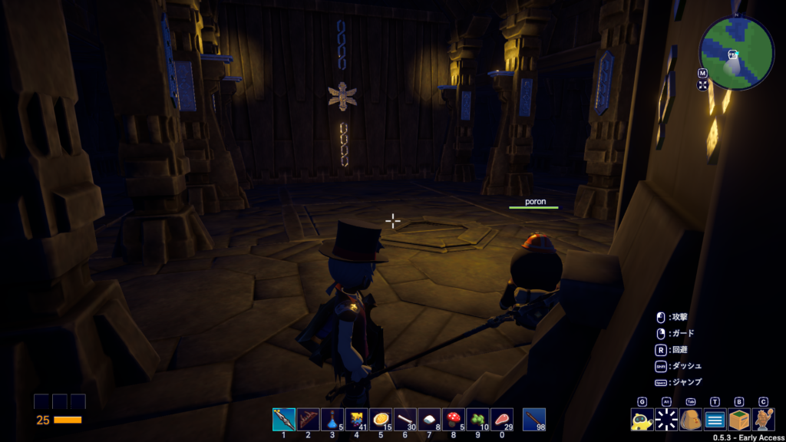

私が気づいたのはこのあたりですね。

次はざっくり攻略について書こうと思います。

攻略としては"探索"と"討伐"と"自動化"のパートに分かれると思います。

探索についてはとにかく敵を倒してレベルアップしつつクラフト用のアイテムを集めていく必要があると思います。それからダンジョン内の宝箱からアイテムを拾うことですね。スキルの割り振りはこんな感じ

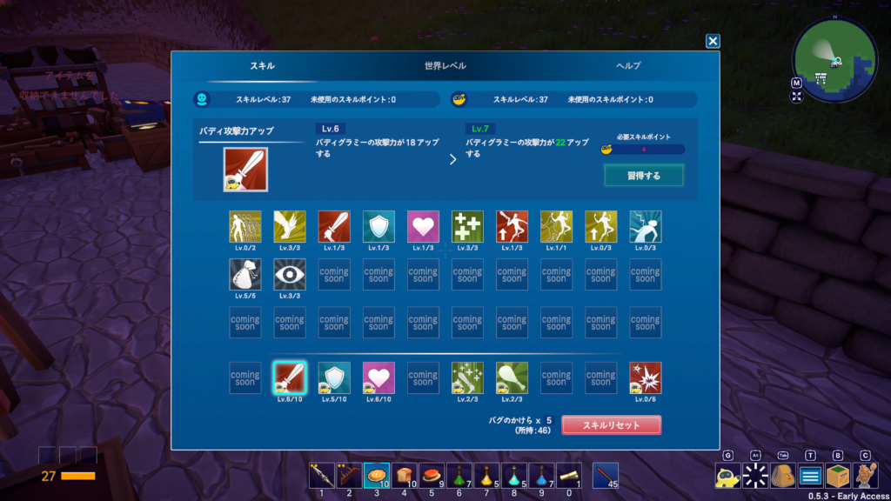

とにかくダッシュ時のスタミナ減少は必須ですね。後は2段ジャンプとインベントリ、視野拡大はどちらでも大丈夫です。それから攻撃よりは防御に振ったほうがいいですね。やられると経験値がなくなってアイテムもその場に落としちゃうので回収が面倒です。

食事は必須になります。体力とスタミナが増えます。場合によっては攻撃や防御にもバフがかかります。オレンジが体力で水色がスタミナです。

<figure>

<figure>

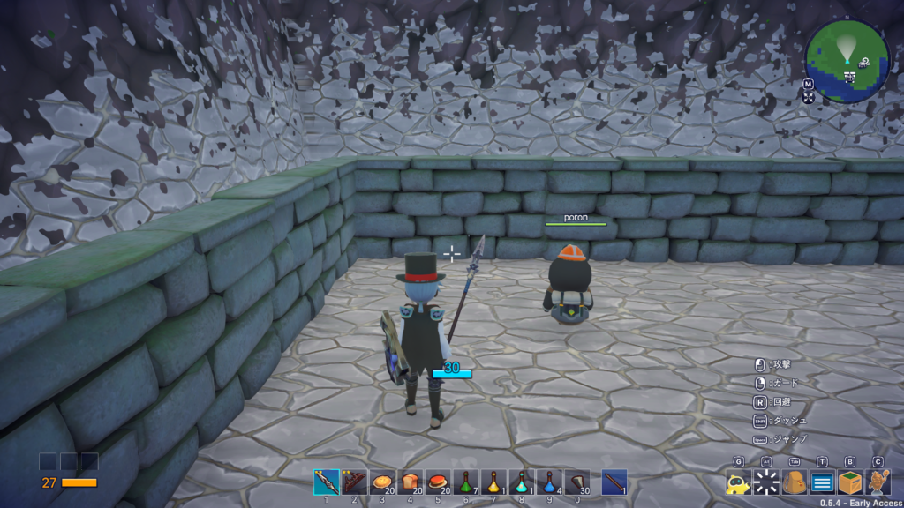

<figcaption>

食事前

</figcaption>

</figure>

<figure>

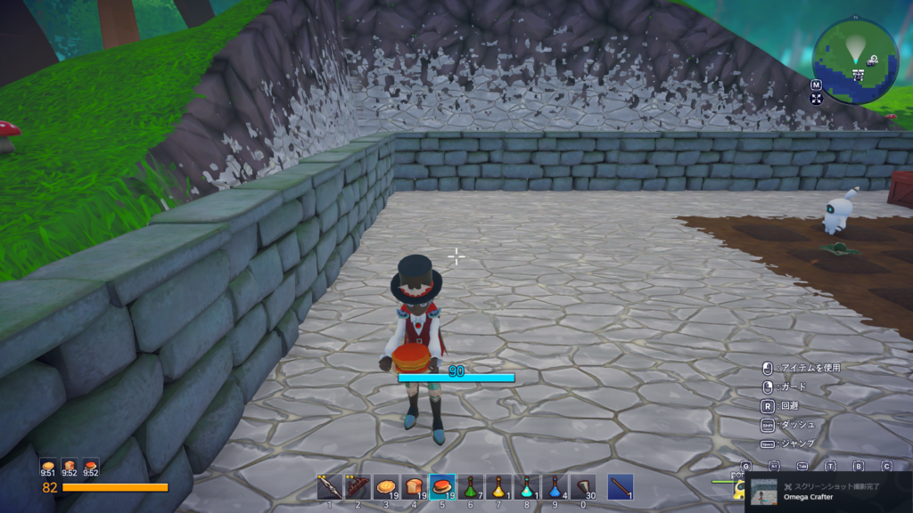

<figcaption>

食事後

</figcaption>

</figure>

</figure>

後は覚える必要はないですが崖を上るときにジャンプをすると早く登れます。スタミナには気を付けないと落ちてやられてしまいます。

次は討伐ですね。

レベルアップもある程度して装備が十分に整ったらボスに挑みましょう！必要なのはダンジョン内にある"封印"というアイテムです。1面は2つ、2面は3つ、3面は4つ必要になります。

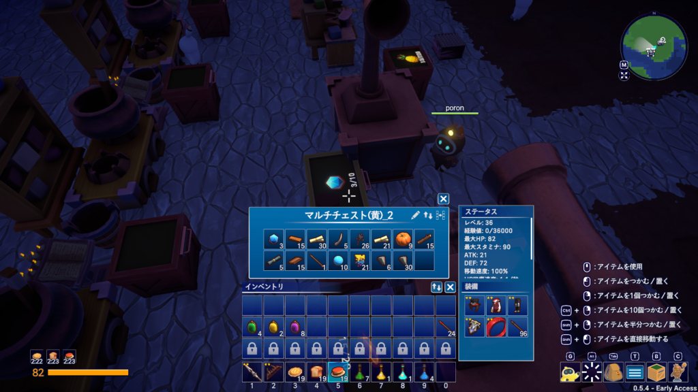

それからボスは1度雑魚を召喚してきます。グラミーが生きていれば楽ですが、いない場合は苦戦を強いられます。弓矢を装備して避けつつ、各個撃破すると楽になるとは思います。3面では"爆発矢"があるので持っていくことをおススメします。

また大型ボスの特徴として顔面が弱点になります。その時におススメになるのがジャンプ攻撃になります。とは言えリスキーなので腕に自信がなければヒット＆スウェイが基本戦法になります。

さらに腕に自信があれば2段ジャンプ攻撃で頭上に乗ることはできます。乗ってる間多少攻撃は来ないので矢で打ち放題になります。通常攻撃は当たらないこともありますし、ジャンプ攻撃だと落ちることもあります。

こちらも探索と同様食事は必須です。走って時間を稼ぎつつ回復したり、ローリングで攻撃を避けることもありますので体力とスタミナは欲しいですね。余裕があればバフがかかる食べ物もおすすめです。

ちなみに3面まで行けばエンチャント機能が解放されて装備に特殊効果を付与できます。体力や攻撃力、体力、スタミナなど効果は色々です。ぜひ試してみてください。

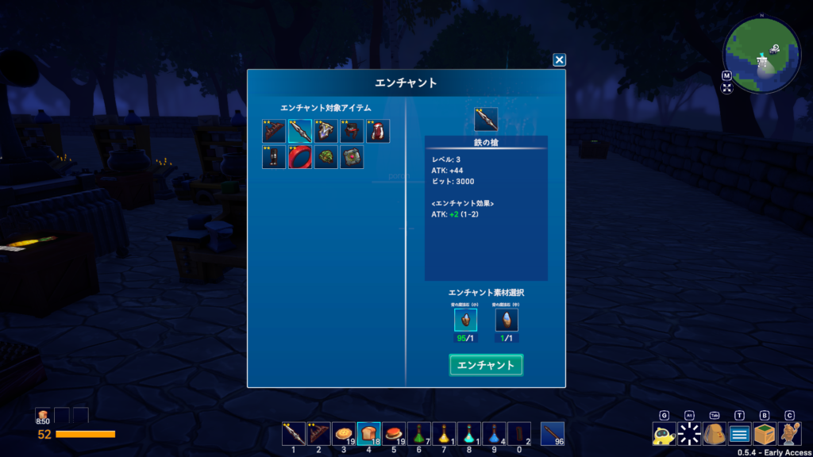

最後に自動化についてです。

このゲームの特徴でもあるローコードを使った作業の自動化ですが、基本的には標準搭載してあるものをえ十分対応できます。

クラフトはもちろん、農業、鉱業、林業等も基本搭載しています。では自分で作るのはどんな時か？自動化した時よくこんな場面に遭遇します。左は全く拾われないアイテム達、右は必要なところに別の素材が入ってるアイテム

<figure>

<figure>

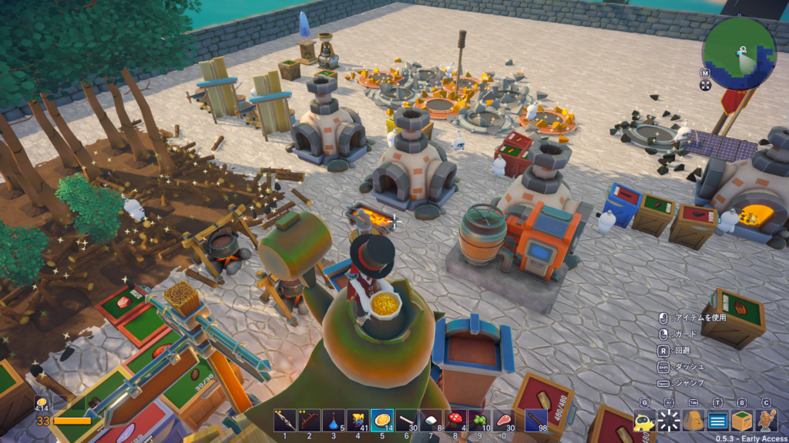

<figcaption>

全く拾われないアイテム

</figcaption>

</figure>

<figure>

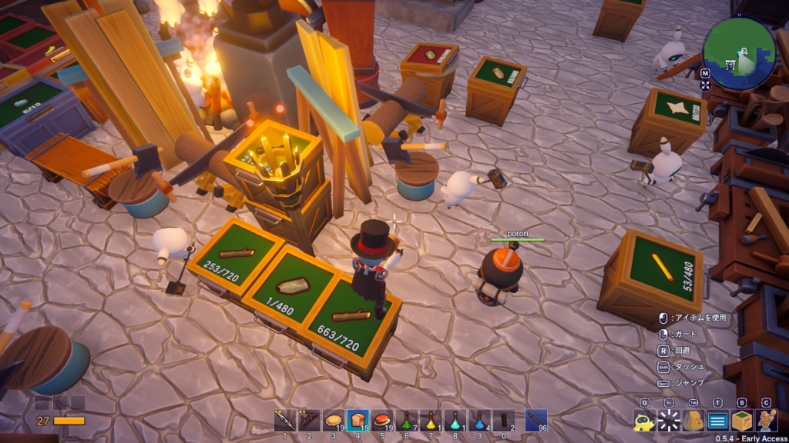

<figcaption>

間違えて入れられた樹皮

</figcaption>

</figure>

</figure>

こんな状況がたびたび発生します。左の方は気づいたらこうなっており、止めた後こっちで回収してきれいにして、クラフトしたらまた足りなくなって、再度作業を指示したら散らかるの無限ループに入ったりします。

右はクラフトで必要な素材が別のクラフトで作られるものだとして、その素材が足りなくなったりすると発生することがあります。何を言ってるかわからないかと思いますが、とりあえずクラフトで使用するコンテナを共通にしてればいずれ起きます。

このような状況を避けるためにはコンテナの中の数をカウントすると避けられます。マルチコンテナでなければコンテナの中のアイテムの種類は1つだけですので、"コンテナの中身が1以上であれば作業を行う"という判定を入れてあげるとよいです。

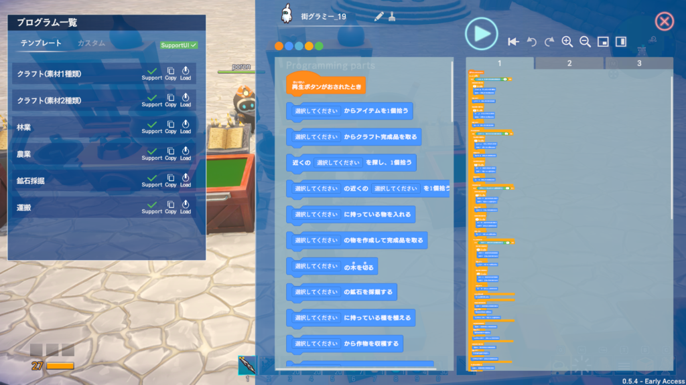

上図では長いですがやってることはコンテナの中がなくなったら別の加工台で作業をする、その加工台に必要な素材のコンテナの中がなくなったら別の加工台で作業をする、といった処理を流しています。

まあ作るのも大変だし、処理はシンプルであるほどいいものだと思ってるので色々やりすぎるのはおすすめできません。グラミーもたくさん召喚できますのでグラミーごとに必要なクラフトや作業を任せるのが一番だと思います。

それでも散らかったりするのが嫌であればコンテナの中の数で判定を行うとだいぶストレスは減るかと思います。他にも面白そうな処理はあるのでぜひいろいろ試してみるのもいいと思います。

最後に今の私の状況ですが表のボスは全て倒し切り世界レベルも全て解放し終わってます。そこでまだ9割という話に繋がるのですが、残ってる作業としてはマップ埋めとバトルシミュレーターになります。マップ埋めはまだまだですね。探索の仕方が良く性格に出ています（笑）

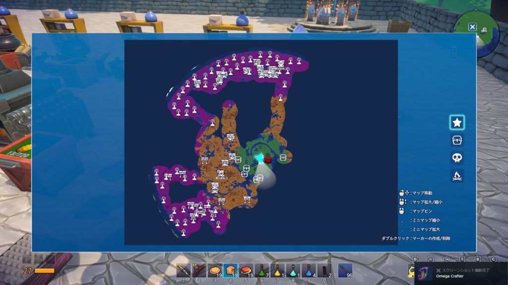

後はバトルシミュレーターですね。こちらは3面のボスと同等以上の強さを持ったボスと戦えます。敵はこれまでのボスの強さが強化されたもので戦闘パターンはほぼ同じです。アイテムに必要な素材は難しくないですが、段階的に倒す必要があります。

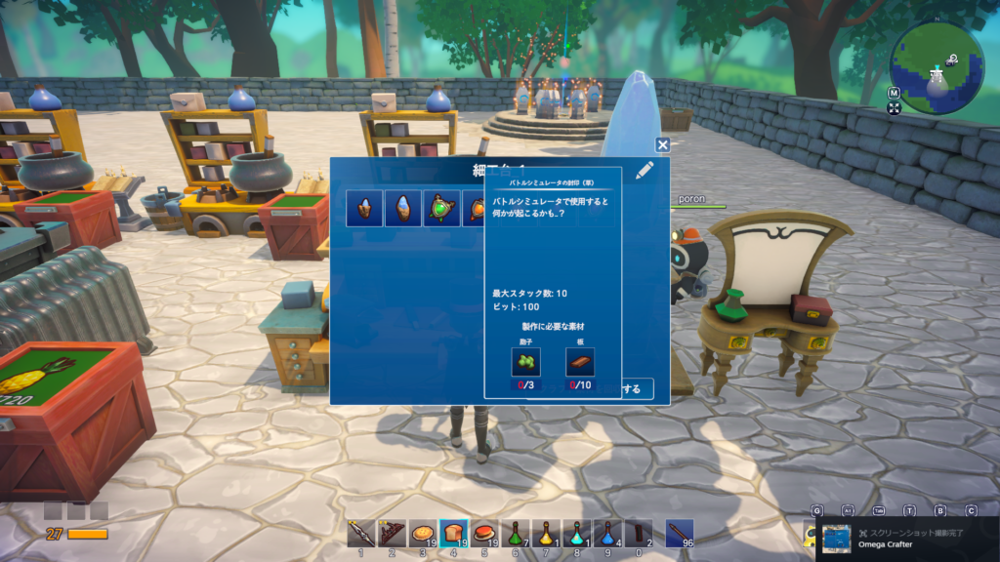

またもらえる素材や装備もあってこちらを強化していくことをできます。強化するにはボスを倒した時にもらえる素材が必要なので少し大変そうです…

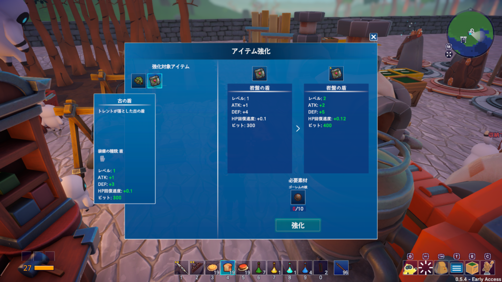

以上で大体のことは説明できたと思います。作業の自動化を試行錯誤できますし、興味があればぜひやってみてください。ストーリーはないのでそこの面白さはないですが…

それでは別のゲームで、ではでは。
