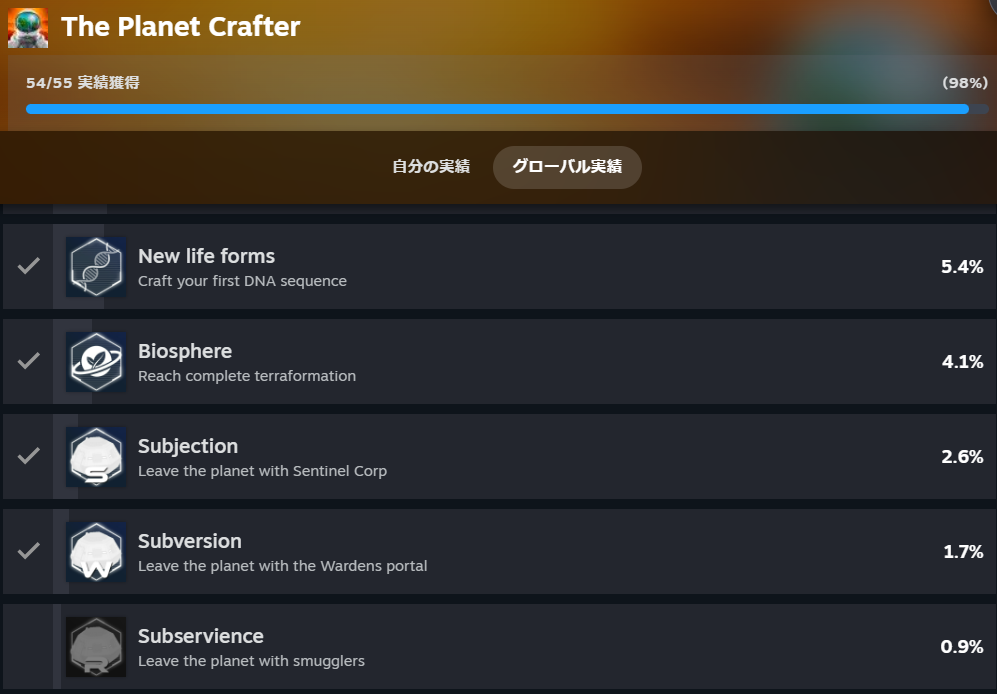
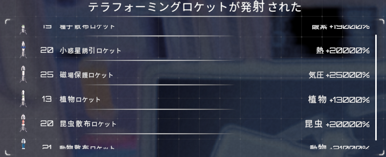

"The Planet Crafter"ほぼ完クリしました！実績はこんな感じ

1つだけ終わってないのですがこれは時間がかかる上に少し面倒なのでまだ終わってないです。ただ自動化できているのでいずれ終わります。

このゲームはタイトルの通り惑星をテラフォーミングしていくゲームになります。最初は水も緑もない中で3つの要素である"熱"、"気圧"、"酸素"を増やしていきます。これは酸素がない中各地を探検し、いろんな素材を集めて建築を進めていけば大丈夫です。

その他に"バイオマス"という要素を増やしていきます。これはテラフォーミングを進めていくと水と緑が少しづつ増えていきます。その時に新しく増える項目でもう少し細かく分類すると

- 植物

- 昆虫

- 動物

が出てきます。緑が増えると植物が増え昆虫を増やす建築物が作れるようになり、昆虫を増やすと動物を増やす建築物を作れるようになります。この6つの増やしていくことでテラフォーミングが進んでいきます。

ある程度建築物を作ったらロケットでブーストするのもありだと思います。私はめんどくさがりなので最終的にロケット20発ずつ打ってました（笑）

このゲームのエンディングは3種類あります。条件はテラフォーミングした後、"ある物"を破壊してこの惑星から脱出することになります。"ある物"はネタバレになりますのでここでは控えます。エンディングは

1. センチネル社に戻る

3. とある民のもとに向かう

5. 密航者となる

です。1は上記を行った後抽出プラットフォームを作れば到達できます。2は鍵を10個集めてコンテナに入れると到達できます。3が大変で50万ものトークンと5個のソーラークォーツが必要になります。

2に行く場合はエンディングである物破壊するのですが、その時に必要な鍵を10個集めれば問題ありません。ただ、ヒントは別の場所にあり滝の下の水没した道の先にあります。石板に書かれているので気になった方は読んでください。

3に行くのが最も大変でトークン集めがしんどいです。トークンはアイテムの売買かポータルを作って難破船で取得することができます。アイテムの売買は高くても1個80トークンなので6250個必要になります(遠い目)…

他の方法で難破船に行くというのもあるのですが、探索するのが面倒で道に迷いやすい構造になってますので嫌になります。ただもらえるトークンは1回のポータルで5000くらい稼ぐことができます。運が良ければ1万ですかね？

トークンだけあればいいので荷物も拾わず食べ物と水さえあれば何とでもなるかもしれないですね。貧乏性なのでついつい荷物を拾っちゃうのですが…

またポータルを開くにはある程度クォーツが必要になりますのでそれも集めたほうがよさそうですね。めんどくささを考えた結果、私は80トークンを自動生成→自動売買するようなシステムにして放置することにしました。寝てる間にも勝手にやってくれますし。

3に行くヒントはエンディングの爆破をする場所である場所の座標が書かれた台座があります。そこに行くと"パラダイス"という実績がもらえます。その後に1のエンディング条件を満たすとメールが届きます。そこにトークンやクォーツの話が出ています。

少し時間がかかりましたがほぼ終わらせることができました。なかなか手ごたえがありましたが楽しかったです。今度は違うゲームをやってみようと思いますが、そろそろ開発を再開しようと思います。ではでは。
