自身のWebサイトを立ち上げてから大体半年が経過しそうなところです。

自身のアウトプットを行う機会を作りたいなと思ってなんとなくで立ち上げたのですが、まだ続けられているので継続する力は一応あるんだなと思ってます。まあ毎日書いてるわけではないですし、書いてるジャンルもバラバラなので微妙なラインですが…

さて今回は自身のサイトのパフォーマンス向上したり、閲覧数を増やしたりする試みをしてみようということで少し調べてみました。

使用したツールは以下の2つになります。

- Lighthouse

- axe DevTools

1つ目のLighthouseについてはGoogleの開発者ツールにデフォルトで導入されています。

使い方の流れとしては

1. 自身のサイトにアクセスする

3. 開発者ツールを開く

5. Lighthouseタブでレポートの生成を行う

開発者ツールの開き方はいくつかありますが、右上のオーバーフローメニューのアイコンをクリックして"その他のツール" > "デベロッパーツール"から開くことができます。

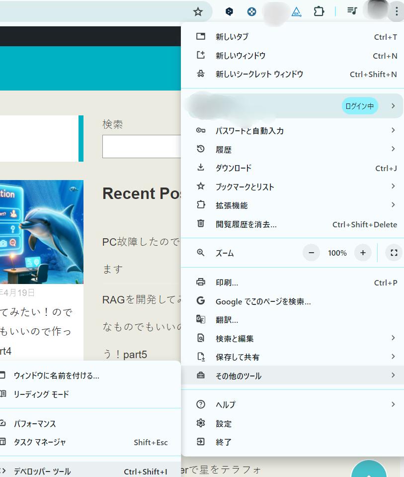

もしくは自身のサイトを右クリックして"検証"をクリックしていただいても開けます。

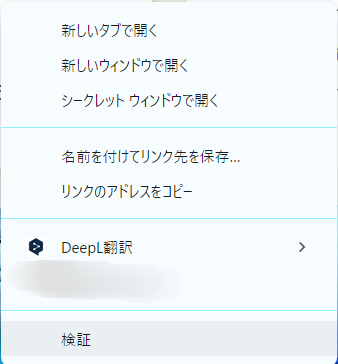

見た結果がこちらになります。メインのページを見てみました。

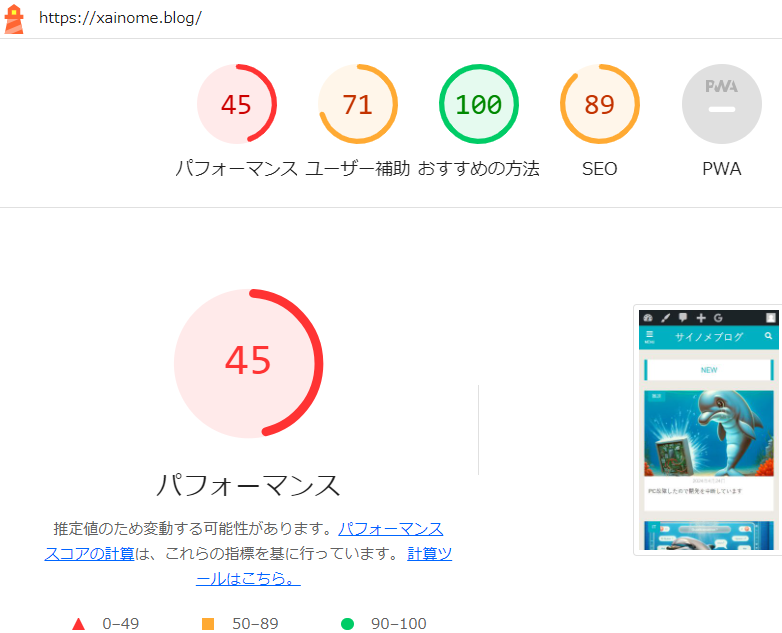

パフォーマンスが圧倒的に低く、ユーザー補助とSEOがちょい低めですね。下にスクロールすると計測した結果が見れます。改善どころは多いですね。

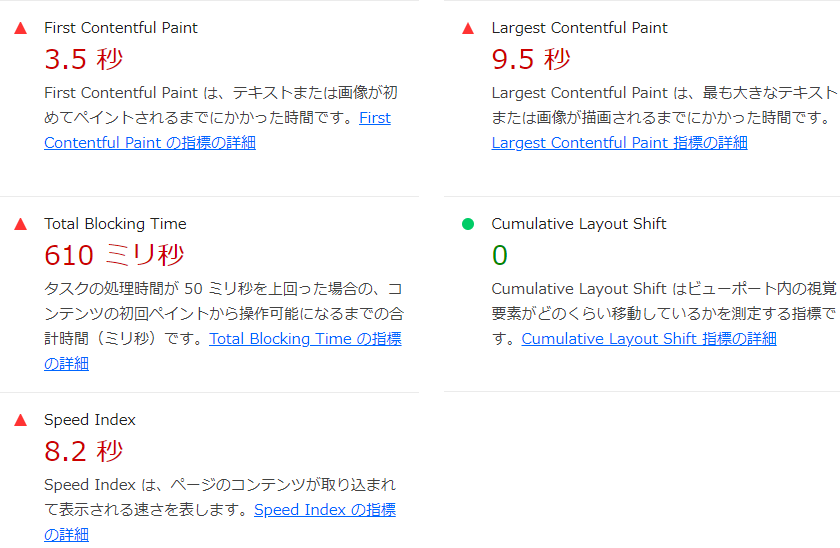

とはいえ私はサイトの運営とか詳しくないのでChat-GPTに改善策を聞いてみました。

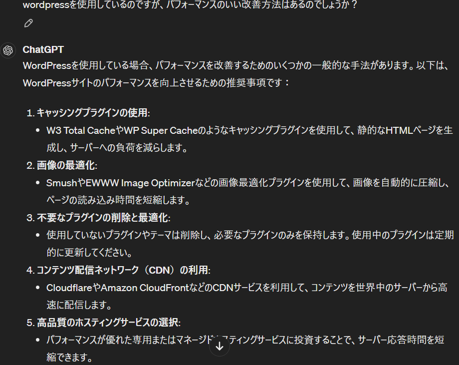

改善方法はいろいろありそうなので少し調べつつプラグインの導入とか考えようと思います。

2つ目のaxe DevToolsはウェブアクセシビリティのチェックに使えます。[こちら](https://chromewebstore.google.com/detail/axe-devtools-web-accessib/lhdoppojpmngadmnindnejefpokejbdd)の拡張機能から利用することができます。

Web Content Accessibility Guidelines (WCAG) などの国際的なアクセシビリティ基準に照らし合わせて評価する、低ければ低いほどよいというものになります。

使い方としてはLighthouseと同様開発者ツールを開いた後、タブからaxe DevToolsを選択します。

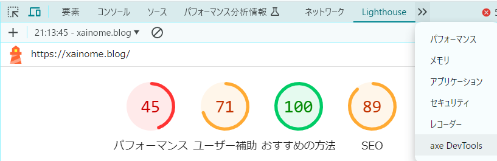

タブから開いたら"Scan ALL of my page"を実行します。

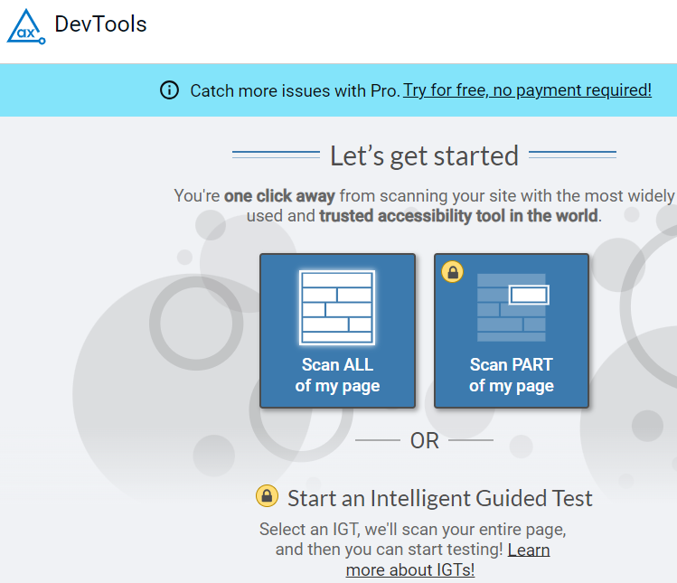

実行した結果がこちらです。問題がどのくらい存在するか、どのくらい重要かが表示されます。スクロールすると原因も見ることができます。

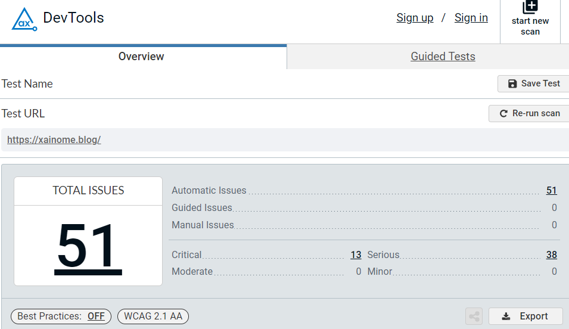

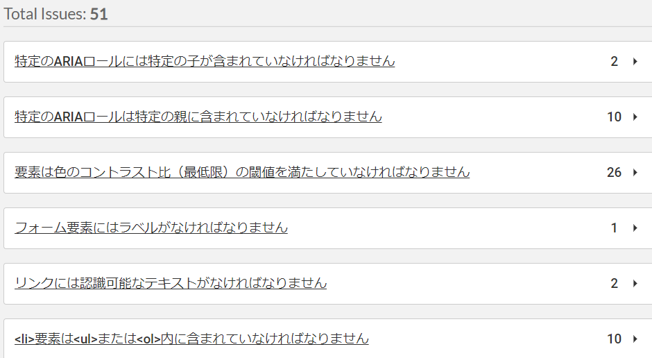

こちらの解消法もChat-GPTにも聞いてみました。こちらはプラグインで何とかなるものではなさそうなので少しづつ調べて解消していこうと思います。

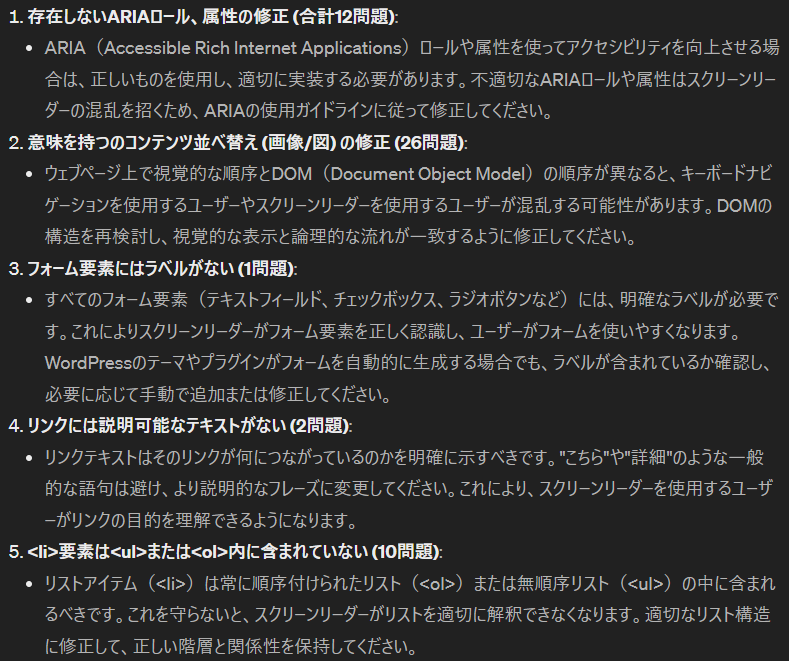

さていろいろ調査をしてみましたが、1つ気になることがありました。それはある2つの画像です。

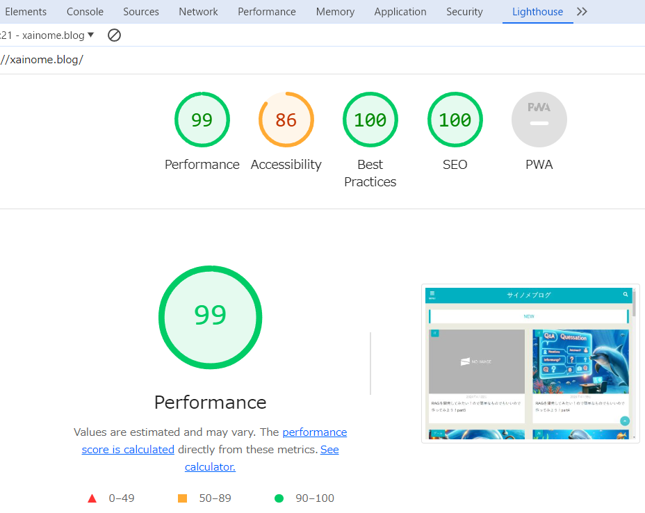

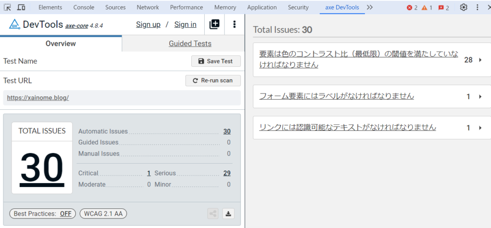

これは同じページで同様の調査をした結果です。どうやら説明の時に利用した画像よりもいいスコアが出ています。ただ、何も解消はしていません。ではなぜこんなことが起きるのでしょうか？

2つ目の画像では別のPCで確認したものになります。どうやらPCによっても差が出るみたいです。また、実は初めに出した画像も動画を見ながら調査した結果になります。動画を見なければもう少しパフォーマンスがよくなります。

つまり、人によって環境が異なるのでパフォーマンスも変化します。ここで考えるべきことは低スペックな環境に合わせてパフォーマンスを良くした方がいいという点です。

いくら自身のPCで確認してパフォーマンスが良くなっても、古いスペックのスマホやPCで遅いとなればそのサイトに訪れようという気は失せると考えられます。

本当は低スペックのスマホやPCを使って確認したほうがよさそうですが、難しそうなので動画だったり良い画質のゲームを開いたまま確認するのも手ですかね？あるいは激安の低スペックスマホを買ってwi-fiにつないで確認するのもありそうですね。

とはいえここまでする人はいなさそうですが、本気でやるとここまでやることになりそうです。よく言われるのが阿部寛さんのHPですね。爆速で有名ですが、あれを同じように作れたらすごいんだろうなと思います。

ということで少しづつサイトの改善を考えていこう話でした。ではでは。
