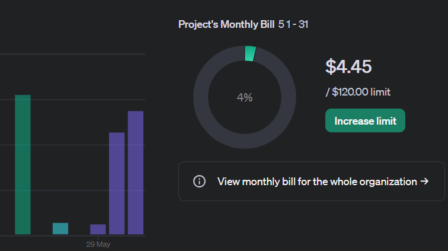

## RAG開発の一旦終了と成果物の共有

とりあえず目標としていたものが完成したので開発はこれで一旦終わりとします。

完成して動いたものを動画にして3つほどはります。

### 動画の内容とモデルの読み込み

ファイル数別に動画を取ってみました。ベクトルモデルの読み込みと読み込ませるテキスト量によって時間が変わってきます。

モデルの読み込みとかはOpenAIに変わったぐらいで大きく変更したところはないですが一部お見せします。

```
    def generate_response(self, prompt: str, max_tokens: int = 3000) -> str:
        try:
            client = OpenAI(
                # This is the default and can be omitted
                api_key=os.environ.get("OPENAI_API_KEY"),
            )

            response = client.chat.completions.create(
                model="gpt-4o",  # 使用するモデルを指定
                messages=[
                    {"role": "system", "content": "You are a helpful assistant."},
                    {"role": "user", "content": prompt}
                ],
                max_tokens=max_tokens,
                n=1,
                stop=None,
                temperature=0.7
            )
            print(response)
            return response.choices[0].message.content
        except Exception as e:
            logging.error(f"エラーが発生しました: {e}")
            return "申し訳ありませんが、応答を生成する際にエラーが発生しました。"
```

この辺をGPT-4oに聞いてみたのですが最近のコードを提示してくれなかったので、chatを作成する部分はgit-hubを参考に作りました。[こちら](https://github.com/openai/openai-python)です。

### Flaskの設定と変更点

それからFlaskの部分ですね。

```
@app.route('/process', methods=['POST'])
def process_question():
    file_count = data.get('file_count')
    try:
        instruction = '要約してください'
        results = cos_sim_calc.main(query, file_count, instruction)
```

ファイル数をフロント側から受け取る部分とプロンプトで指示する部分を受け渡すように変更しました。本当はフロント部分で実装すべきだったのですが、簡単に作るコンセプトなのでいいかと。

### フロントエンドの改良

最後がフロント部分ですね。

```
  const [fileCount, setFileCount] = useState(1); // 初期値を1に設定

      body: JSON.stringify({ query: question, file_count: fileCount }) // file_countを追加

        <select
          name="fileCount"
          id="fileCount"
          value={fileCount}
          onChange={(e) => setFileCount(Number(e.target.value))} // 文字列を数値に変換
        >
          {[1, 2, 3, 4, 5].map(count => (
            <option key={count} value={count}>{count}</option>
          ))}
        </select>
              <button onClick={() => toggleVisibility(index)}>
                {result.visible ? '▼' : '▶'}
              </button>
```

ファイル数の選択と内容の省略ボタンを追加しました。内容はたくさん出てもみないことが多そうだなということで省略しました。

### RAG開発の振り返り

ここまで頑張って作ったんですが、Difyのほうが高性能で早いんですよね…

とは言え素人でも生成AIに頼ればそれなりのものを自前で作れるし、PCの性能次第ではローカルモデルで使えるので実質無料でできることがわかりました。まあDifyもモデル次第で無料になるんですけど。

### RAGとベクトルデータベースの考察

RAGは色んなとこで研究されていますが、ベクトルデータベースの軽量化、テキストの圧縮、ベクトルの精度改善など様々です。私が作ったのも精度がいいとは言えないですし、関連はしててもドンピシャとは言えないと思うので、使う際は注意が必要ですね。

### RAG開発費用のまとめ

最後に、使用した料金はこんな感じですね。直近だとこれくらいです。Difyの部分を除外すると3$くらい。他の時期でもやったので合計15$くらいは試してたと思います。ベクトル化でも多少使用したので。



### 次のステップと今後の計画

どっかの記事でGitの記事を作ったのですが改めてリンクを貼っておきます。[こちら](https://github.com/sai-nome/precedent_conjugation)です。

今更ですがホーム画面や各記事にgit-hubやXのリンクを張れるようにHPを改修してみたいですね。

自動で投稿できる機能もあると思うので少し調べてHPの改善もやっていこうとは思います。

次の開発ももう考えているので随時更新していきたいですね。ではでは。
