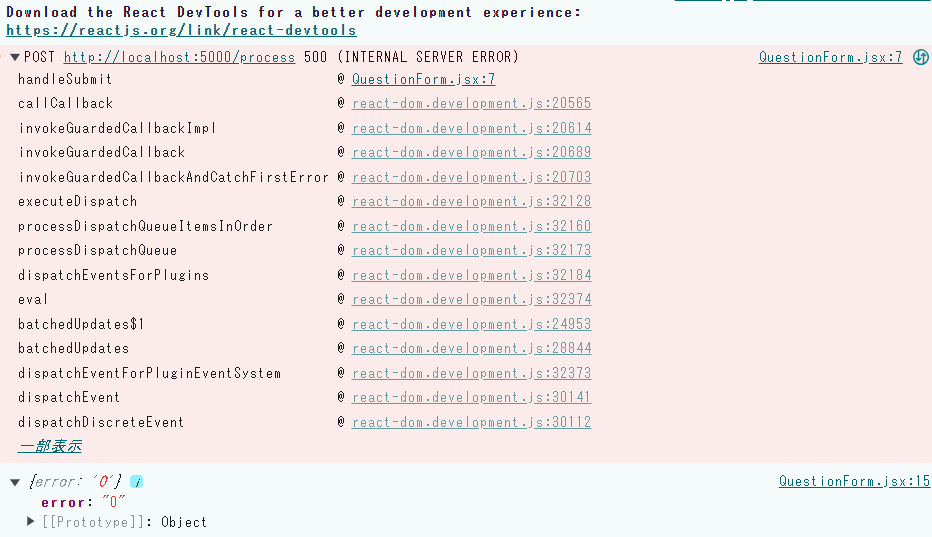

PCが故障したという話をしたのですが、コンセントから電源が抜けてたというオチでした。

なのでRAGの開発を再開しました！

前回開発した部分は

- 質疑応答画面の作成

今回開発する部分は

- 画面(Next.js)から送られるデータを受け取るエンドポイントをFlaskに設定

- ベクトル化するプログラムをクラス化

Flaskも触ったことないのでChat-GPTに質問しながら触ってました。一旦中身は以下の内容にしています。

```
from flask import Flask, request, jsonify
from flask_cors import CORS
import pdf_to_model
import logging

logging.basicConfig(level=logging.DEBUG)
app = Flask(__name__)
CORS(app)

@app.route('/process', methods=['POST'])
def process_question():
    data = request.get_json()
    query = data.get('query')
    logging.debug("Received query: %s", query)
    try:
        vector = pdf_to_model.PDFToVector()
        result = vector.main(query)
        # 結果を JSON 形式で返す
        return jsonify(result[0])
        # return jsonify({'result': 'Processed result of ' + query})
    except Exception as e:
        logging.error("Error processing query: %s", str(e))
        return jsonify({'error': str(e)}), 500

if __name__ == "__main__":
    app.run(debug=True)
```

ログの設定はする必要はないですが、まだ開発段階なので一旦設定しています。それから"CORS(app)"ですね。少し調べたのですが異なるオリジン間でのリソース共有を可能にするために必要な設定みたいです。そもそも同一のオリジンとは以下の3つが同じであることが条件です。

- プロトコル(http、https)

- ドメイン(〇〇.com, localhost等)

- ポート番号(80, 3000, 5000等)

フロントエンドとバックエンドはポート番号が基本的には異なるので同一のオリジンとは見なされません。そこで"CORS(app)"を設定することでデータのやり取りを可能にします。

フロントエンドとバックエンドのポート番号が異なるのはセキュリティによるものだと聞きましたが、詳しいことはわかってないのでもう少し調べてみます。

それから"@app.route('/process', methods=\['POST'\])"ではPOSTでデータを受け取っています。確か"GET"もあったと思いますが、この辺はどう違うのかまだわかってないのでここも調査が必要そうです。

あとはローカルで実行する際、http://localhost:5000というURLになるかと思いますが後ろに"/process"を付けています。つける必要あるかはわかってないですが…

後はデータの受け取りとpythonの実行、返ってきた値を画面に渡すように設定しています。ただ、まだエラーとかが出ているので修正が必要です。以下のような感じですね。



それからクラス化ですね。上記のプログラムでも呼び出していますがクラス化をしないとインスタンスの作成ができないのでクラス化を行います。

とは言っても今まで関数だけで処理してきたものをクラスで囲んで、実行している部分をmain関数で囲んだだけになります。以下のような感じですね。

```
class PDFToVector:

    def get_page_count(self, pdf_path: str) -> int:
        """
        ページ数取得
        Args
            pdf_path (str): ファイルパス
        Return
            page_count (int): ページ数
        """

    ・
    ・
    ・

    def main(self, question):
        # 現在のディレクトリ取得
        dirname = os.getcwd()
        # pdf出力用フォルダ
        output_pdf = dirname + '/output_pdf'

    ・
    ・
    ・

        # コサイン類似度で降順（大きい順）にソート
        results = sorted(results, key=lambda i: i['similarity'], reverse=True)
        return {results[0]}

    if __name__ == "__main__":
        main()
```

作業はここまでになります。次で目標の2つ目が完成になるかと思います。画面から文字列を入力して送信されたデータをベクトル化、コサイン類似度が高いタイトルと内容を画面に表示させるところまでが目標です。

次の目標もありますが今回はここまで。ではでは。
