## Difyを使ったLLM開発アプリの導入と設定

LLM開発アプリの選択肢として**Dify**があると聞いたので触ってみました。

最後にはこんな感じになるといいなと思ったものになります。

### Dify\_クラウド版とローカル版の比較

やり方は2つあります。クラウド版とローカル版の2つなります。お好きな方を使っていただければと思いますが、ローカル版のほうが個人的にはいいかと思います。

### クラウド版の導入方法

クラウド版に関しては登録するだけで使えます。画面はこんな感じ

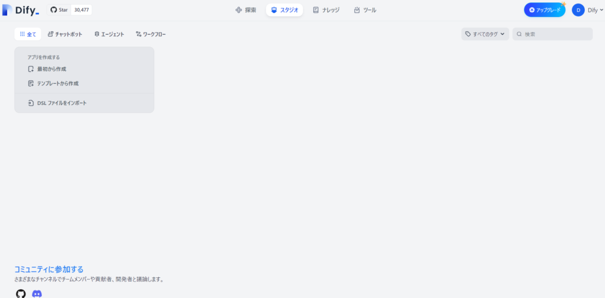

### ローカル版の導入手順

ローカル版はGItとDockerが必要になるのでない人はインストールから始めましょう

### Difyのインストールとセットアップ

DockerはDocker Desktopを導入しておけば大丈夫です。docker composeも入っているので一緒にインストールされます。

ではコマンドプロンプトを開いて開発する場所にgit cloneでdifyをインストールします。コマンドはこちら

```
git clone https://github.com/langgenius/dify.git
```

### Docker Composeの起動

インストールが出来たらdocker compseを起動させるのでフォルダを移動します。開発場所にdifyをインストールできたと思うのでdockerフォルダに移動します。

```
cd docker
```

フォルダの移動が出来たらdocker composeの起動をします。起動できるとこんな感じ

```
docker compose up -d
```

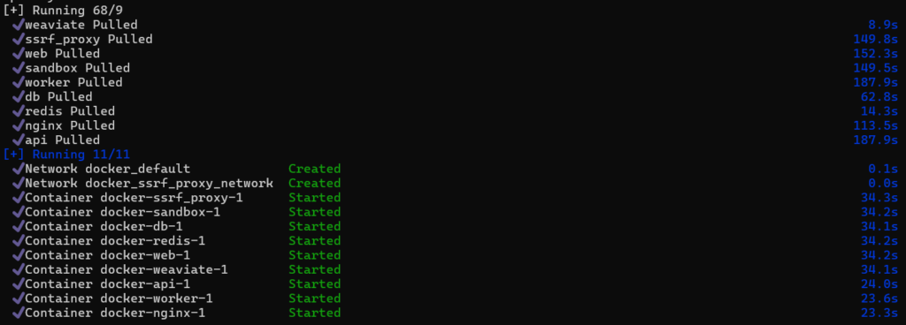

### アプリ作成の開始

起動したらURLを入力して画面を表示させてみましょう！クラウド版とそこまで変わりません。

URL: [http://localhost/apps](http://localhost/apps)

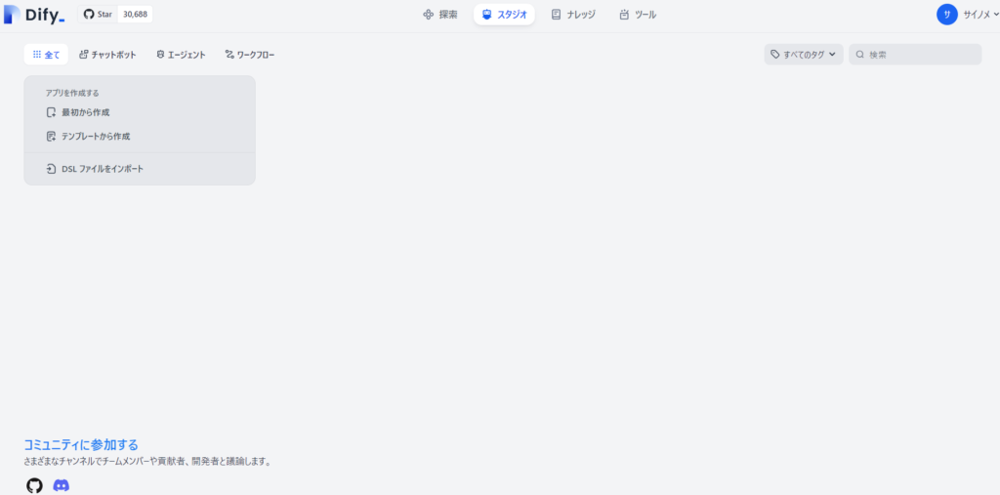

テンプレートから作成でもいいですが、私は最初から作成してみました。こんな感じ。今回はチャットボットを作ってみますので適当に名前を付けて作成します。

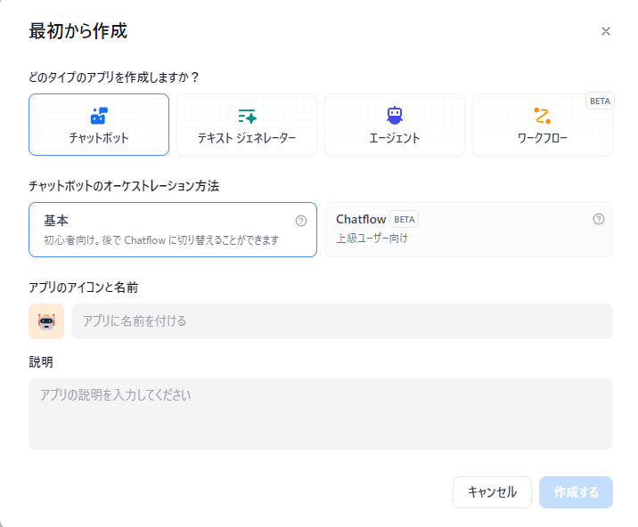

### LLMモデルの設定

アプリが出来たらこんな感じの画面ができます。今回はgptモデルを使っていこうと思います。

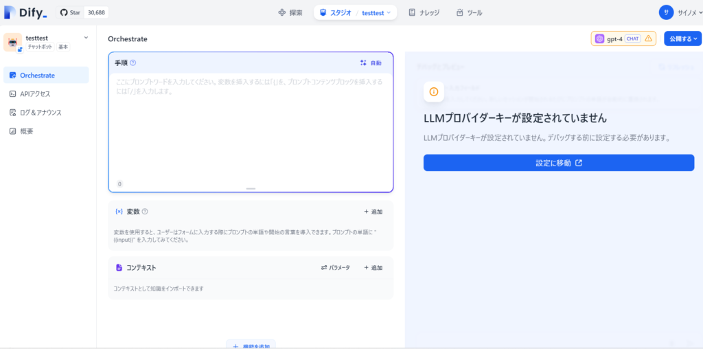

設定から色んなLLMモデルを選ぶことができます。今回はOpenAIを使用するのでOpenAIのAPI-KEYをセットしました。他に使いたいモデルがあればそのAPI-KEYを設定すれば使えます。

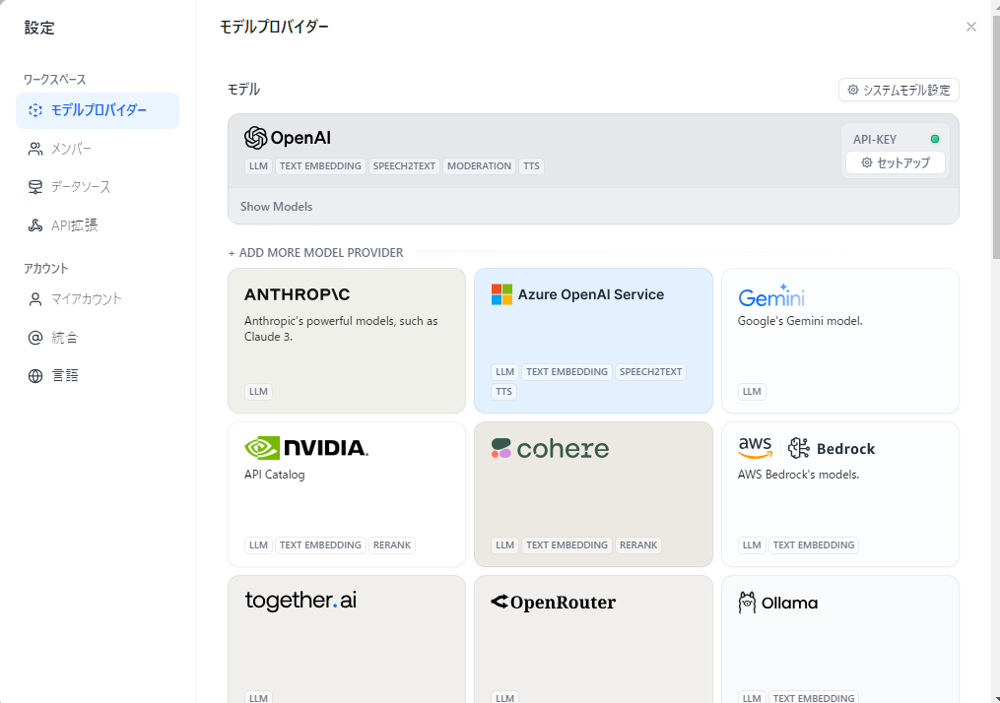

それから使用するモデルは"システムモデル設定"から設定します。他のモデルも設定すればそちらも使えるようになります。

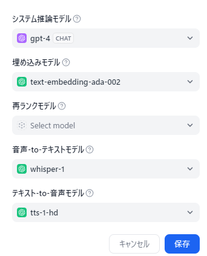

### ナレッジの登録

今回作るチャットボットはRAGなので次はナレッジを登録します。"知識を作成"からファイルを登録してインデックス化していきます。

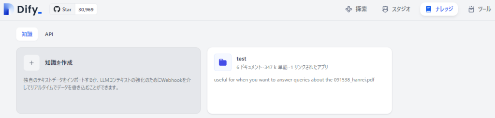

ファイルのアップロードをします。私が本来作りたいのは15000ファイル位あったのでそこまではアップしませんが、いくつか登録します。

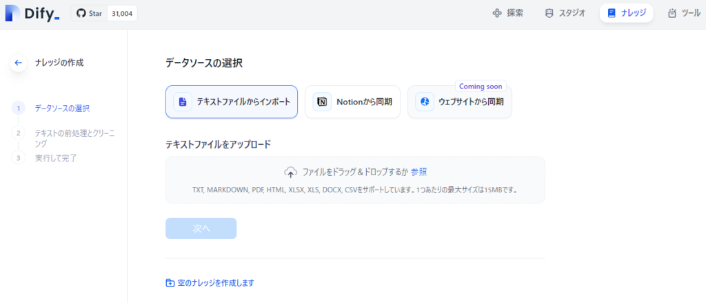

アップロードが完了してインデックス化が完了すると**利用可能**というステータスになります。エラーになってるものは利用できないので、再試行かアップのし直しでインデックス化を試みてください。

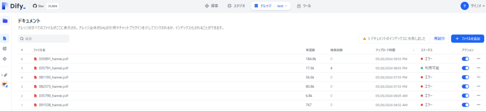

### アプリのプロンプト設定とテスト

ナレッジの登録が完了したらいよいよアプリの作成です。手順つまりプロンプトを設定して、コンテキストに作ったナレッジを設定します。今回は取得したナレッジを要約するように指示します。

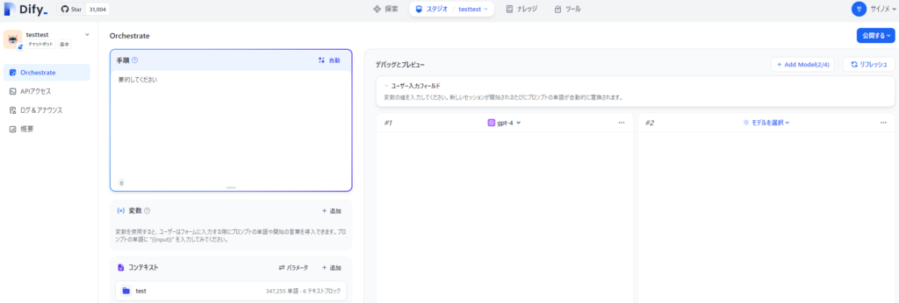

設定したら公開するからアプリ実行をします。するとチャット画面に移動します。

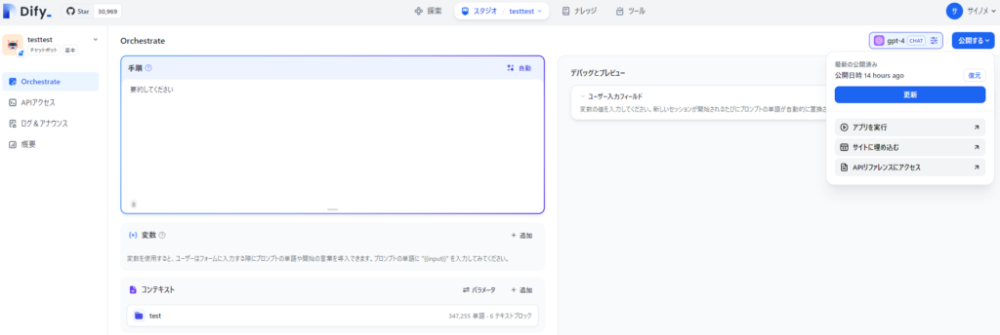

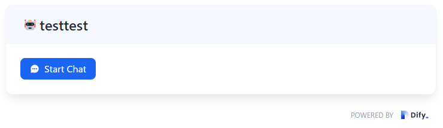

Star Chatからチャットを打ってどんな感じか動かしてみます。まず使えるファイルが1つだけだったので"特許権について"と聞いてみました。

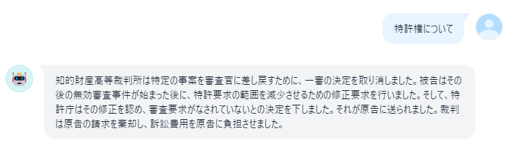

中を見たのですが合っていました。とは言え私は法律の専門家ではないのでよくわかってないですが、雰囲気的には合ってそうです。

### エラーの対応と改善

一応やってるときにエラーが出たりしたのでその時の話も共有します。アプリの作成途中でこんな感じのエラーが出ました。

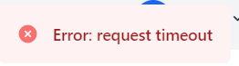

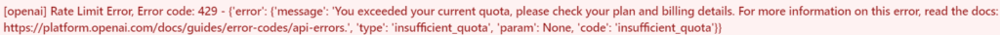

どうやら課金のチャージができていなかったようです。そこでOpenAIのサイトでチャージしたらこのエラーは解消されました。

APIあまり使ってなかったのですが、こういうことが起こるので自動設定でチャージさせるようにしました。ただ、悪用されたら怖いので注意を払う必要がありますね。

### Difyを活用した応用の可能性

これがうまいことできれば他のファイルでもできそうなので色んなとこで応用できそうです。もちろんセキュリティの問題が付きまといますので専門的な知識や暗黙知とかのファイルであれば有効活用できそうですね。ではでは。
