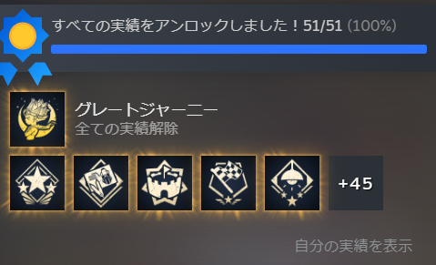
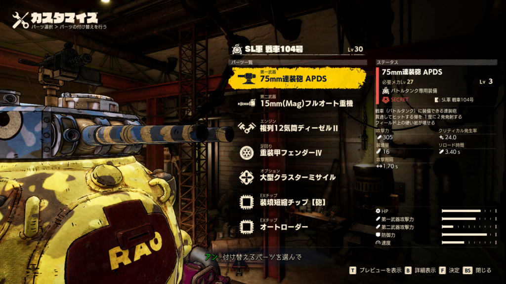
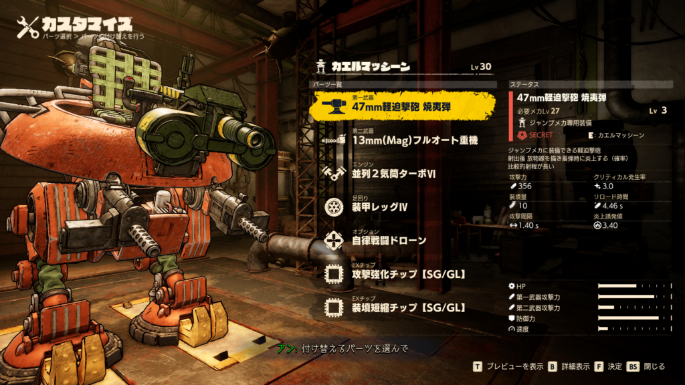
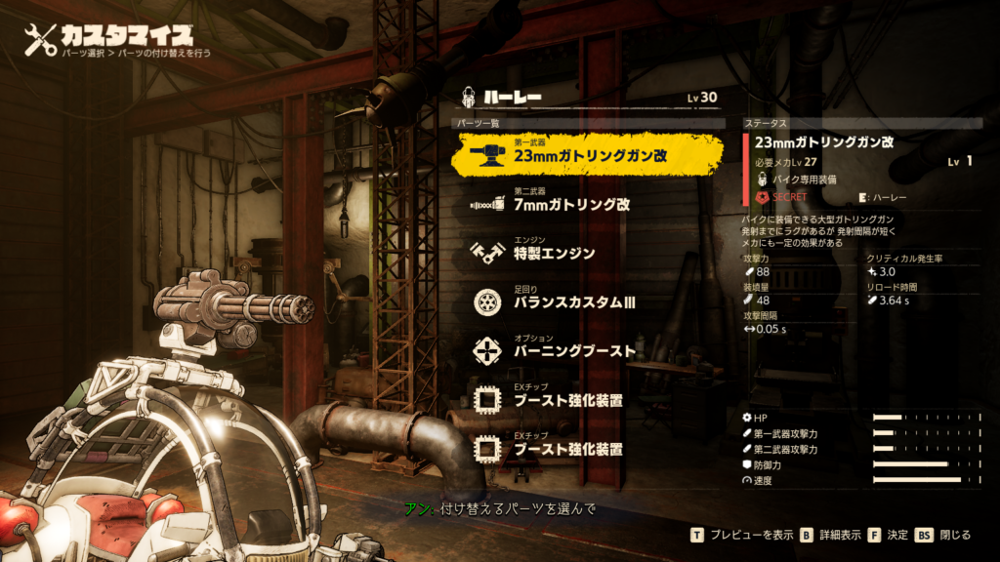
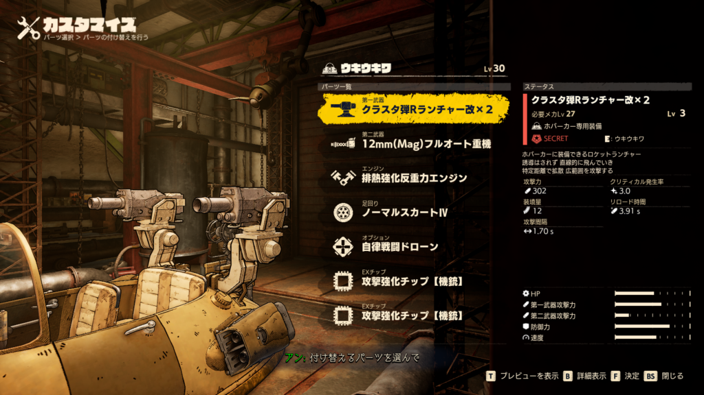
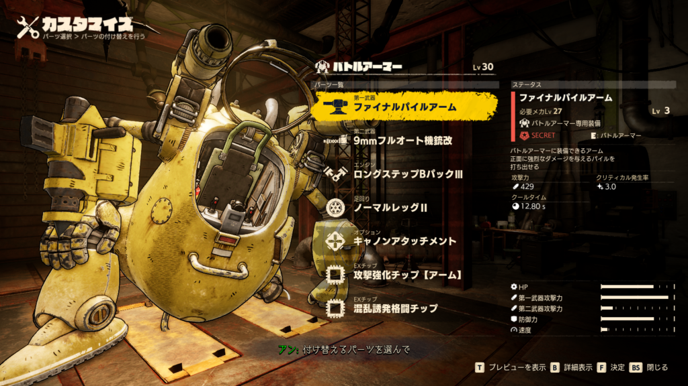
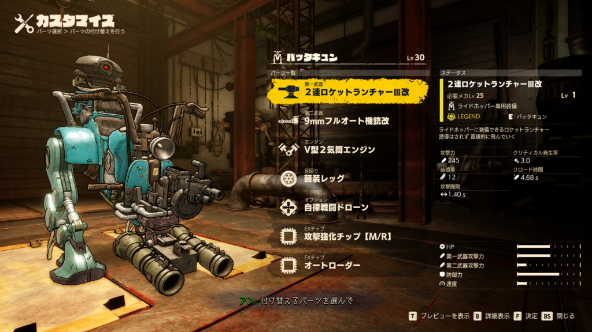
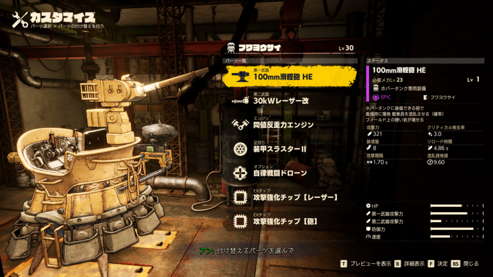
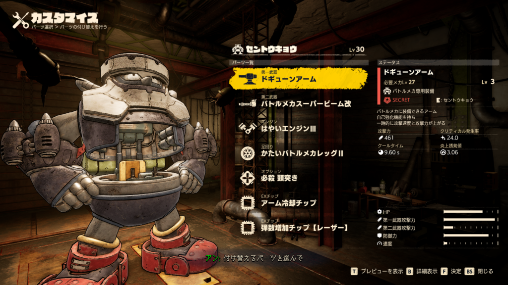
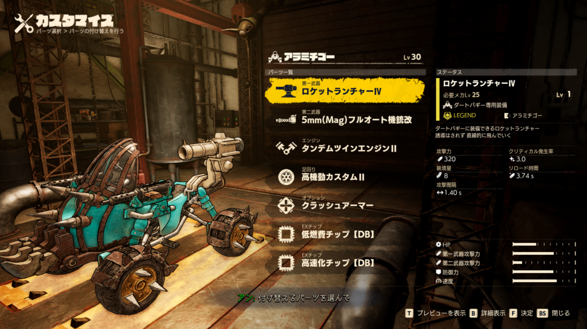

少し時間がかかりましたが**サンドランド(SAND LAND)**の実績をコンプしました！

ここから先は遊んだ感想や誰かのヒントにでもなればなと思うことを書いていきます。

## **ストーリーの感想**

まずストーリーの感想としてはとても面白かったです。原作を全く知らないのですがおっさんがかっこよく描かれています。訳あり保安官の"ラオ"や後編に出てくる"ランゴ"等いい活躍をしています。"シーフ"は不憫な部分も多いですが活躍する部分も出てきます。

あとはいいやつばかりでした。多少の正義でやりすぎたのであれば私も不快には思わないのですが、行き過ぎた思想は不快だったので"見捨てればいいのに"と思うやつも助けてました。だからこそ王道で主人公なのでしょう。

ストーリーの内容ではもう少し疑ったほうが良いのでは？と思う部分がありました。まあ私の性格がひねくれているのもありますが、メインもサブもすんなりと進むのでそう感じてました。ドラゴンボールもそんな感じでしたっけ？

ストーリーのシステムとして不満だったとことと言えば、話がスラスラ流れるのではなく少し間をおいて他の人が話したり、自身でボタンを押さないと話が進まないということがあったのでこの辺はもう少しスムーズだと嬉しかったなと思います。個人的にですが。

## **ゲームの感想**

次はゲームの部分です。

所持できるマシンは5つですが制作できるマシンの種類は13、フレームさえあればいくらでも作れると思います。上限がわからないので作るのに限度があるかもしれませんが。

**ストーリー**を進めるのに最低5つ必要です。

- バトルタンク

- ジャンプメカ

- バイク

- ホバーカー

- バトルアーマー

になります。ストーリーを進めるならこれだけで十分ですが、**ランクマッチ制覇**には

- ライドホッパー

- バトルメカ

- ホバータンク

も追加で必要です。**レース**を含めると

- ダートバギー

もですね。

残りの

- クルマ

- ユニライド

- ホバースクーター

- ジェットホバー

は強化しなくても大丈夫です。実績コンプには作る必要があります。

5つも持てるのですが道中の関係で最後まで固定でした。"タンク"、"ホバー"、"ジャンプ"、"バトルアーマー"、"バイク”がいつめんになっており、強化しないとストーリーも大変になるので、進行上入手したものを大体最後まで使用します。強化素材も取るのは大変ですし…

私的に戦闘で一番使いやすかったのは"バトルタンク"と"ホバーカー"ですね。タンクは移動に難がありますが、移動し続ければ大体の攻撃は避けれますし、火力も高いですので。ホバーカーは火力が少し劣りますがその分移動が楽なので。また全方位に対して攻撃できるのもいいです。バイクやライドホッパーは基本前方にしか攻撃できないので…

それからオプションは個人的に**自律戦闘ドローン**がおすすめです。勝手にダメージを与えてくれますし、雑魚敵が沸いても対処してくれますので。タンクだと**大容量ミサイルポッド**を使ってました。固定砲台だと動けないのでランクマッチではハチの巣ですし。こっちは雑魚もまとめてダメージを与えられますし、撃つまでは時間がほぼ止まりますので、被ダメが少ないです。

## **実績コンプについて**

最後に実績についてですが"サブクエ"、"落とし物"、"アリーナの制覇"あたりが大変だと思います。ヌシは探して倒す、レースは取り合えず全て上位の商品を取る、設計図は商人に会うたび確認して購入する、賞金首は王冠が付くまでやるをやれば大体の実績が取れます。

サブクエで少し大変だったのが"ペットボトル"。これは"魔物の里"に5,6個、それ以外の街で1,2個ほど落ちているので巡っていけば大丈夫です。洞窟にも落ちているみたいです。

後は"お宝探し！"は3つ全て見つけないと実績コンプに影響しそうというのと、隠しサブクエはマップ上に出ないのでわかりにくいくらいですかね？それと"因縁の対決"は合計3回やる必要があります。

次は落とし物です。[ここで](https://forum.psnprofiles.com/topic/160919-lost-properties-concerned-fellow-citizen-trophy/?do=findComment&comment=2983579)言及されていますが合計65個あります。内訳は

- メインで手に入る3つ

- サブクエで手に入れられる4つ(サブクエのお宝探しで3つ全て集める、他のサブクエで1つ)

- 残り58個は探し出す(持ち主に届けなくてもよいが、届けると小話が聞ける)

他のサイトで場所の記載はしていますのでそちらをご参照ください。私はめんどくさいのでやりません（笑）

最後にアリーナです。これがかなりしんどいと思います。私の場合はハードということもありますが、他の人の書き込みを見るとイージーでも難しいみたいです。ビッグマッチは時間制限付き**5分**のボス戦、ランクマッチはレベルが徐々に上がり**最大32**まで上がるかつマシンが限定されます。さらに時間制限付き、こちらも**5分**

まあボス1体ぐらいなら回復がなくても何とでもなりますが、一番きついのが”**アレ将軍の戦車**”

このビッグマッチやランクマッチの後半はほぼダメージを受けてはいけません。1,2回くらいならともかく3回くらいボスから攻撃受けると終わります。

アレ将軍の戦車のきついところは”地形”と”雑魚敵”ですね。

まず地形は基本狭く正面からだと敵の攻撃を避けにくい上にオプションの攻撃が当たりにくいです。固定砲台にしろ誘導ミサイルにしろほぼ当たらないですし、大容量ミサイルポッドも天井がなくさらに敵にある程度接近しないといけません。

それから雑魚敵ですね。ランクマッチで戦う際は雑魚敵が固定砲台をやってきます。物陰に隠れればどうということはないですが、アレの戦車が近くにいると攻撃されますし、倒しても無限沸きなので割としんどいです。大砲1発で落とせるならまだしも2,3発だとそちらに気を取られ、アレの戦車にやられたりします。

アリーナのボス戦で戦う相手全てに言えることですが、最小限の動きでよけながら的確に攻撃を当てる必要があります。それは大砲にしろバトルアーマーの投げ爆弾にしろなんでもです。

避けるならまだしも的確に攻撃を当てていかないと制限時間に間に合わなかったりします。

他に苦戦したのはライドホッパーを使ったジャンプメカ戦ですね。使い慣れていないうえに前方しか攻撃できないので苦労しました。誘導ミサイルの対処として地上から打ってくる場合は敵から2,3メートルの距離にいれば勝手に地面に着弾します。コンテナからなら撃ち落とすしかないです。

後はバトルアーマーやバトルメカを使った戦いですね。防御をうまく使わないといけないのでいつものマシンと立ち回りが少し変わります。それに基本接近戦なので回避→攻撃→防御→回避の繰り返しになりがちでした。オプションの攻撃とアームの特殊技をうまく使う必要があります。

それくらいだと思います。ビッグマッチ→ランクマッチの順にやればある程度ボスの攻撃パターンもわかっていると思うので何とかなると思います。

それからアリーナの商品にメカパーツがありますが全ておすすめというわけではありません。戦車は電磁砲なのですが、個人的には普通の戦車砲が使いやすかったです。リロードも早いですし。

後はバトルメカの第二武器ですね。拡散系よりは遠距離から打てるもののほうがおすすめです。

最後に改造についてですが、火力をあげるのであれば断然クリティカル発生率です。最大強化で4回に1回くらいはダメージが上がるので必須、あとはリロード時間を短縮できれば早く撃破できると思います。多少当たらなくても問題なし！

個人的には状態異常系はうまく使いこなせませんでした。デフォルトで炎上がついているもの(焼夷弾系)はまだいいのですが、故障系は機械にしか使えないというのもあってほとんど使っていません。おそらくクロウやエピなど移動が多めのマシンであれば割と有効だったかもしれませんが…

アリーナにはメカと生身の戦闘がありますが生身はあまり言うことがありません。ぶちぎれ使って殴るだけですし…

少し補足をするとぶちぎれ中は攻撃3回→回避→攻撃3回だと効率よく殴れます。ただランクマッチの”スイマーズパパ&ダイヤ団ボス＆クラブ団ボス”はこういきませんでした。

とはいえぶちぎれで攻撃を避けつつひたすらパパを殴った後、倒せなかったら攻撃を避けつつ少しずつ殴り、スキルが使えたら使っていくで十分倒せます。

これでアリーナは制覇できると思います。とはいえある程度のプレイヤースキルを必要とするので大変だとは思います。

## 最終的なマシン構成

最大まで強化したマシンの構成をお見せします。参考になるかはわかりませんし、使いやすさは人それぞれだと思いますので

バトルタンク

ジャンプメカ

バイク

ホバーカー

バトルアーマー

ライドホッパー

ホバータンク

バトルメカ

ダートバギー

## 終わりに

余談ですがメカパーツの所持に上限がありますので、適宜レア度が低いものは売っちゃうといいです。

これで以上になります。次にやるゲームは"ラチェット＆クランク パラレル・トラブル"！ではでは。
