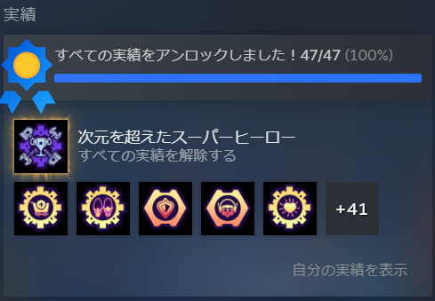

実績もすべて達成！

やってみた感想を書いていこうと思います。

ストーリーとしては面白かったです。基本シリアスに話が進んでいくのですが、ちょくちょく笑いをやツッコミが入ってて相変わらずだなと思いました。

私は1,2,3,4をプレイ済みなので一部のキャラや流れはわかっていますが5以降を全くプレイしてないので、そこで出てきたキャラは全くわかりませんでした。

今回のストーリーは次元を超えたキャラたちと会ったり戦ったりしているので、この次元ではこんな感じのキャラかだったり、このキャラは元次元のキャラの関係者なの！？という驚きがありました。

別次元の主人公二人の関係性がギクシャクしたけど最後は助け合ったりと王道で楽しかったです。また惑星によってはダークな部分もあったりしてドキドキしました。

ただストーリーは短くは感じました。惑星数が少なかったのもありますが、割とトントン拍子で進んで行ったり、別ルートから他の惑星に行くということもなかったのでサクサク進めました。

ゲームの感想としては良い部分と悪い部分があります。どのゲームにもあると思いますが…

このシリーズゲームの特徴として"ガラメカ"と呼ばれる武器をぶっ放して爽快感を得るというのがポイントです。そこは変わらず良かったと思います。それから移動の部分ですね。ブーツで荒野を駆け巡ったり、スイングショットで空を移動したり楽しいですね。

グラフィックもよくなってきれいでした。グラフィックドライバーの更新が少し面倒でしたがやってよかったです。他のことをやるときもサクサクになりましたし。

悪い点だとバグが少し多かったかなと感じました。私の環境も多少あるかもしれませんが、ショップが利用できない、武器のデモ映像が見れない、たまにスタック(引っかかって動けない)するという現象が起きていました。

ロードするなりチェックポイントからやり直しをすれば問題ないのですが、他のゲームよりはよく起きていたなという気がします。

後は実績ですが実績コンプよりは他のゲームよりもやりやすいと思います。クレイガーベア集めや特定の武器で攻撃を跳ね返すのが面倒ですがそれ以外は達成しやすいと思います。

ちなみにベア集めは他のサイトでも書いているので省きます。攻撃を跳ね返すのに楽な方法と言えばアリーナのブロンズの1戦目2waveが銃持ちしか出てきません。そこで武器を構えてある程度貯まったら放つ→玉切れ or waveが終わったら場外に出てダウン→再挑戦を繰り返せばいつか達成しています。

感想としては以上になります。他のシリーズをやりたいなと思うのですがPS3やPS5が必要なので出来ていないのですが、いつか買ってやってみたいですね。

ゲームはそろそろ終わりにして開発のほうを進めていこうと思います。裏で少しずつ進んでいますのでもう少しでめどが立つと思います。ではでは。
