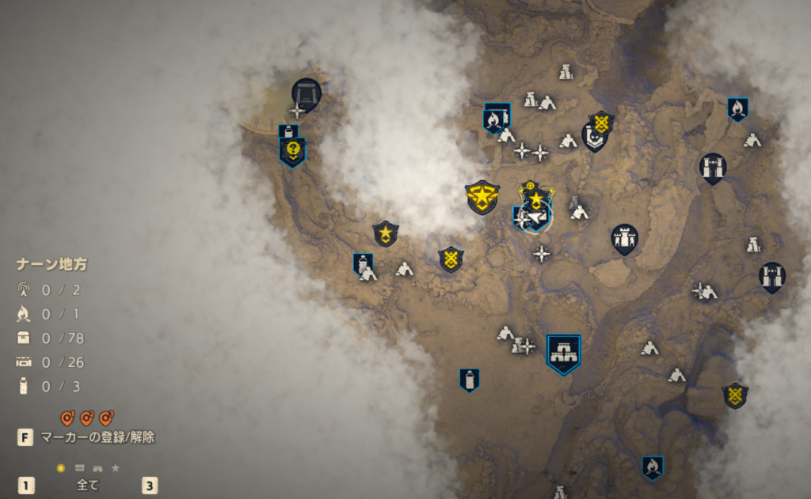
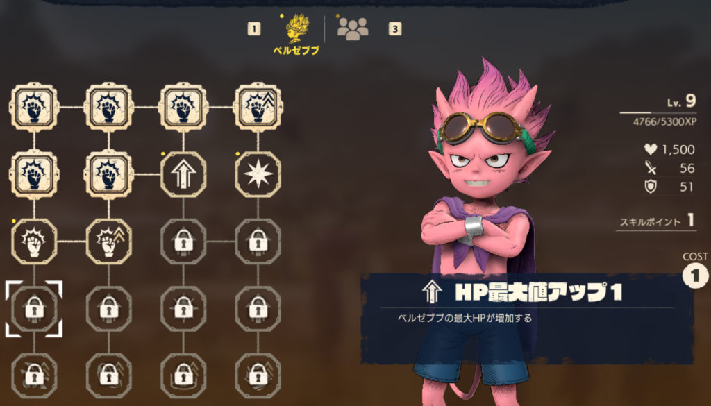
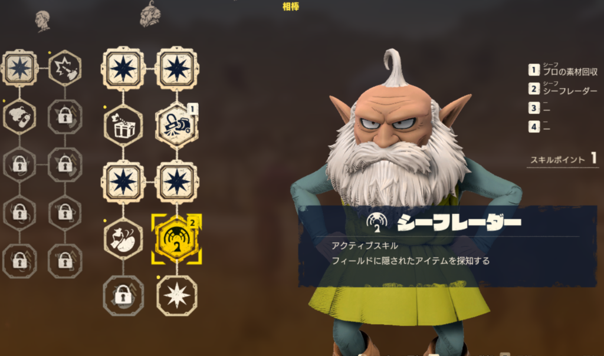
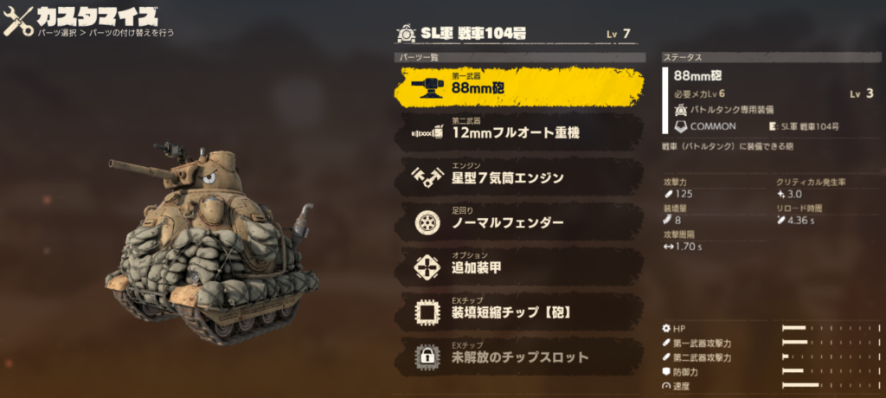
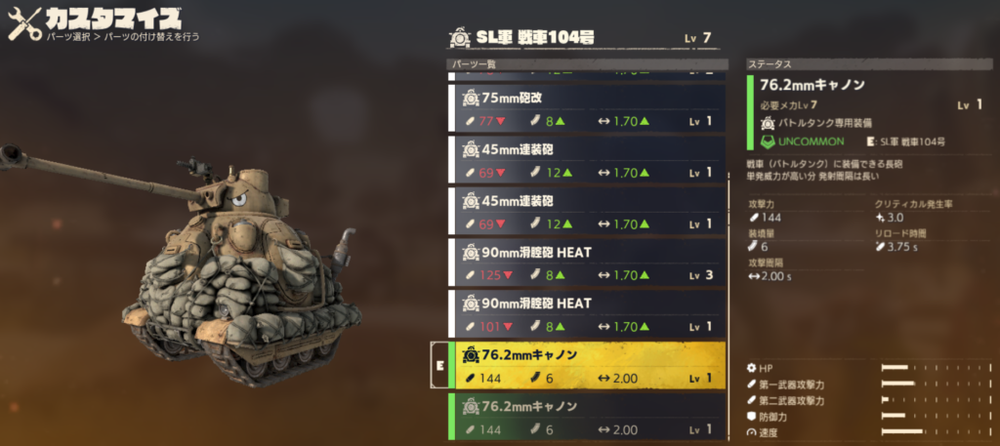
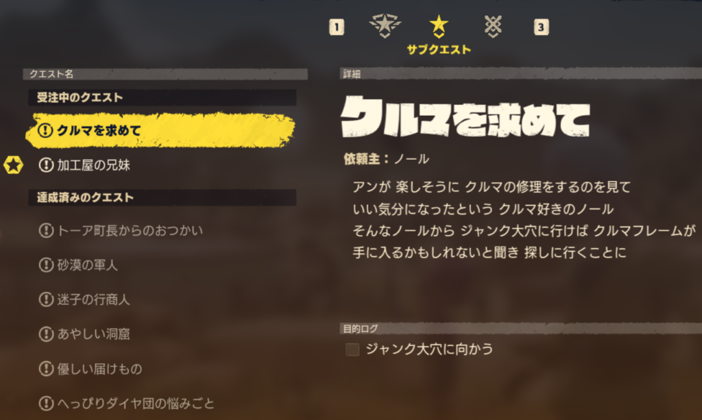

最近はクラフト系のゲームをプレイしていたので私が好きなアクション系のゲームを探していたところ、最近発売された"SAND LAND(サンドランド)"というゲームをプレイしました。まだ10時間もたってないですが…

このゲームはバンダイから発売されたゲームで「ドラゴンボール」の作者である**鳥山明**先生が手掛けたアクションRPGになります。

ざっくりとあらすじを言うと悪魔の子である"ベルゼブブ"と仲の良い物知り爺さんの"シーフ"、保安官61歳の"ラオ"と幻の泉を求めて旅をする話になります。漫画とアニメ、映画もあるので興味があれば見てください。

基本操作はベルゼブブで道中は戦車などのマシンを使って移動できます。ファストトラベルもできるので一度行けばすぐに移動できます。

対人戦のアクションも楽しいですが、戦車などのマシンを使った戦闘も面白いです。様々なカスタマイズと強化ができて状況に応じて使い分けていく必要もありますし、不得意なメカで戦う必要も出てきます。

マップはこんな感じで様々なスポットや行った場所、クエストなどが表示されています。

キャラクターの強化もでき、スキルポイントを割り振ることで威力やコンボを追加することができます。

またお供キャラクターの強化もあります。プレイアブルではないですが先頭に参加したり、冒険に役立つスキルを覚えることができます。私は性格的に冒険に役立つスキルを優先しがちですが、戦闘が苦手であればそのスキルを取ると戦いが苦手な人でも楽になるとは思います。

それからマシンのカスタマイズもいろいろあり、部品ごとに効果も様々です。砲台や機関銃、エンジンや装甲、強化チップが存在します。レアリティもあるみたいですが武器の強化次第ではレア度が低くても多少強くなるので、素材が集まり次第強化していくといいと思います。

メインクエストがストーリーの道筋になりますがサブクエストや懸賞金と呼ばれる討伐クエもあるので寄り道もちょこちょこ必要になります。必須ではないですがやると色々もらえますので

原作やアニメを見たことがある人はオチがわかっていると思うのでストーリーを楽しめるかはわからないですが、私は見たことも聞いたこともなかったので現時点でかなり楽しめています。

キャラゲーみたいですが全く知らないのでかなり楽しめている気がします。ゲームの進行度的にはまだまだなのでもっともっと楽しんでいきたいと思います。ではでは。
