## はじめに

ここ最近セキュリティに関するニュースが後を絶たないですね…。例えば

- [岡山の病院で患者情報流出](https://www.nikkei.com/article/DGXZQOUE119GJ0R10C24A6000000/)

- [ニコニコ動画サイバー攻撃](https://news.yahoo.co.jp/articles/9bfd4c3577e2beb21023ebc1bfe951c2986e2734)

- [積水ハウス個人情報流出](https://www.nikkei.com/article/DGXZQOUF249OW0U4A520C2000000/)

流出や攻撃だけでも頻繁に起きますし、脆弱性の発見も日々起こっています。[こちら](https://www.ipa.go.jp/security/vuln/index.html)のサイトなどで見ることができます。

そこで自身もセキュリティ意識を高めるため、パスワードではなく**パスキー**を使ったWordPressのログインを試みようという話になります。

## 設定手順

まずはWordPressにログインして「**OwnID Passwordless Login**」をインストールします。その後設定画面に移動すると以下の画像画面に行くので、「OwnID Console.」をクリックします。

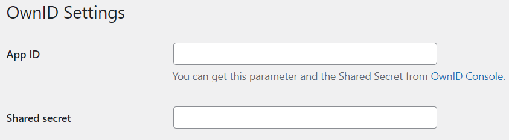

OwnID Console画面に入ったらアカウントを作ってログインしましょう！Githubがあればそちらでも大丈夫です。

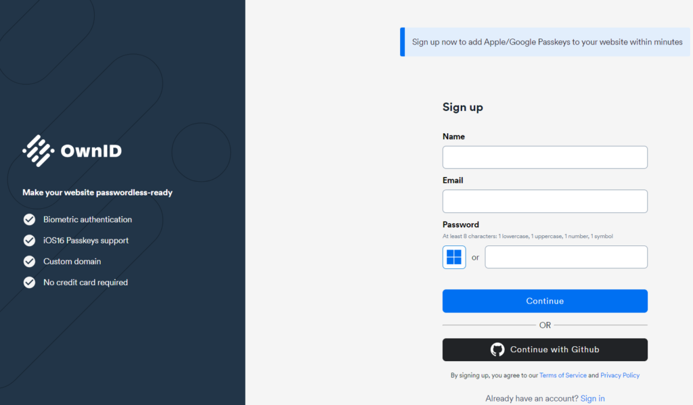

ログインができたら「Create Application」でアプリの作成を行います。

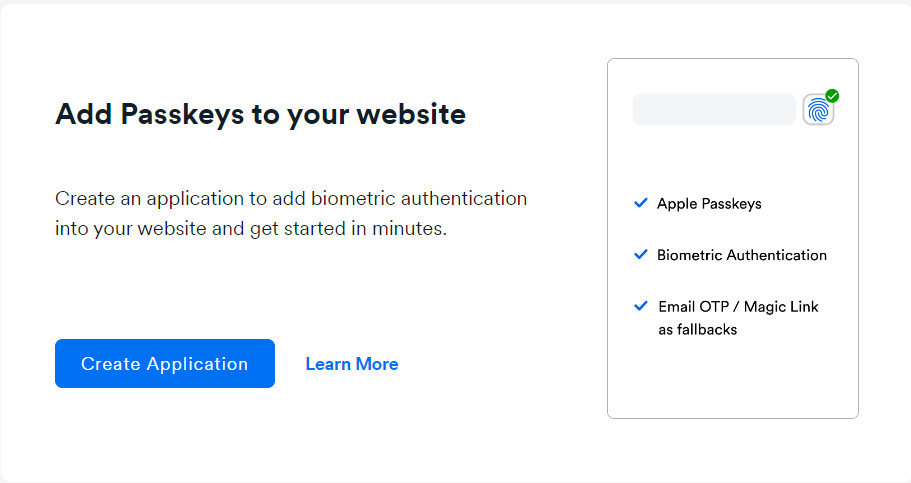

まずはアプリ名を決めましょう。適当で大丈夫です。

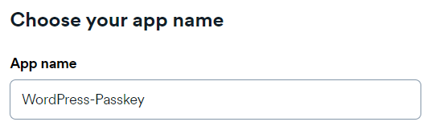

アプリ名を決めたら使用するシステムを選択しましょう！今回の場合はWordPressになります。

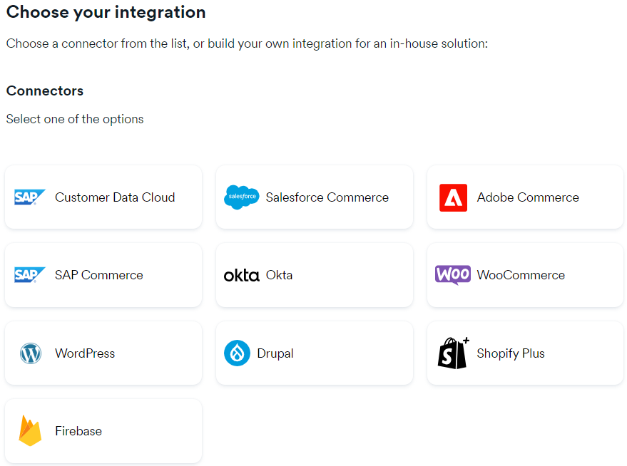

もし開発に使用する場合は以下から選択することになると思います。いつか開発で使ってみたいですね。

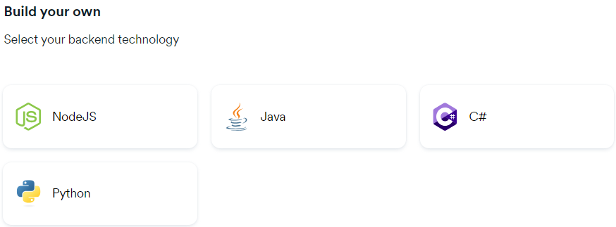

WordPressの場合は自身のURLサイトを設定しましょう。

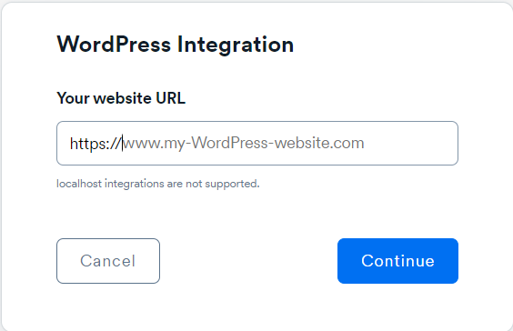

設定が完了したら準備完了です！

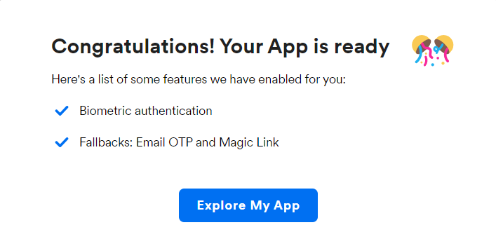

## 複数サイト設定

ここから先は複数作る場合になります。カスタムドメインで作ると複数パターン設定できます。

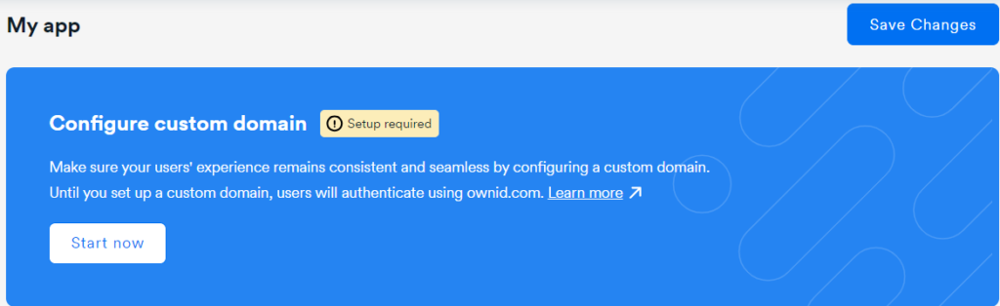

カスタムドメインをまずは作ります。基本は「passwordless.あなたのドメイン」で設定します。

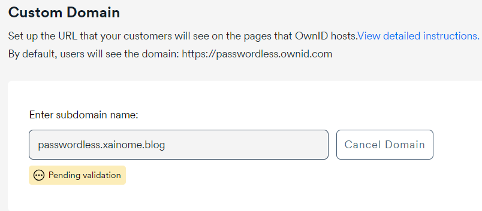

カスタムドメインの設定が完了したらDNSにStep1とStep2の値を設定します。

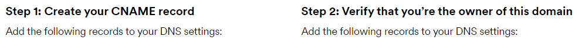

設定が完了してチェックが通れば「Verified」になります。

設定が完了したら「App ID」と「Shared Secret」の画面を出したまま、WordPressの画面に戻ります。

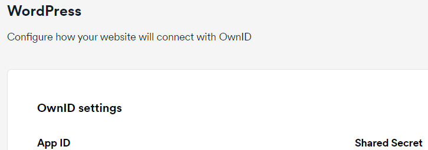

OwnIDの設定画面で先ほどの**App ID**と**Shared secret**を入力して完了です。

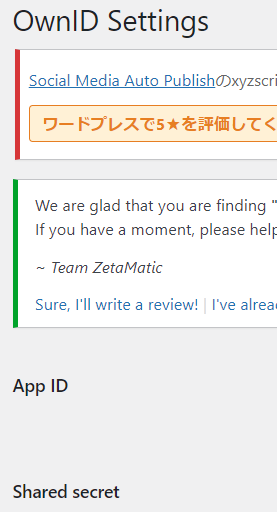

この画面が出れば成功したことになるのでログアウトしてみましょう！

そうするとパスワードの部分にパスキー用のアイコンが出ますのでこれでログインができるようになります。

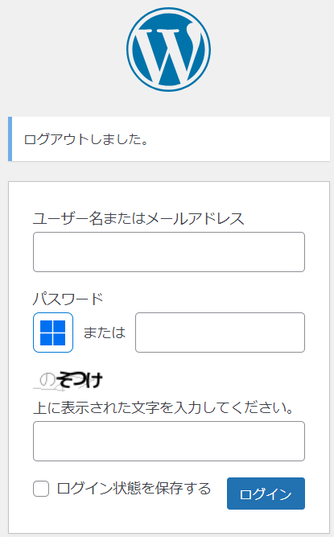

これにてパスキーの設定が完了になります。パスワードを忘れてもログインできるようになるので、多少便利になると思います。

またパスキーについて詳しくなればログイン周りのセキュリティも強化されるのでやっておくと後々良くなると思います。

## 終わりに

最後に余談ですが私の環境ではうまく機能せず、ログインしようとすると「**アカウントが見つかりません**」と言われます。

環境の問題なのかプラグインの問題なのか設定の問題なのかわかってないのですが、もう少し調べて修正しようと思います。ではでは。
