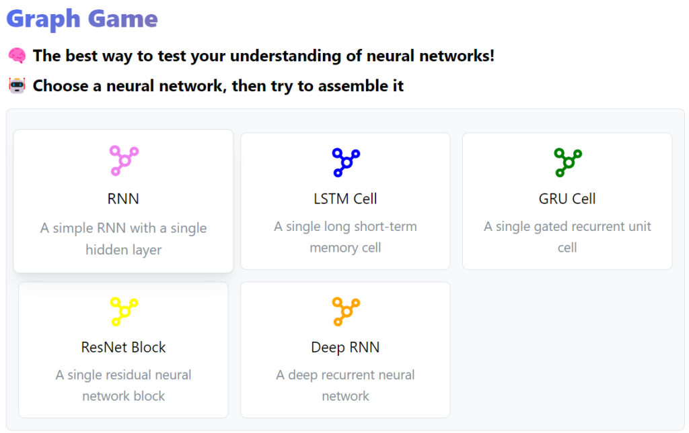
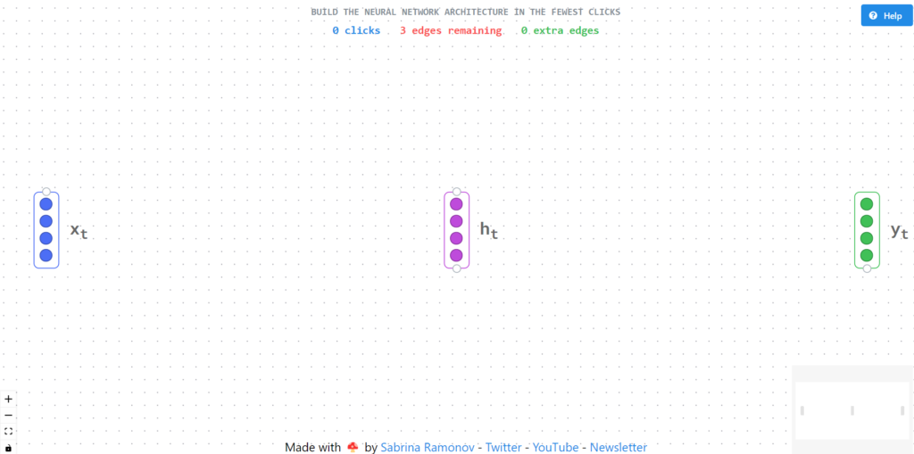
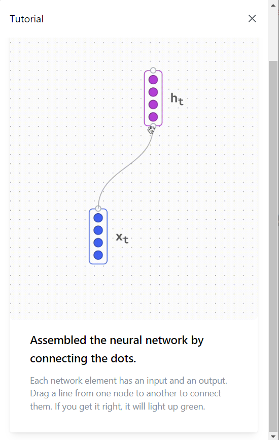
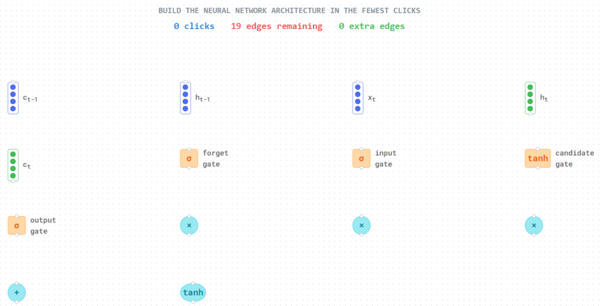
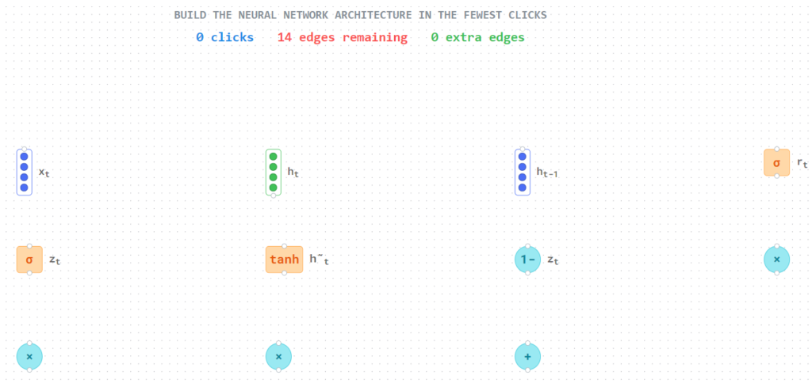
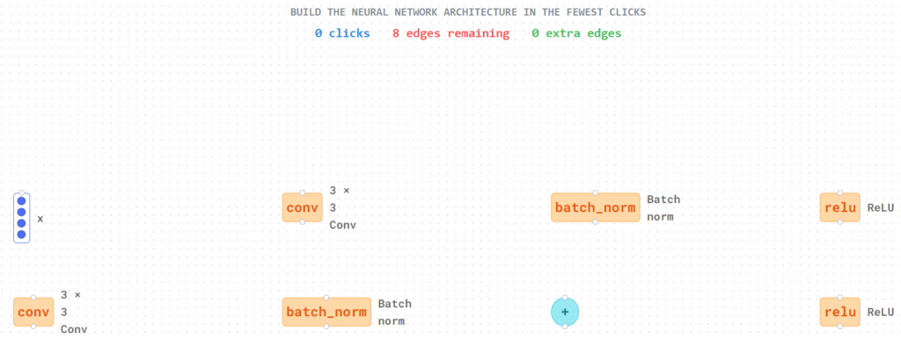
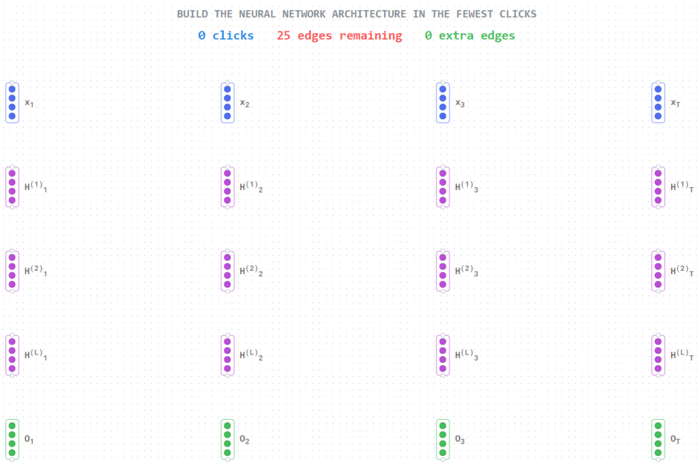

## 機械学習と深層学習の復習

G検定やE資格である程度機械学習や深層学習で使われている技術を学んだのですが、特に深層学習についてはあやふやな部分が多いなと感じていました。

とはいえまた学習教材を買うのもと思ってましたが、良いサイトを見つけました。

### Graph Game: ニューラルネットワークの理解度をテスト

**Graph Game**というニューラルネットワークを理解しているかわかるサイトになります。([こちら](https://graphgame.sabrina.dev/)から遊べます。)

とはいえこのサイトでできるのはRNN、LSTM、GRU、ResNet、Deep RNNのテストになります。CNNやGANなどはテストできません。

### RNNのテスト

まずはRNNから試してみましょう。"clicks" は繋げた回数、"edges remaining" は繋げる必要がある本数、"extra edges" は余計な繋がりの本数になります。

RNNについて補足すると連続的なデータや時系列データを処理するのに最適です。株価などの時系列分析、テキスト生成、音声認識など様々なところに使われる重要なニューラルネットワークです。

ちなみにHelpはチュートリアルの確認になります。

もし正解できれば画面の文字が左上にでます。何回でも挑戦できるので理解しながらつなげてみましょう！

### LSTMのテスト

LSTMはこんな感じ。

長い依存関係を持つ時系列データの処理に向いています。RNNでは勾配消失問題が発生するのでそれを解消するために考えられました。3つ(入力、忘却、出力)のゲートを使って重要なデータは保持、不要なデータは捨てます。

### GRUのテスト

GRUはこんな感じ。

補足するとGRUはLSTMの精度を保ったまま計算量が少ないと言われています。GRUは2つ(リセット、更新)のゲートで情報を制御します。

### ResNetのテスト

ResNetはこんな感じ

補足すると深い層のニューラルネットワークで使われ、画像認識で使用されています。残差ブロックがあり、skip connectionで直接値を渡すことで勾配消失問題が解消されます。

### Deep RNNのテスト

最後にDeep RNNはこんな感じ。

Deep RNNの補足としては複数のRNN層を組み合わせたものになります。より複雑なパターンを学習することができます。

## まとめと感想

少し忘れていたのでここで視覚的に思い出せました。初めての人でもなんとなくでわかるようになるし、ある程度知っている人も視覚的に覚えられるので良いと思います。

忘れていた処理を思い出せたので良かったです。他の深層学習や機械学習でも視覚的にわかるようなサイトがあるとイメージが付きやすそうですね。ではでは。
