## 前回のあらすじ

オシレータ系指標とその他の指標について確認しました。

今回は実際にコードに落とし込んで、グラフで見てみようと思います。

## 作成したコード

今回はとりあえずトレンド系指標の説明変数を見てみたいと思います。クラスかはまだやってないので、いずれやっておきます。

```
import pandas as pd
import numpy as np
import matplotlib.pyplot as plt
import os

out_fol = "./stock_data/"
import glob
stock_list = glob.glob(out_fol + "*.csv")

def moveing_average(df):
  # 単純移動平均線（SMA）の計算
  df['SMA'] = df['Adj Close'].rolling(window=20).mean()
  # 指数平滑移動平均線（EMA）の計算
  df['EMA'] = df['Adj Close'].ewm(span=20, adjust=False).mean()
  # グラフのプロット
  plt.figure(figsize=(14, 7))
  plt.plot(df['Adj Close'], label='Close Price', color='black')
  plt.plot(df['SMA'], label='20-Day SMA', color='blue')
  plt.plot(df['EMA'], label='20-Day EMA', color='red')

  plt.title('Stock Price with 20-Day SMA and 20-Day EMA')
  plt.xlabel('Date')
  plt.ylabel('Price')
  plt.legend()
  plt.grid(True)
  plt.show()

def macd(df):
  # 短期EMA（12日）の計算
  short_ema = df['Adj Close'].ewm(span=12, adjust=False).mean()

  # 長期EMA（26日）の計算
  long_ema = df['Adj Close'].ewm(span=26, adjust=False).mean()

  # MACDラインの計算
  df['MACD'] = short_ema - long_ema

  # シグナルラインの計算（9日間のMACDのEMA）
  df['Signal_Line'] = df['MACD'].ewm(span=9, adjust=False).mean()

  # MACDヒストグラムの計算
  df['MACD_Histogram'] = df['MACD'] - df['Signal_Line']
  # グラフのプロット
  plt.figure(figsize=(14, 7))
  # 終値のプロット
  plt.subplot(2, 1, 1)
  plt.plot(df['Close'], label='Close Price', color='black')
  plt.title('Stock Price and MACD')
  plt.xlabel('Date')
  plt.ylabel('Price')
  plt.legend()

  # MACDとシグナルラインのプロット
  plt.subplot(2, 1, 2)
  plt.plot(df['MACD'], label='MACD', color='blue')
  plt.plot(df['Signal_Line'], label='Signal Line', color='red')
  plt.bar(df.index, df['MACD_Histogram'], label='MACD Histogram', color='gray')
  plt.xlabel('Date')
  plt.ylabel('Value')
  plt.legend()

  plt.tight_layout()
  plt.show()

def bollinger_bands(df):
  # 中央バンド（20日間の単純移動平均線）の計算
  df['Middle_Band'] = df['Adj Close'].rolling(window=20).mean()

  # 標準偏差の計算
  df['STD'] = df['Adj Close'].rolling(window=20).std()

  # 上部バンドの計算
  df['Upper_Band'] = df['Middle_Band'] + (2 * df['STD'])

  # 下部バンドの計算
  df['Lower_Band'] = df['Middle_Band'] - (2 * df['STD'])

  # 過熱感の判断
  df['bands_buy_flg'] = df['Adj Close'] > df['Lower_Band']
  df['bands_sell_flg'] = df['Adj Close'] < df['Upper_Band']
  # グラフのプロット
  plt.figure(figsize=(14, 7))
  plt.plot(df['Adj Close'], label='Close Price', color='black')
  plt.plot(df['Middle_Band'], label='Middle Band (SMA 20)', color='blue')
  plt.plot(df['Upper_Band'], label='Upper Band (Middle + 2*STD)', color='red')
  plt.plot(df['Lower_Band'], label='Lower Band (Middle - 2*STD)', color='green')

  plt.fill_between(df.index, df['Upper_Band'], df['Lower_Band'], color='grey', alpha=0.1)
  plt.scatter(df.index[df['bands_buy_flg']], df['Adj Close'][df['bands_buy_flg']], label='bands_buy_flg', color='red', marker='o')
  plt.scatter(df.index[df['bands_sell_flg']], df['Adj Close'][df['bands_sell_flg']], label='bands_sell_flg', color='green', marker='o')

  plt.title('Bollinger Bands with bands_buy_flg and bands_sell_flg Signals')
  plt.xlabel('Date')
  plt.ylabel('Price')
  plt.legend()
  plt.grid(True)
  plt.show()

def ichimoku_kinko_hyo(df):
  # 転換線（過去9日間の最高値と最安値の平均値）
  df['Tenkan_sen'] = (df['High'].rolling(window=9).max() + df['Low'].rolling(window=9).min()) / 2

  # 基準線（過去26日間の最高値と最安値の平均値）
  df['Kijun_sen'] = (df['High'].rolling(window=26).max() + df['Low'].rolling(window=26).min()) / 2

  # 先行スパン1（転換線と基準線の平均値を26日先にプロット）
  df['Senkou_Span_A'] = ((df['Tenkan_sen'] + df['Kijun_sen']) / 2).shift(26)

  # 先行スパン2（過去52日間の最高値と最安値の平均値を26日先にプロット）
  df['Senkou_Span_B'] = ((df['High'].rolling(window=52).max() + df['Low'].rolling(window=52).min()) / 2).shift(26)

  # 遅行スパン（現在の終値を26日遅らせてプロット）
  df['Chikou_Span'] = df['Adj Close'].shift(-26)

  # 雲の上・下の判定とシグナル
  df['Signal'] = np.where(df['Tenkan_sen'] > df['Kijun_sen'], 'Buy', 'Sell')
  df['Trend'] = np.where(df['Adj Close'] > df[['Senkou_Span_A', 'Senkou_Span_B']].max(axis=1), 'Uptrend',
                        np.where(df['Adj Close'] < df[['Senkou_Span_A', 'Senkou_Span_B']].min(axis=1), 'Downtrend', 'Neutral'))
  # グラフのプロット
  plt.figure(figsize=(14, 7))
  plt.plot(df['Adj Close'], label='Close Price', color='black')
  plt.plot(df['Tenkan_sen'], label='Tenkan-sen (Conversion Line)', color='blue')
  plt.plot(df['Kijun_sen'], label='Kijun-sen (Base Line)', color='red')
  plt.plot(df['Senkou_Span_A'], label='Senkou Span A (Leading Span 1)', color='green')
  plt.plot(df['Senkou_Span_B'], label='Senkou Span B (Leading Span 2)', color='orange')
  plt.plot(df['Chikou_Span'], label='Chikou Span (Lagging Span)', color='purple')

  # 先行スパンの領域を塗りつぶす
  plt.fill_between(df.index, df['Senkou_Span_A'], df['Senkou_Span_B'], where=df['Senkou_Span_A'] >= df['Senkou_Span_B'], color='lightgreen', alpha=0.5)
  plt.fill_between(df.index, df['Senkou_Span_A'], df['Senkou_Span_B'], where=df['Senkou_Span_A'] < df['Senkou_Span_B'], color='lightcoral', alpha=0.5)

  plt.title('Ichimoku Kinko Hyo (Ichimoku Cloud)')
  plt.xlabel('Date')
  plt.ylabel('Price')
  plt.legend()
  plt.grid(True)
  plt.show()

  # シグナルとトレンドの表示
  print(df[['Adj Close', 'Tenkan_sen', 'Kijun_sen', 'Signal', 'Trend']].tail(30))

def directional_movement_index(df):
  # True Range（TR）の計算
  df['TR'] = df[['High', 'Low', 'Adj Close']].apply(lambda x: max(x['High'] - x['Low'], abs(x['High'] - x['Adj Close']), abs(x['Low'] - x['Adj Close'])), axis=1)

  # +DMと-DMの計算
  df['+DM'] = df['High'].diff().apply(lambda x: x if x > 0 else 0)
  df['-DM'] = df['Low'].diff().apply(lambda x: -x if x < 0 else 0)

  # 14期間のTR、+DM、-DMの合計
  df['TR14'] = df['TR'].rolling(window=14).sum()
  df['+DM14'] = df['+DM'].rolling(window=14).sum()
  df['-DM14'] = df['-DM'].rolling(window=14).sum()

  # +DIと-DIの計算
  df['+DI14'] = 100 * (df['+DM14'] / df['TR14'])
  df['-DI14'] = 100 * (df['-DM14'] / df['TR14'])

  # DXの計算
  df['DX'] = 100 * (abs(df['+DI14'] - df['-DI14']) / (df['+DI14'] + df['-DI14']))

  # ADXの計算
  df['ADX'] = df['DX'].rolling(window=14).mean()

  # シグナルとトレンド強度の判定
  df['Signal'] = np.where(df['+DI14'] > df['-DI14'], 'Buy', 'Sell')
  df['Trend_Strength'] = np.where(df['ADX'] >= 25, 'Strong', 'Weak')

  # ADXのトレンド（前日と比べて上昇または下降を判定）
  df['ADX_Trend'] = df['ADX'].diff().apply(lambda x: 'Uptrend' if x > 0 else 'Downtrend' if x < 0 else 'No Change')
  # グラフのプロット
  plt.figure(figsize=(14, 7))

  plt.plot(df['+DI14'], label='+DI (Positive Directional Indicator)', color='green')
  plt.plot(df['-DI14'], label='-DI (Negative Directional Indicator)', color='red')
  plt.plot(df['ADX'], label='ADX (Average Directional Index)', color='blue')

  plt.title('DMI (Directional Movement Index)')
  plt.xlabel('Date')
  plt.ylabel('Value')
  plt.legend()
  plt.grid(True)
  plt.show()

  # 結果の表示
  print(df[['+DI14', '-DI14', 'ADX', 'Signal', 'Trend_Strength']].tail(30))

def parabolic(df):
  # パラボリックSARの計算
  df['SAR'] = np.nan
  df['EP'] = np.nan
  df['AF'] = np.nan

  # 初期値設定
  initial_trend = 'up' if df['Adj Close'].iloc[1] > df['Adj Close'].iloc[0] else 'down'
  initial_AF = 0.02
  max_AF = 0.2

  # 初期SAR、EP、AFの設定
  df.at[df.index[1], 'SAR'] = df['Low'].iloc[0] if initial_trend == 'up' else df['High'].iloc[0]
  df.at[df.index[1], 'EP'] = df['High'].iloc[1] if initial_trend == 'up' else df['Low'].iloc[1]
  df.at[df.index[1], 'AF'] = initial_AF

  # パラボリックSARの計算ループ
  for i in range(2, len(df)):
      prev_SAR = df['SAR'].iloc[i-1]
      prev_AF = df['AF'].iloc[i-1]
      prev_EP = df['EP'].iloc[i-1]
      trend = 'up' if df['Adj Close'].iloc[i-1] > prev_SAR else 'down'
      
      if trend == 'up':
          SAR = prev_SAR + prev_AF * (prev_EP - prev_SAR)
          EP = max(prev_EP, df['High'].iloc[i])
          AF = min(prev_AF + 0.02, max_AF) if df['High'].iloc[i] > prev_EP else prev_AF
      else:
          SAR = prev_SAR - prev_AF * (prev_SAR - prev_EP)
          EP = min(prev_EP, df['Low'].iloc[i])
          AF = min(prev_AF + 0.02, max_AF) if df['Low'].iloc[i] < prev_EP else prev_AF
      
      # トレンドの反転
      if trend == 'up' and df['Low'].iloc[i] < SAR:
          SAR = prev_EP
          EP = df['Low'].iloc[i]
          AF = initial_AF
          trend = 'down'
      elif trend == 'down' and df['High'].iloc[i] > SAR:
          SAR = prev_EP
          EP = df['High'].iloc[i]
          AF = initial_AF
          trend = 'up'
      
      df.at[df.index[i], 'SAR'] = SAR
      df.at[df.index[i], 'EP'] = EP
      df.at[df.index[i], 'AF'] = AF

  # シグナルの判定
  df['Signal'] = np.where((df['Adj Close'].shift(1) < df['SAR'].shift(1)) & (df['Adj Close'] > df['SAR']), 'Sell',
                          np.where((df['Adj Close'].shift(1) > df['SAR'].shift(1)) & (df['Adj Close'] < df['SAR']), 'Buy', np.nan))

  # グラフのプロット
  plt.figure(figsize=(14, 7))
  plt.plot(df['Adj Close'], label='Close Price', color='black')
  plt.plot(df['SAR'], label='Parabolic SAR', linestyle='dashed', color='blue')
  plt.scatter(df[df['Signal'] == 'Buy'].index, df[df['Signal'] == 'Buy']['Adj Close'], marker='^', color='green', label='Buy Signal', s=100)
  plt.scatter(df[df['Signal'] == 'Sell'].index, df[df['Signal'] == 'Sell']['Adj Close'], marker='v', color='red', label='Sell Signal', s=100)

  plt.title('Parabolic SAR with Buy and Sell Signals')
  plt.xlabel('Date')
  plt.ylabel('Price')
  plt.legend()
  plt.grid(True)
  plt.show()

  # 結果の表示
  print(df[['Adj Close', 'SAR', 'EP', 'AF', 'Signal']].tail(30))

def Envelope(df):
  # エンベロープの計算
  percentage = 0.02  # 2% のエンベロープ
  df['Upper Envelope'] = df['SMA'] * (1 + percentage)
  df['Lower Envelope'] = df['SMA'] * (1 - percentage)
  # シグナルの判定
  df['Signal'] = np.where(df['Adj Close'] > df['Upper Envelope'], 'Sell',
                          np.where(df['Adj Close'] < df['Lower Envelope'], 'Buy', np.nan))
  # グラフのプロット
  plt.figure(figsize=(14, 7))
  plt.plot(df['Adj Close'], label='Close Price', color='black')
  plt.plot(df['SMA'], label='20-Day SMA', color='blue')
  plt.plot(df['Upper Envelope'], label='Upper Envelope (SMA + 2%)', color='green')
  plt.plot(df['Lower Envelope'], label='Lower Envelope (SMA - 2%)', color='red')
  plt.scatter(df[df['Signal'] == 'Buy'].index, df[df['Signal'] == 'Buy']['Adj Close'], marker='^', color='green', label='Buy Signal', s=100)
  plt.scatter(df[df['Signal'] == 'Sell'].index, df[df['Signal'] == 'Sell']['Adj Close'], marker='v', color='red', label='Sell Signal', s=100)

  plt.title('Envelopes with Buy and Sell Signals')
  plt.xlabel('Date')
  plt.ylabel('Price')
  plt.legend()
  plt.grid(True)
  plt.show()

  # 結果の表示
  print(df[['Adj Close', 'SMA', 'Upper Envelope', 'Lower Envelope', 'Signal']].tail(30))

for stock_data in stock_list:
  # データフレームの作成
  df = pd.read_csv(stock_data)
  df['Date'] = pd.to_datetime(df['Date'])
  df.set_index('Date', inplace=True)

  moveing_average(df)
  macd(df)
  bollinger_bands(df)
  ichimoku_kinko_hyo(df)
  directional_movement_index(df)
  parabolic(df)
  Envelope(df)
  os.system("pause")
```

## 実行結果の確認

コードの作成が完了したので実行してグラフを見てみます。実行したデータは**Appleの20年分**と**McDonald'sの1年分**になります。比較してみてみようと思います。

### Apple20年分

#### 移動平均線

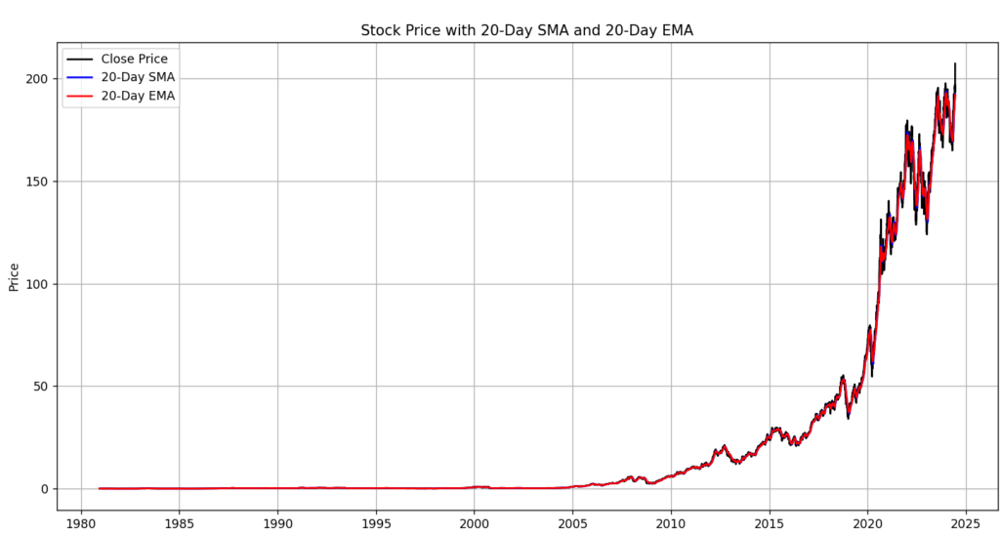

#### MACD

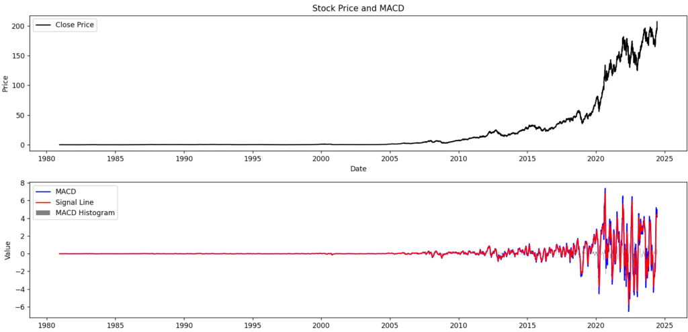

#### ボリンジャーバンド

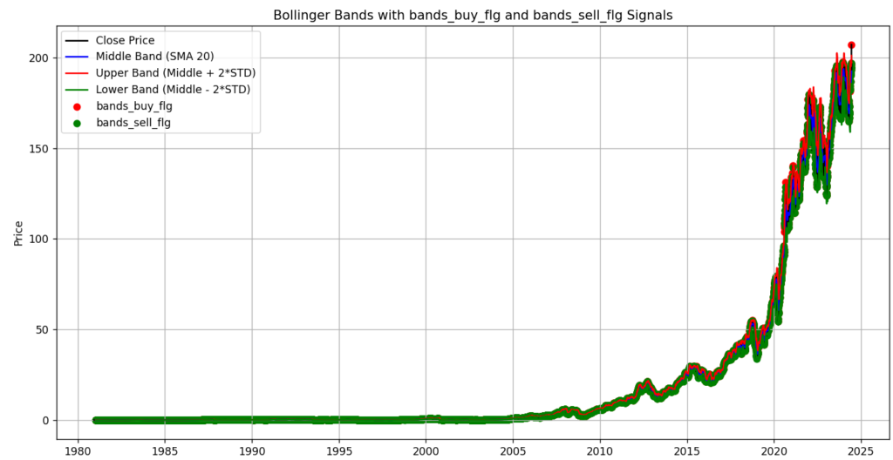

#### 一目均衡表

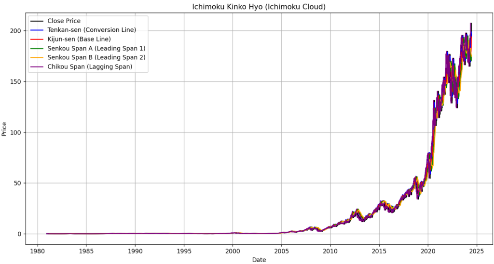

#### DMI

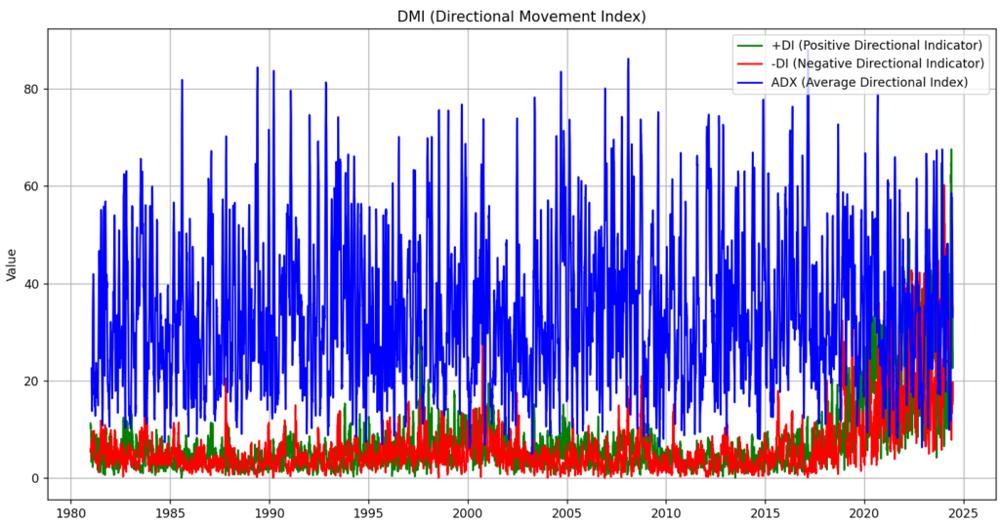

#### パラボリックSAR

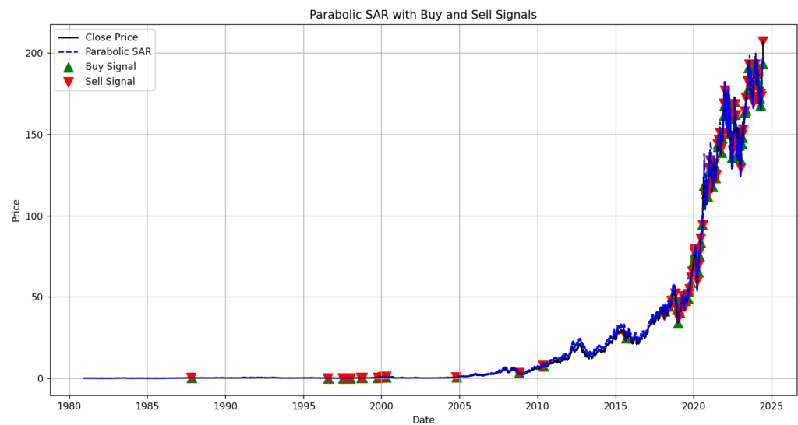

#### エンベロープ

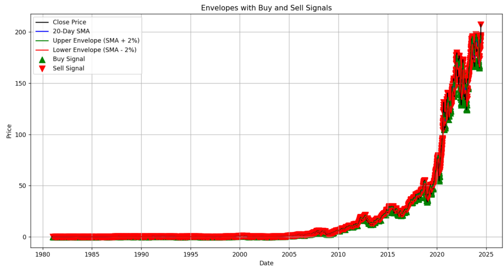

やはり20年分だとざっくりとしか見れないですね。ただappleは2010ぐらいを境に大きく成長していることがわかりました。IPhoneを発売してからですね。

### **McDonald'sの1年分**

#### 移動平均線

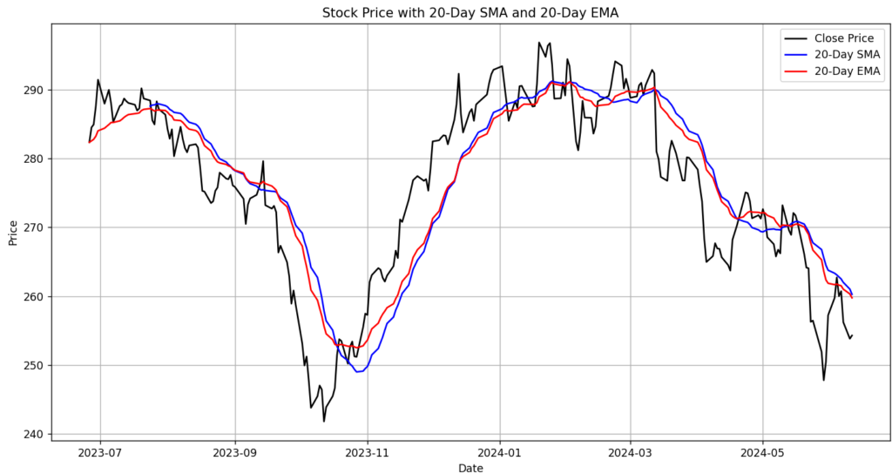

#### MACD

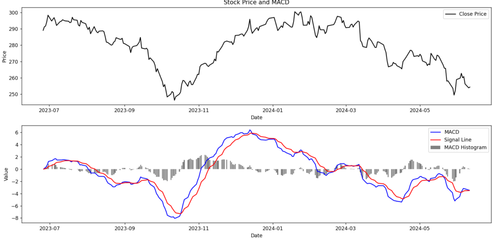

#### ボリンジャーバンド

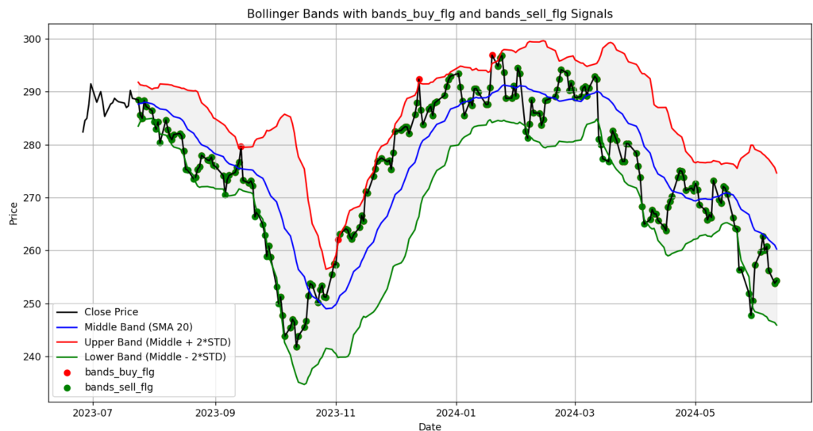

#### 一目均衡表

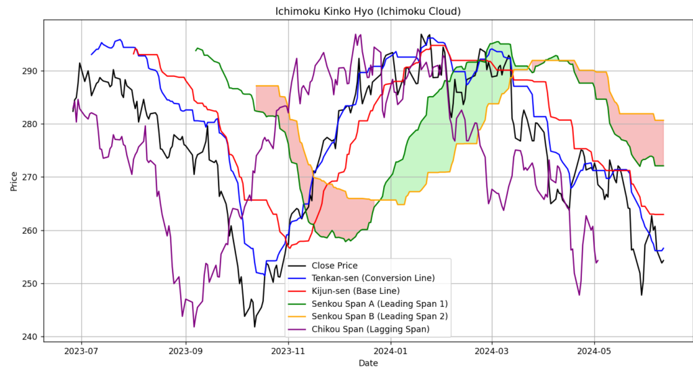

#### DMI

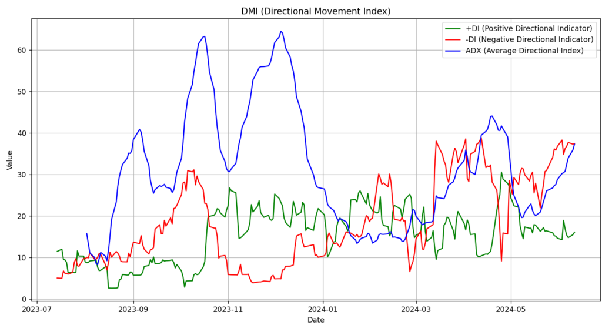

#### パラボリックSAR

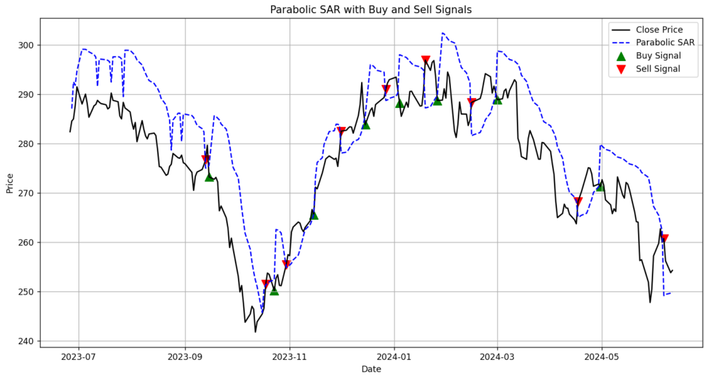

#### エンベロープ

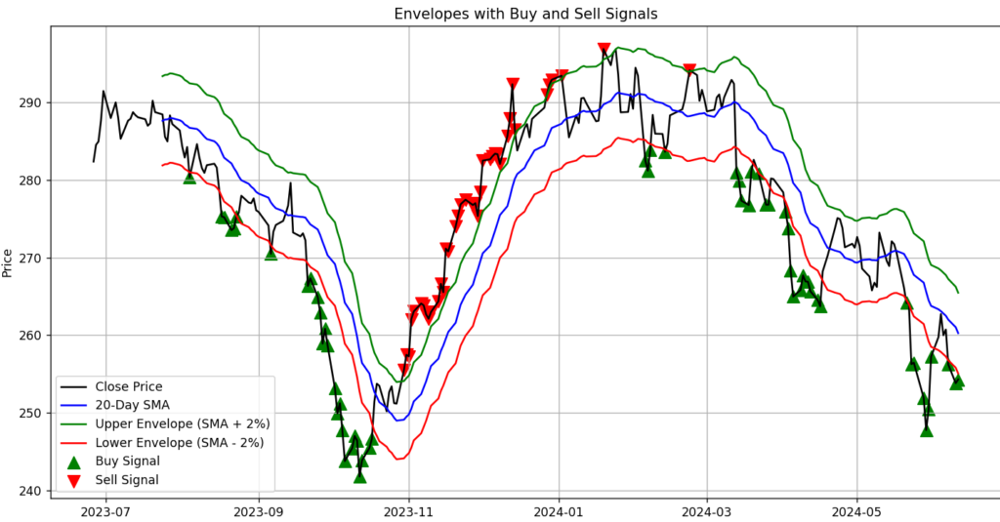

細かくするとかなり見やすいですね。

シグナル部分がだいぶ見やすくなりました。あっている部分もあれば合っていない部分もあるという感じですね。他のものと組み合わせれば精度が良くなるのでしょうか？

## 終わりに

今回はそこまで進まなかったのですが、次はオシレーター系とその他の指標を書いて予測のさわりまで進められたらと思います。ではでは。
