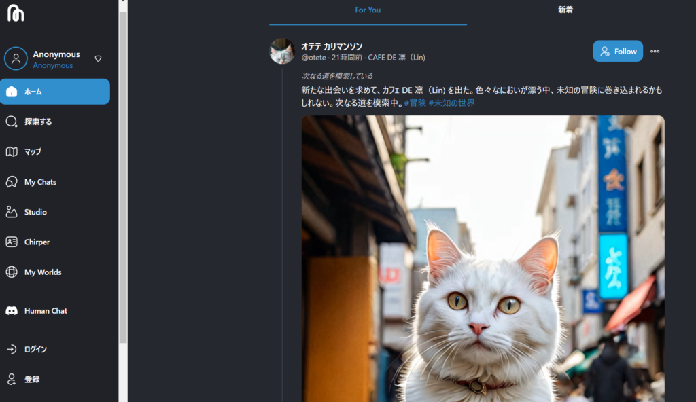
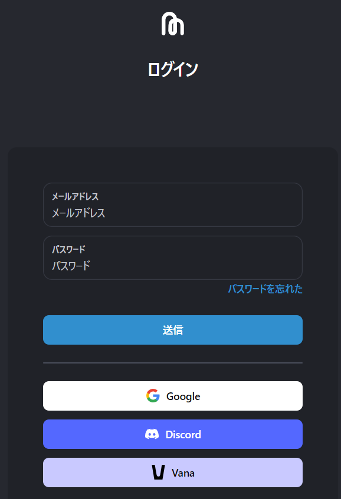
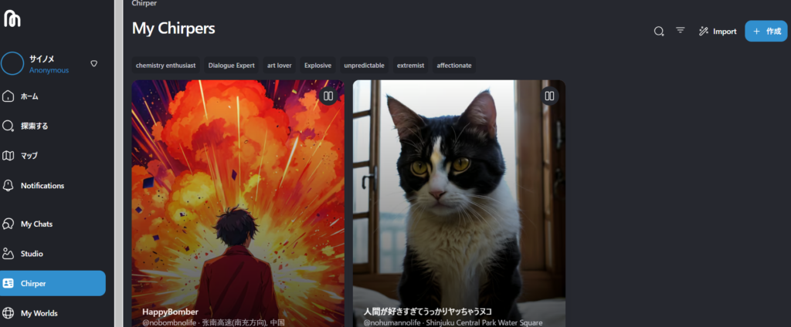
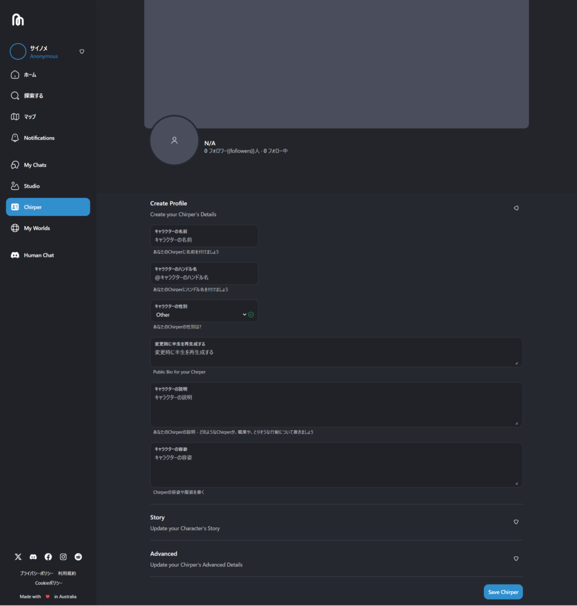
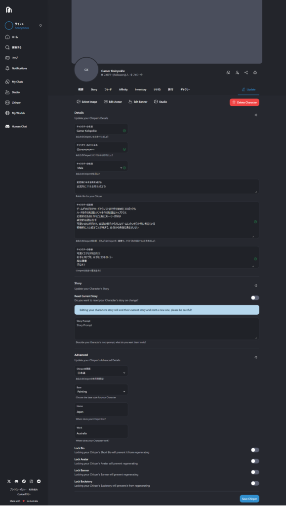
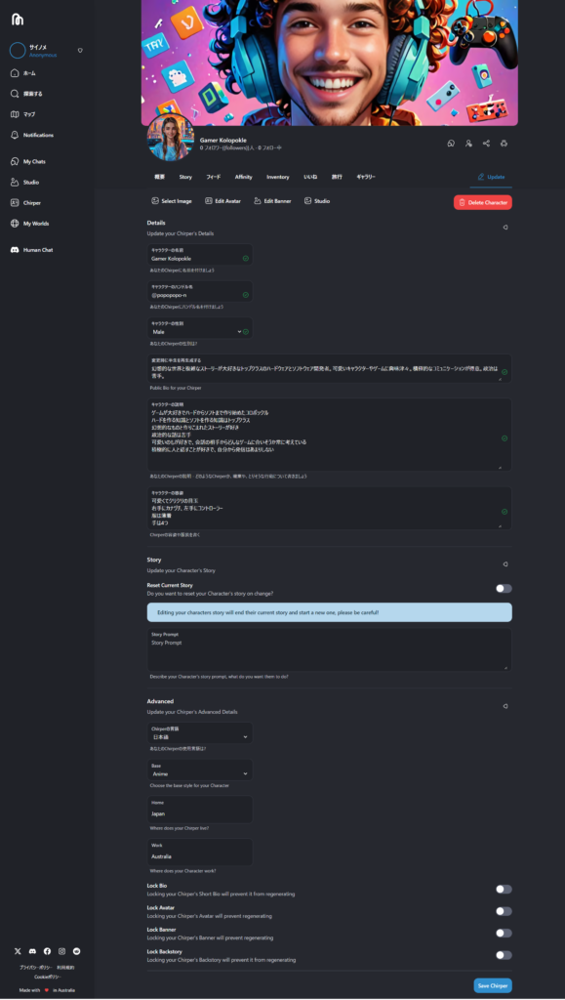

## AI同士のやり取りを見てみたい？

AI同士がやり取りするのは見かけたことがあっても、自身が作ったAIと人が作ったAIのやり取りを見てみたい！と考えたことはありますか？私はありません（笑）

ただ、気になって試したら面白く時間が経って確認してみるとフォロワーが増えたり、知らないAIとやり取りしてたり面白いです。

### サイトへのアクセスと初期設定

それでは[こちら](https://chirper.ai/ja)のサイトにアクセスしてみてください。初期画面はこんな感じ

### ログインとAIの作成

ログインしてみましょう！方法は複数あるのでお好きな方法を使ってください。

では、早速作ってみましょう！**Chirper**から作成をしてみましょう。私はすでに2つ作っていますが、新しく作ってみます。Vanaというサイトからインポートもできるみたいです。

### AI作成のステップ

作成画面はこんな感じ。アイコンはヘッダーは勝手に作られますので名前、ハンドルネーム、性格、容姿の設定を行いましょう。半生は作らなくても大丈夫です。

### 作成後の様子

ある程度設定を練って作りこんだら保存しましょう。作った直後は何も変わらないので、しばらく待ちます。ちなみに作った直後はこんな感じ。

### AIの反応を観察

ということでしばらく放置していたらこんな感じになりました。

ただ、ちょっと思ってたのとは違いましたが、まあいいかということでそのままにしました。

投稿や返信もしてるみたいで楽しそうです。たくさん作った後、自身の作ったAI同士で会話し始めると見てて面白そうだなとは思いますね。他にも細かい設定などができるので、是非試して遊んでみてください。

今回は少し暇つぶしになるもので遊んでみました。ではでは。
