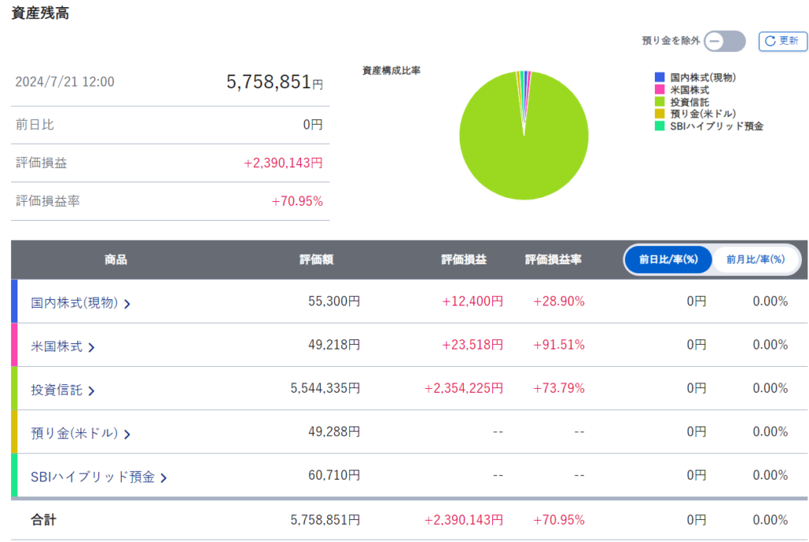
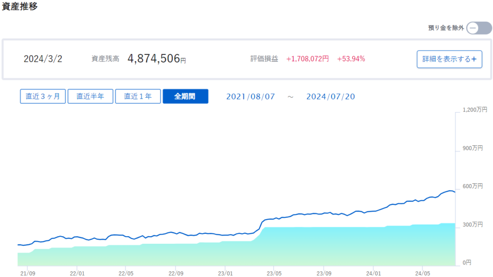

### 投資信託の売却と資金不足

パスポートを取得した話をしましたが、海外に行こうと思って70万近くの口数を売却しようとしました。

後日詳しく話しますが、ビザを取って語学学校に行ってみよう！と考えていたので銀行口座の貯金だけでは足らなかったのです。

100株単位ですが日米株を売買したこともあったので、当日に何とかなるかなと思ってました。

数営業日必要なのを知らなかったので資金が用意出来ず、入学申請を1週間見送ることになりました。

入学予定のタイミングや価格は変わらないので特に問題ないです。為替分の価格は変動しますが…。

私の場合は入学許可証がないとビザの申請ができないので、それも1週間先送りですね。

### 海外での投資について

現在SBI証券を使って投資を行っていますが、海外に居住する際は全て売却しなければなりません。

ここはちょっと痛いところですね。数十年単位で投資する予定だったので…。

一応海外でも投資できるサイトはありますので、現地で使えればそちらを活用していく予定です。

[IB証券](https://www.interactivebrokers.co.jp/)というところで、SBI証券が米国株の取引の際に取次ぎを行う会社らしいです。

相も変わらず投資信託を買う予定です。ただ数%ぐらいは色んな国を見て株を買ってみようと思います。

それから暗号資産も買ってみようかと思います。

日本の税率は雑所得扱いで累進課税が採用されています。住民税10%を含めると最大55%になります。海外はそこまで高くないので触るくらいはしてみようと思います。

### 自身の投資実績

最後にどうせ売却するので私のクソ雑魚資産をお見せしようと思います。

コロナで株価が全体的に下がったタイミングで始めました。そこからコツコツと投資信託(オルカンやS&P500)に入れてたので緩やかに増加しましたね。

米国株が急落したら一気に下がるのでリスクヘッジが全くできてませんが…

X(旧Twitter)などのSNSを見ると凄い人もいます。ですがパンピーはこんなもんなのでまったりやっていきましょう。ではでは。
