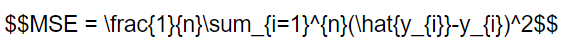
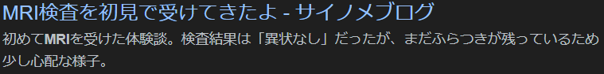

私はサイト運営に対してそこまで興味がないです。

ただ、快適に見てもらうに越したことはないし、SEO対策もいつか役に立つかと思っていくつかプラグインを入れてみました！

### **MathJax-LaTeX**または**Simple MathJax**

数式を表すのに必須と言えます。

数学の世界でも良く使われるものになります。例えば**平均二乗誤差**を数式で表すと

MSE = 1 / n ∑(yi - y)^2 (yiは予測値、yは正解値) ←この書き方が↓のようになります。

$$MSE = \\frac{1}{n}\\sum\_{i=1}^{n}(\\hat{y\_{i}}-y\_{i})^2$$

実際にコードに書き起こすとこんな感じ

いつ使うかわかりませんが、数式を使う機会がある人は覚えておくと良いかと思います。

最悪Chat-GPTなどの生成AIに頼る方法もありますので。

### WP ULike

いいねボタンやグッドボタン的なやつです。記事の下部やコメントした時に表示されると思います。

特に誰がやったか全くわからないので雑に付けられると思います。

X(旧Twitter)のようにいいねした記事が見れるようにしてみたい気持ちはあります。

### Yoast SEO

SEO対策のプラグインになります。有料限定の機能もあるみたいですが、そこまでではないので無料でやってます。

昔の記事に比べて見出しを付けるようになりましたが、このプラグインによるものです。

後はメタディスクリプションを入れています。こんな感じでリンクの下に出ているやつです。

ちなみにメタディスクリプションは全体の文字をコピーして生成AIに70字で作ってもらってます。

自分で考えるのも面倒ですし…

## 終わりに

同じものずっとやり続けるのではなく、気が向いたら良くしてみよう！だとか新しいものを取り入れてみるといい変化があると思います。

すぐに役に立つかはわかりませんがちょっとした話もできるかもしれないですし。

それから少しコメントをしやすくしてみました。

認証も文字列を入れるのは面倒ですが、名前もメールアドレスも不要にしました。こんな感じになると思います。

サイトが重くならない程度に面白いプラグインや設定が会ったら試してみます！ではでは。
