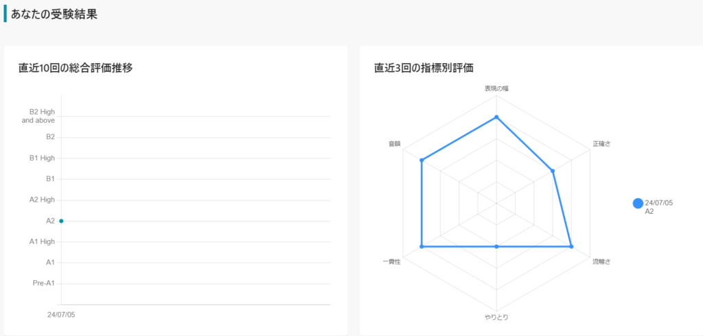
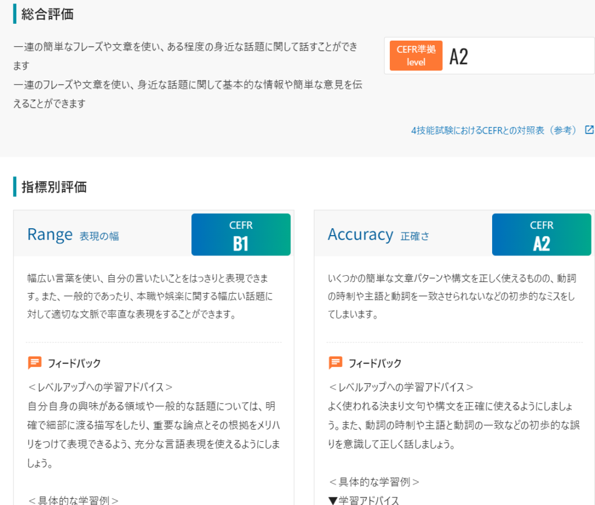
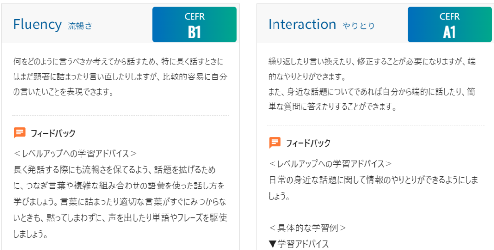
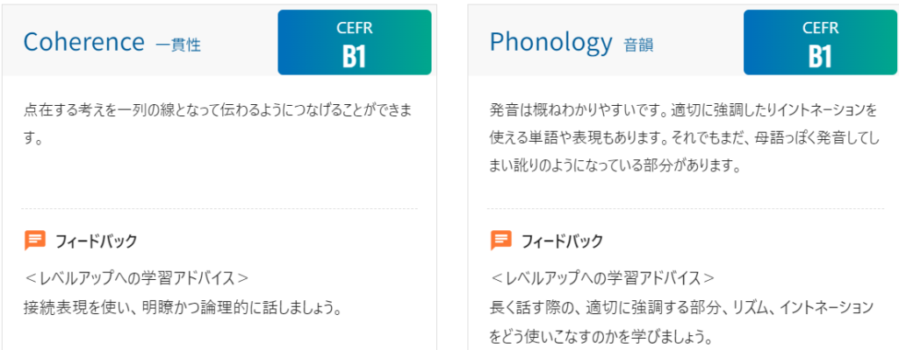

個人的にいろいろあったので残すために書いておきます。

### MRI検査

前回も少し話しましたが、6/29(金)にMRI検査を受けてきました。

いただいた検査結果の内容を見てみると

**所見:** 左内頸動脈の栄上部に若干の狭小化が疑われますが、equivocal（判断が難しい）な所見です。その他、頭蓋内の動脈に広狭不整や動脈瘤は指摘できません。左内頸動脈は全体的に hypoplastic（発育不全）ですが、右内頸動脈から前交通動脈を介して両側大脳動脈が描出されているためと思います。両側椎骨動脈に解離を疑わせる所見はなく、脳底動脈の血流は良好です。

聴神経や内耳に異常なく、聴神経腫瘍は指摘できません。両側乳突蜂巣の含気も良好です。新鮮な梗塞やラクナ梗塞、皮質梗塞は指摘できません。基底核や白質の intensity（信号強度）も良好で、加齢に伴う Nonspecific findings（非特異的所見）は認められますが、年齢相応です。出血の既住もありません。側脳室の大きさや形も正常です。水頭症や病的な萎縮は指摘できません。

ということで特に何もないので経過観察となりました。

### パスポート申請

今後のことを考えてパスポートの申請に行きました。[外務省](https://www.mofa.go.jp/mofaj/toko/passport/pass_2.html)のページに記載されていますが、最低限必要なものは

- 申請書

- 戸籍謄本

- 写真

になります。

申請書は事前に記載してダウンロードすると楽になります。写真もスマホで撮ったものをコンビニで印刷する方法があります。計660円必要ですが、[こちら](https://www.freedpe.com/v1/)から印刷できます。

戸籍謄本に関しては場所によってはコンビニで印刷できると思います。私の場合は戸籍と居住地が違うので市役所まで行く必要があったので、この準備が大変でした。

私は東京の池袋で申請しましたが人がかなり多かったです。大体6時過ぎくらいに向かいましたが、受付に20分、申請に70分くらいかかりました。

やはり平日の空いてるタイミングを狙った方がスムーズですね。あるいは申請のタイミングで食事に行くのもおすすめです。

ただし、呼ばれたタイミングでいたほうがいいので事前に食べる場所を決めておくと良いです。

支払いは受け取るときなのでお金は準備しなくても問題ありません。

### 英語力チェック

[こちら](https://hr.progos.ai/student/igpNehDYz9qCAp8I20sAhBMsa466RQYF/login)のPROGOSというサイトでSpeakingのテストを受けてみました。

結果は全然ですね…

なかなかアドリブではうまいこと喋れないですね。今後の頑張りが必要です。ちなみに検査の見方は[こちら](https://progos.ai/cefr_chart.html?utm_source=progos_exam&utm_medium=hr_site&utm_campaign=progos_feedbacksheet_jp)から確認できます。

総合評価と各評価、フィードバックとアドバイスがもらえます。

最近あったこととしてはこんな感じです。ゲームの話はまたいずれやります。ではでは。
