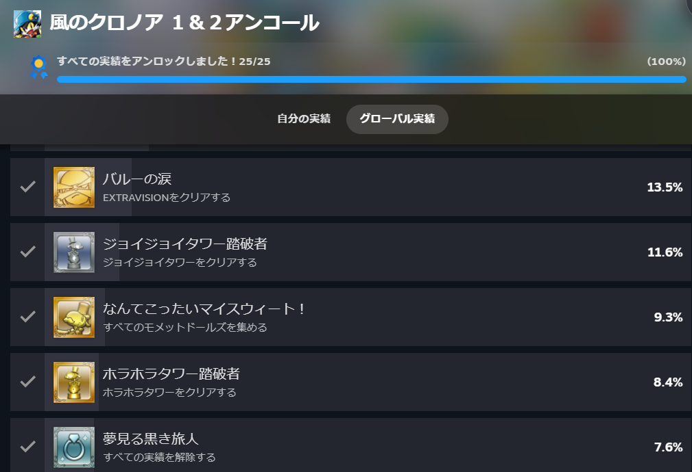
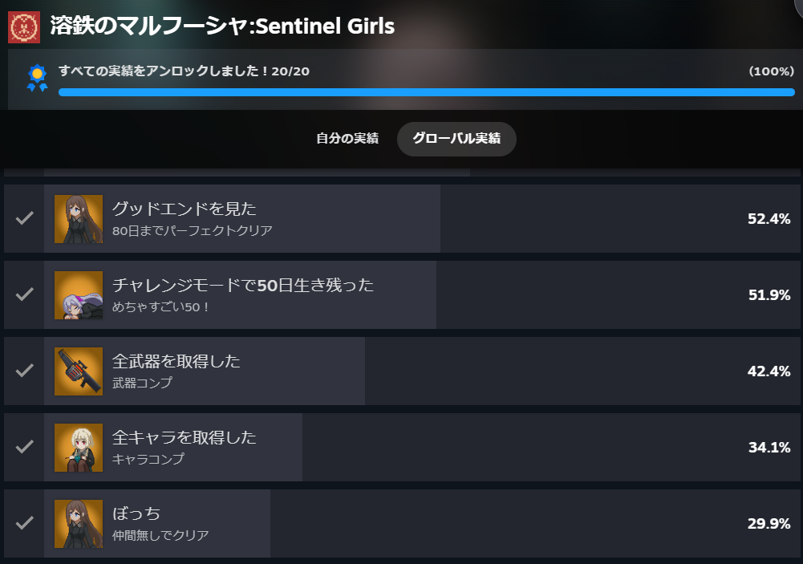
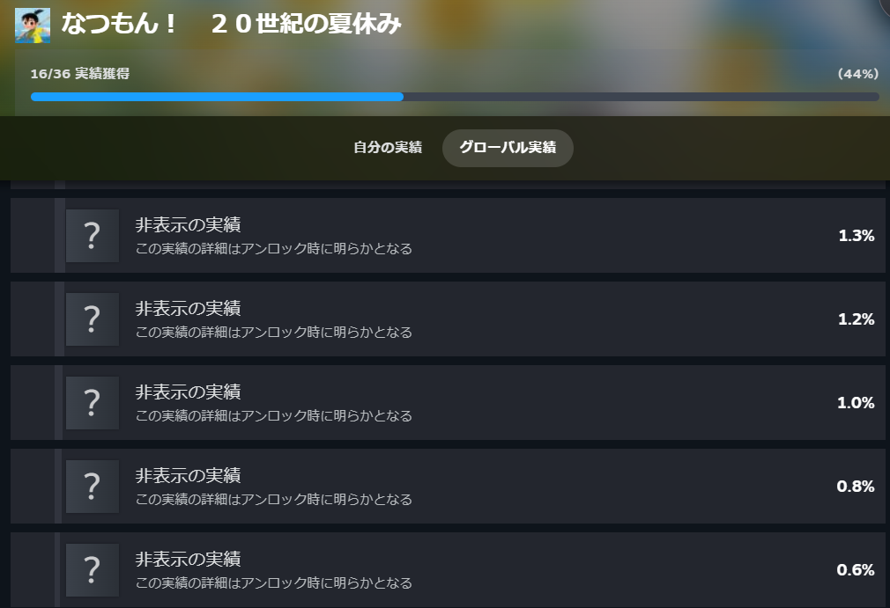

掲題の通り最近やったゲームを少し上げてみようと思います。

### 風のクロノア 1 & 2 アンコール

前から少しずつ進めていたゲームを全クリしてきました！

幼いころ少しだけ遊んだ記憶があって楽しかったので、購入してプレイしてました。

アクションゲームなので人によっては苦手だと思います。

実績として収集要素がありますが、基本見やすい場所にあるので達成しやすいと思います。

ストーリー中喋ってくれるのですが、独自の言葉を喋るので字幕を見ることにはなるんですよね。とは言え結構癖になる話し方をするので聞いちゃうのですが…

### 溶鉄のマルフーシャ

こちらタワーディフェンス系のゲームになります。

機械兵が来るので銃器を使って撃破し、壁を守るゲームになります。

銃器は使用日数があるので交換しつつ、仲間を迎えて80日間生き残ることを目指します。

銃器は初期から変えた方がいいですが、仲間はいたほうが楽になると思います。

また、ゲームオーバーになってもある程度資金を持った状態で同じ日からスタートするので、苦手でも安心して進めることができます。

慣れれば実績も達成しやすく、そこまで時間もかからないのでおすすめしやすいです。

今年、続編が出ますのでそちらも楽しみに待っています。

### なつもん！ 20世紀の夏休み

まだエンディングを迎えてもいないですが、現在プレイしているゲームになります。

こちらは**ダンガンロンパ**や**シュタインズゲート**でおなじみの**スパイクチュンソフト**様から出たゲームになります。

内容としてはオープンワールドの"ぼくなつ"というイメージですね。私は"ぼくなつ"をやったことはないですが…

やることは昆虫採集や魚釣り、化石の発掘、人との交流、サーカスを盛り上げるなどがあります。

一部引き継いで2週目もできるみたいなのでまったりとやりたいことを進めればいいと思います。

ある程度進めると"ラブちゃん"という方が登場して、占いをしてくれます。

占いでは絵日記にかける内容の話や珍しい昆虫や魚の場所等いろいろと教えてくれます。1日を過ごすうえで指標になるので、是非活用することをおすすめします。

それから**ステッカー**(スタミナ)という概念が存在します。これは走ったり泳いだり登ったりするときに必要になります。

集める方法としては大きな冒険と探偵ノートをクリアすることなので、積極的に進めていくのが良いです！

早くエンディングを進めてDLCも遊びたいですね。

## 終わりに

他にもいろいろと遊んでいるものもありますが、今はこんな感じです。

勉強も必要ですがストレス解消も必要なので、無理しない程度に頑張りましょう！ではでは。
