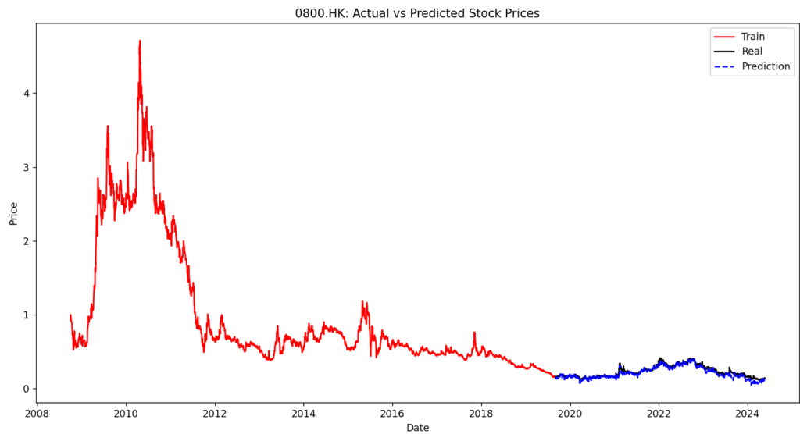
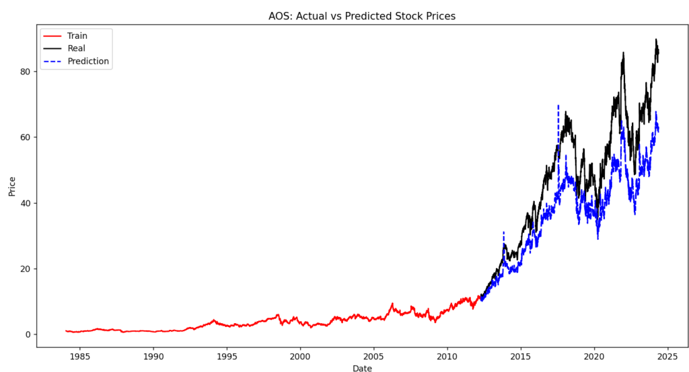
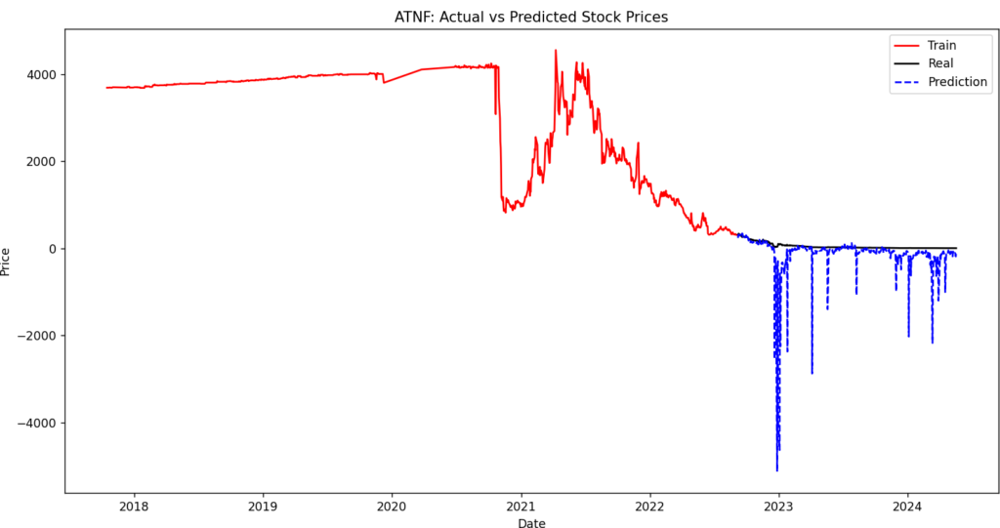
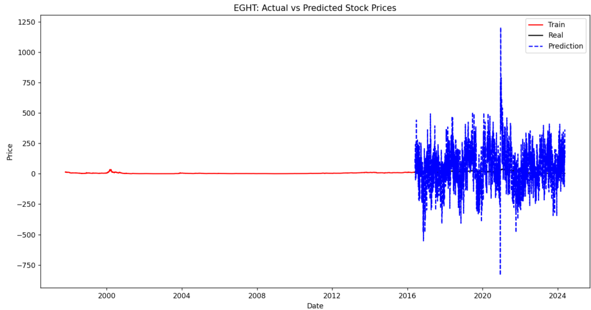
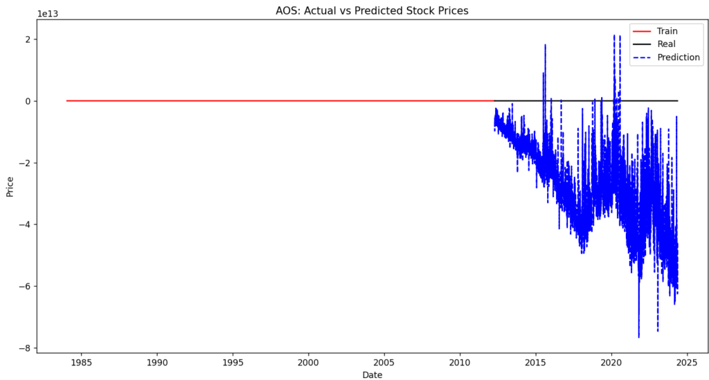

## 前回のあらすじ

株価予測を行うコードをいったん書いてみました。

課題はまだ残ったままですが、今回はそこを解決しつつモデルを追加で学習するというやり方を試してみました。

## 確率的勾配降下法

```
def predict_next_day(model, scaler, df):
    last_row = df.drop(columns=['Close']).iloc[-1].values.reshape(1, -1)
    # last_row = df.iloc[-1, :-1].values.reshape(1, -1)
    df.drop(columns=['Close']).iloc[-1].to_csv("test.csv")
    last_row_scaled = scaler.transform(last_row)
    next_day_prediction = model.predict(last_row_scaled)
    print(f"Previous Day Prediction: {df.iloc[-1]['Close']}")
    print(f"Next Day Prediction: {next_day_prediction[0]}")
```

前回の予測部分ですが予測するカラムが異なっていたので変な値が出ていました。

修正したことによってだいぶまともな値に修正ができました。



ただ、うまくいくときはきれいな形になっていますがそうでないことも多いです。







波があるところはうまくできている方ですが、直線気味だとうまくいかないですね。

毎回初期化しているのですが、ダメですね。使ってるモデルが確率的勾配降下法も要因としてあるかもしれないです。

というわけで追加学習する形に変更しようと試してみました。

```
def update_model(model, scaler, new_df):
    target = new_df['Close'].shift(-1).dropna()
    features = new_df.drop(columns=['Close'])
    features = features[:-1]
    
    # データのスケーリング
    X = scaler.transform(features.values)
    y = target.values
    
    model.partial_fit(X, y)

    # 新しいデータに対する予測と評価
    # X_new = scaler.transform(new_df.drop(columns=['Close']).values)
    X_new = scaler.transform(new_df.drop(columns=['Close']).iloc[:-1].values)
    y_new = new_df['Close'].shift(-1).dropna().values
    y_new_pred = model.predict(X_new)
    mse_new = mean_squared_error(y_new, y_new_pred)
    print(f"New Data MSE: {mse_new}")

for count, stock_data in enumerate(stock_list):
  ・
　・
　・
  if count == 0:
    model, scaler, X_train, X_test, y_train, y_test = train_model(df)

    # モデルの評価
    y_pred = evaluate_model(model, X_test, y_test)

  else:

    update_model(model, scaler, df)
```



ちょっと途中のコードでうまくいってない部分があったみたいで直線になってました。

今度修正しておきます。

## 終わりに

次回は追加学習の部分の修正かモデルの変更を検討してみます。

もし、次いい感じになったらB/SやP/Lの取得も検討してみたいと思います。ではでは。
