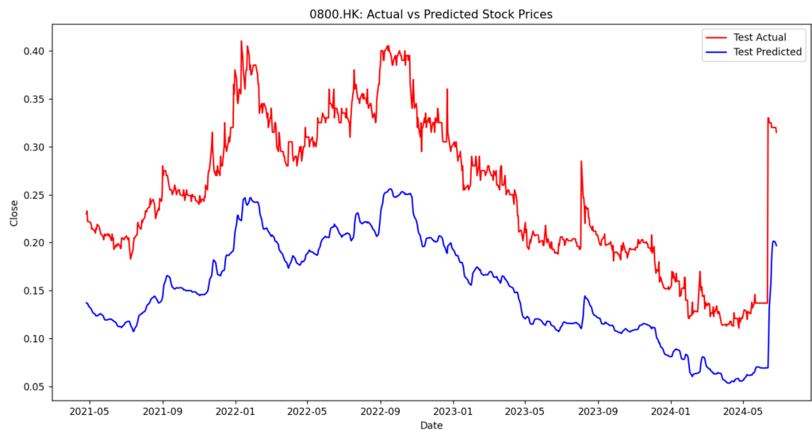
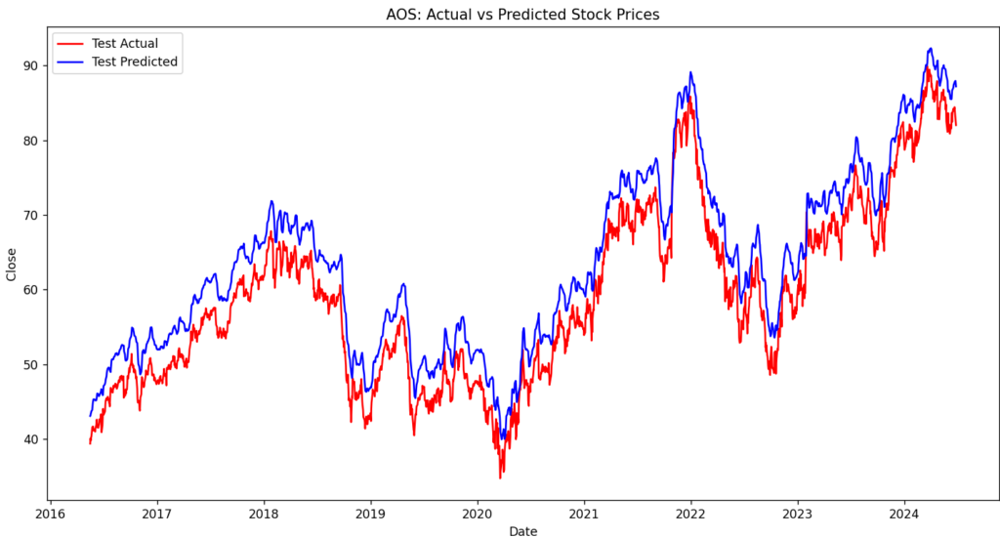
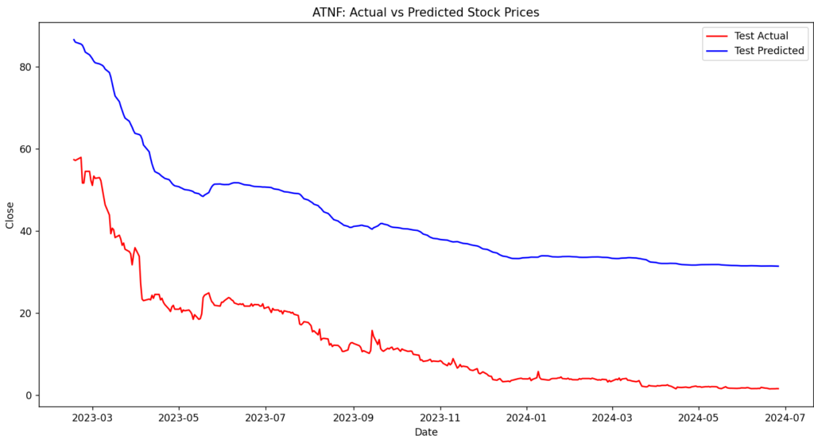
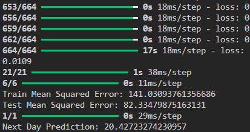

## 前回のあらすじ

確率的勾配降下法を使って予測をしてみました。

うまくいかなかったので、別の方法を試すことにしました。

## LSTM

時系列分析の代表モデルと言えばLSTMだと思います。

というわけで前回とはプログラムを分けて実装しました。

```
import pandas as pd
import numpy as np
from sklearn.preprocessing import MinMaxScaler
from tensorflow.keras.models import Sequential
from tensorflow.keras.layers import Dense, LSTM, Input
import matplotlib.pyplot as plt

import glob
dm_fol = './datamart/'
stock_list = glob.glob(dm_fol + "*.parquet")

# データの読み込みと前処理
def preprocess_data(df, time_step=60):
    df['Close'] = df['Close'].astype(float)
    data = df[['Close']].values

    # データのスケーリング
    scaler = MinMaxScaler(feature_range=(0, 1))
    scaled_data = scaler.fit_transform(data)
    
    # LSTM用のデータセット作成
    X, Y = [], []
    for i in range(time_step, len(scaled_data)):
        X.append(scaled_data[i-time_step:i, 0])
        Y.append(scaled_data[i, 0])
    
    X, Y = np.array(X), np.array(Y)
    X = X.reshape(X.shape[0], X.shape[1], 1)
    
    return X, Y, scaler

# LSTMモデルの構築
def create_lstm_model(input_shape):
    model = Sequential()
    model.add(Input(shape=input_shape))  # Inputオブジェクトを使用して入力形状を指定
    model.add(LSTM(50, return_sequences=True))
    # model.add(LSTM(50, return_sequences=True, input_shape=input_shape))
    model.add(LSTM(50, return_sequences=False))
    model.add(Dense(25))
    model.add(Dense(1))
    model.compile(optimizer='adam', loss='mean_squared_error')
    return model

# モデルの評価とプロット
def evaluate_model(df, model, scaler, X_train, y_train, X_test, y_test, time_step, sticker_name):
    y_train_pred = model.predict(X_train)
    y_test_pred = model.predict(X_test)
    
    y_train_pred = scaler.inverse_transform(y_train_pred)
    y_test_pred = scaler.inverse_transform(y_test_pred)
    
    y_train = scaler.inverse_transform([y_train])
    y_test = scaler.inverse_transform([y_test])
    
    train_mse = np.mean((y_train_pred - y_train[0]) ** 2)
    test_mse = np.mean((y_test_pred - y_test[0]) ** 2)
    print(f"Train Mean Squared Error: {train_mse}")
    print(f"Test Mean Squared Error: {test_mse}")
    
    # プロット
    df.set_index('Date', inplace=True)
    train_dates = df.iloc[time_step:len(y_train[0])+time_step].index
    test_dates = df.iloc[len(y_train[0])+time_step-1:-1].index
    
    plt.figure(figsize=(14, 7))
    # plt.plot(train_dates, y_train[0], label='Train Actual', color='black')
    plt.plot(test_dates, y_test[0], label='Test Actual', color='red')
    plt.plot(test_dates, y_test_pred, label='Test Predicted', color='blue')
    plt.title(sticker_name+': Actual vs Predicted Stock Prices')
    plt.xlabel('Date')
    plt.ylabel('Close')
    plt.legend()
    plt.show()

# 次の日の予測
def predict_next_day(model, scaler, df, time_step=60):
    data = df[['Close']].values
    last_data = data[-time_step:]
    last_data_scaled = scaler.transform(last_data)
    X_input = last_data_scaled.reshape(1, time_step, 1)
    next_day_prediction = model.predict(X_input)
    next_day_prediction = scaler.inverse_transform(next_day_prediction)
    print(f"Next Day Prediction: {next_day_prediction[0][0]}")

# データの読み込み
for count, stock_data in enumerate(stock_list):
  df = pd.read_parquet(stock_data)
  sticker_name = stock_data.split('\\')[1].replace('.parquet', '')

  # データの前処理
  time_step = 60
  X, Y, scaler = preprocess_data(df, time_step)

  # データの分割
  train_size = int(len(X) * 0.8)
  X_train, X_test = X[:train_size], X[train_size:]
  y_train, y_test = Y[:train_size], Y[train_size:]

  # モデルの構築と訓練
  model = create_lstm_model((X_train.shape[1], 1))
  model.fit(X_train, y_train, batch_size=1, epochs=1)

  # モデルの評価
  evaluate_model(df, model, scaler, X_train, y_train, X_test, y_test, time_step, sticker_name)

  # 次の日の予測
  predict_next_day(model, scaler, df, time_step)
```

## コード確認

```
    # LSTM用のデータセット作成
    X, Y = [], []
    for i in range(time_step, len(scaled_data)):
        X.append(scaled_data[i-time_step:i, 0])
        Y.append(scaled_data[i, 0])
    
    X, Y = np.array(X), np.array(Y)
    X = X.reshape(X.shape[0], X.shape[1], 1)
```

LSTM用のデータセットは60日分のデータを学習として使い、次の日を出力として使用するという特徴があります。

それを計算しやすい配列に変換し、LSTM用にデータをリシェイプします。

```
    model = Sequential()
    model.add(Input(shape=input_shape))  # Inputオブジェクトを使用して入力形状を指定
    model.add(LSTM(50, return_sequences=True))
    # model.add(LSTM(50, return_sequences=True, input_shape=input_shape))
    model.add(LSTM(50, return_sequences=False))
    model.add(Dense(25))
    model.add(Dense(1))
    model.compile(optimizer='adam', loss='mean_squared_error')
```

モデルの初期化後、入力形状の指定。各レイヤーを追加して最終的に出力値を1にします。

モデルをコンパイルする際はアルゴリズムをadam、損失関数をmseに設定してモデルの構築が完了します。

プロットと予測を行って完了になります。プロットした結果がこちらです。







データ量が多い場合は予測との差が少なく、少ない場合は予測との差が大きいです。

また、前回と違いマイナスの値にもならず、直線気味でも近いような値が出力されます。

後は株価の値によっても変わりそうですね。1枚目は1以下の値を予測してますが、2,3枚目は1以上の値を予測してますので。

一応コンソールに予測値を出しています。



## 終わりに

今回の予測でだいぶ近いことができるようになりました。

今回は特徴量1で学習していたので、特徴量を追加して試行錯誤してみようと思います。

他にも"ARIMA"や"Prophet"がありますので試してみたいと思います。ではでは。
