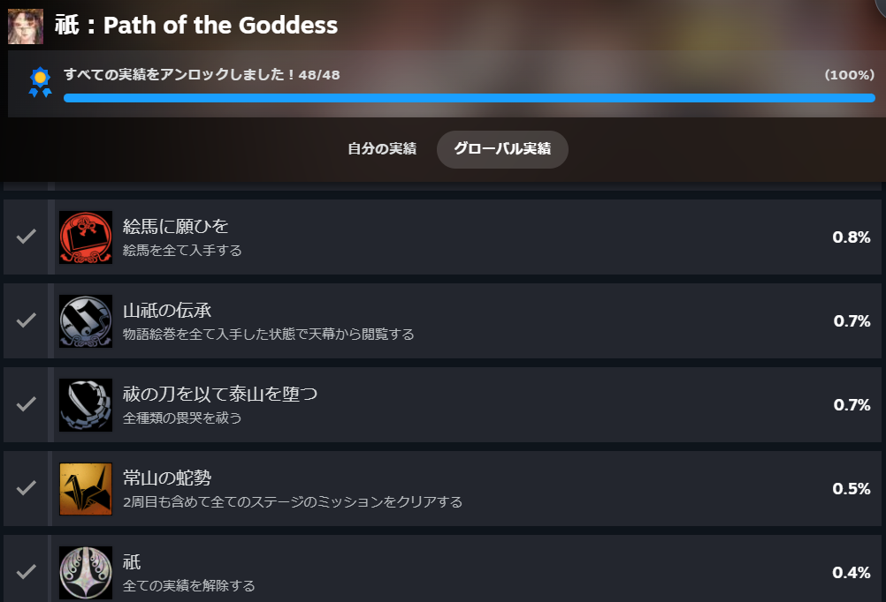

## 初めに

最近発売された祇というゲームの実績をコンプしました！

公式サイトは[こちら](https://www.kunitsu-gami.com/ja-jp/)。Steamのストアページは[こちら](https://store.steampowered.com/app/2510710/Path_of_the_Goddess/?l=japanese)。

こちらのゲームは**タワーディフェンス(以下TD)**のゲームになります。主人公である宗を操作し、世代を守りながら村を救っていきます。

また、宗以外に村人が存在し、ジョブを与えることで攻撃法を得ることができます。操作はできず場所を設定するだけですが…

## ゲームについて

前提として敵の名前を**畏哭**、ジョブの変更やステージ進行のアイテムを**結晶**とします。

#### 攻略の流れ

ステージ攻略流れとしては

1. 穢れを払い結晶を得る

3. 結晶を使って霊道を引く

5. 大工に仕掛けを頼む

7. 村人を救う

9. 結晶を使ってジョブを与える

11. 夜は畏哭を倒し、結晶を拾う

という感じになります。ボス戦はジョブを与えて倒すだけです。

#### 攻略について

ステージを攻略する際は先に霊道を引くことをおすすめします。私の性格もありますが早めにクリアしたいので、ある程度引いてから穢れ払いや村人救いをするとよいです。

他に仕掛けがあり、ステージ攻略が有利になるトラップがあります。味方のバフ、敵の速度ダウン、遠距離の攻撃範囲拡大等があります。結晶の消費はないですが仕掛けを作るのに時間がかかります。早めに頼んだ方が多く作れるので意識すると良いです。

ステージ攻略では物盗りがいると楽になります。お宝を見つけると食料や結晶がもらます。また、最大まで強化していれば落ちている結晶を集めてくれます。途中から複数個所から敵が沸くのでその時に活躍します。

ステージによっては霊道を引かない、主人公が使えない、船の上(刀をあまり振らない)ということがあります。それに適した鍔や魔像を選ぶとサクサク進めます。

#### 強化について

強化をする際は仮面か主人公のどちらかを選ぶことができます。初期に戻せる上に素材も帰ってくるので気軽に強化できます。

主人公の弓や結ノ舞(ダウン攻撃)、溜め攻撃がおすすめです。また、後々のことを考えて後の先(カウンター)を使えるようになっておくと良いです。余裕があれば魔像や鍔も欲しいです。

仮面は初期の斧や弓、その後はタンクや回復(可能なら5段階まで)、最後は銃や大砲(可能なら6段階)がおすすめです。強化素材は気軽に戻せるので使わなければ初期に戻すのもありです。

基本主人公がタゲをとり後ろから村人が遠距離攻撃が楽だと思います。火縄は火力が高いですがダウンは取れないので良し悪しは分かれそうです。

#### ミッションについて

それからミッションが各ステージに存在します。1度目の攻略ではわかりませんが2度目以上からはみえるようになります。ステージ内ではカウント系も可視化されます(例: 50体倒せなら現在30 / 50)

ミッションをクリアすれば鍔や魔像、産霊(むすび)が手に入ります。鍔は必殺技、魔像はパッシブ付与、産霊はジョブや主人公強化素材という感じです。

2週目では新たなミッションが追加されます。全部回収できれば主人公と仮面の両方が最大まで強化できます。

#### 復興について

村を救うと拠点として使え、復興をすることになります。復興は村人に指示した後、ステージをクリアすると復興が完了します。復興が完了すると産霊や絵馬がもらえます。絵馬は畏哭や仮面、動物のバックグラウンドが読めます。絵馬は面白いのでおすすめです。

また、村の復興が完了すると結晶や食料の所持量が増えます。所持量が増えるとステージ攻略が楽になるので積極的に行うと良いです。

#### 装備について

攻撃の型が2種類あるのですが、初期の型が使いやすいですね。出が早くボタン入力後のストレスが感じにくいです。別の型は納刀しないと攻撃しないのでテンポが悪く感じました。

鍔(必殺技)は大体レジストゲージ(ダウンを取れる)を削るものを選んでました。ただ、初期のころは勝手がわかってなかったので村人の防御強化を使ってました。

魔像は基本主人公攻撃上昇で問題ないと思います。ただ、ステージ攻略では結晶の消費減や村人強化も使ってました。

個人的に好きなのは溜め攻撃の時間短縮や弓攻撃速度アップですね。主人公がダメージを受けない系のミッションでは弓が大活躍したのでおすすめです。

## 感想

個人的に良かった点と改善してほしい点がいくつか書いてみようと思います。

### 良かった点

- 無双系に似た範囲攻撃の爽快感

- 主人公を一切操作せず、攻略できた時の楽しさ

- 装備や強化の幅が広がった時のワクワク

- 大神アレンジが入った音楽

- 畏哭や村人のバックグラウンド

- 細部まで装飾があり綺麗

弱→弱→弱→強を良く使っていたのですが、この操作感は好きです。その他は使う機会が少なかったですが…

TDなので主人公を一切操作せず、ステージクリアした時は気持ちよさがあります。結晶集めを物盗りに任せれば放置も可能ですね。

特定のボスを討伐するとジョブの解放と主人公の強化ができます。攻略の幅やクリアできなかったミッションも進められるようになって楽しいです。

大神の実績コンプまで出来てないのですが、クリアまでやったことはあります。少し懐かしく感じ2週目で試してみました。

畏哭には畏哭となった経緯、村人は村での関係性が書かれています。設定が細かく、ついつい確認しちゃうんですよね。

世代の見た目や仮面等細部まできれいに装飾が施されて見るだけで楽しいです。各ステージや畏哭などの3Dモデルも見てみると良いです。

### 改善してほしい点

- 村人のジョブ変更の手間

- お祓い後のスキップタイミング

- 拠点の移動

- ボスラッシュ

- 装備の付け替え

結晶を使ってジョブを変更できますが、最大12人も変更する必要があるので大変です。しかも近づかないと変更ができないのでかなり面倒です。

お祓いが終わった後のスキップが少し遅いですね。ムービーが始まったらすぐスキップできると周回時楽になります。

拠点では復興という作業があります。特定の場所で村人を数人指定して復興できるのですが、移動が手間ですね。復興の場所までワープかその場で指示できれば楽ですね。

ステージではボスラッシュが存在するのですが、ボスのたびにジョブの付け替えが必要になります。そこが大変だったのでもう少し良いやり方がなかったかなと。

装備の付け替えが拠点の天幕に移動しないとできないので、拠点またはステージ選択でも出来たら楽だなとは思いました。

## 終わりに

プレイ時間は攻略を見ずに41時間ぐらい。ミッション等事前に見てればもう少し早く終わらせることができると思います。

攻略を見ない場合は初回ステージを攻略後、復興のタイミングで別のミッションを達成するということを繰り返すのがおすすめです。

ストーリーは喋らないのでわかりにくい部分はありますが、基本は穢れに侵された人、村、果ては山を救うのが目的になります。絵馬や絵巻でより詳細がわかったりするので手に入れたら見ると理解しやすいと思います。

不便な部分もありますがTDゲームとしてとても面白いのでおすすめです。もし興味があればぜひ触ってみてください。ではでは。
