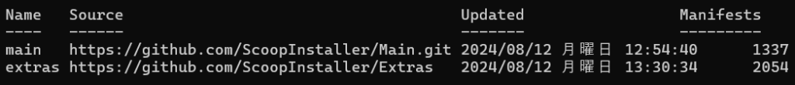
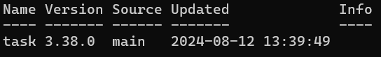
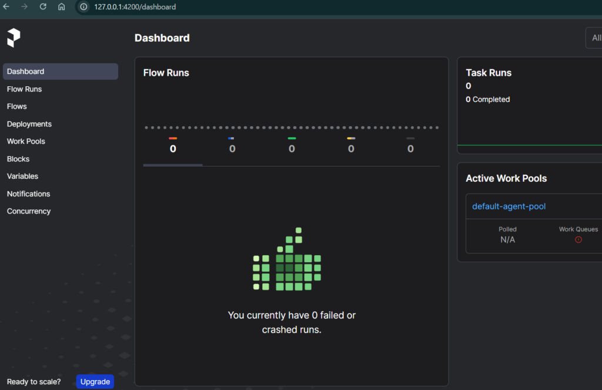

## 副業でのPrefect CloudとBigQueryの使用

[副業](/posts/2023/11/learning-gcp-for-freelance-project/)でPrefect CloudとBigQueryを使っているので触った点と書いてみようと思います。

### 環境の設定とインストール

私はWindowsを使っています。契約を結んでいる企業の導入手順がMacで書かれていたのでそこもいろいろ調べてやってみました。

### Prefectとは？

そもそもprefectとは何ぞや？というところですね。prefectは**Pythonベースのワークフローエンジン**になります。

pythonジョブの実行を自動化したりデバッグしたりする機能をpythonコードで書けるシステムになります。

AWSだとStepfunctionのイメージに近いですね。それに加えてEventBridgeやCloud Watch Logsが足されたような感じです。

おそらくAWSやGoogle Cloudに比べてコストが低く、使いやすいという点で採用されたと考えられます。

Prefectの参照しているドキュメントは[こちら](https://docs.prefect.io/2.19.9/)です。ちなみに3.0がリリースされたみたいなのでそちらのドキュメントは[こちら](https://docs-3.prefect.io/3.0rc/get-started/index)になります。

### インストール手順

一応pythonをインストールしている前提でお話しします。

まずはprefect cloudのインストールを行います。

```
pip install prefect
```

次はタスクを実行するためのコマンドが必要になります。ただ、Windowsにはパッケージ管理ツールがありません。

なくても問題ないですが、せっかくなので導入してみます。今後パッケージを入れるときは活用していきたいです。

### Scoopの導入

今回使ったパッケージは[scoop](https://scoop.sh/)になります。手順はサイトにあるのでコマンドプロンプトに入力します。

```
Set-ExecutionPolicy -ExecutionPolicy RemoteSigned -Scope CurrentUser
```

デフォルトでmainがありますが、もしバケットを別にして管理したい場合は以下のコマンドを使います。

```
# バケットの追加
scoop bucket add extras
# バケット一覧
scoop bucket list
# インストール一覧
scoop list
```





今回はtaskだけ必要なのでmainに入れました。これで[taskコマンド](https://github.com/go-task/task)が使えるようになります。

### Prefectの設定と実行

ただ、taskを実行するにはTaskfile.yamlが必要になります。中身はプロジェクトによりますが私がやったのはこんな感じ。全部ではないですが…

```
tasks:
  start-local:
    cmds:
      - pip install -r requirements.txt
      - prefect config set PREFECT_API_URL=http://127.0.0.1:4200/api
      - prefect server start

  start-local-agent:
    cmds:
      - prefect config set PREFECT_API_URL=http://127.0.0.1:4200/api
```

Taskfile.yamlの準備が出来たらターミナルの用意します。

```
cd workflow(Taskfile.yamlの場所じゃなくてもok)
task start-local
```

これでprefectのサーバーを立ち上げることができます。ログインするとこんな感じ



### Prefect用フローの作成と実行

次にprefect用のフローを書いてみましょう。一応BigQueryも使っているのでテーブルデータを取得するコードを記載してみます。

```
test.py

from google.cloud import bigquery
from prefect import flow, task
@task()
def create_table() -> None:

    schema = [
        bigquery.SchemaField("id", "STRING", mode="NULLABLE"),
        bigquery.SchemaField("name", "STRING", mode="NULLABLE"),
    ]

    table = bigquery.Table(
        table_ref=f"{PROJECT}.{DATABASE}.{TABLE}",
        schema=schema,
    )
    print(table.schema)
    print(table.num_rows)

@flow(name="test")
def result_details():
    create_table()
```

test.pyという形でテーブルのデータを取るようにしました。PROJECT、DATABASE、TABLEは使用しているデータの値を入れます。schemaも使用するカラムに合わせます。

@flowで書かれた部分の関数を実行として呼び出します。nameを付ければ実行した時のフローの名前になります。

@taskはフロー内で実行するタスクになります。実行したい関数があれば@taskを付け、@flow関数で呼び出しましょう。

### ログの確認方法

最後にログですね。pythonのデバッグではなくprefectのGUIのログを見ることになります。

ただ、prefectのログはpythonの標準搭載してあるprintやloggerで見ることはできません。printを使う場合とloggerを使う場合でこんな書き方になります。

#### print文を使う場合

@task()  
def create\_table() -> None:  
print("prefectで見れるよ")  
  
@flow(name="test", log\_prints=True)  
def result\_details():  
create\_table()  

#### loggerを使う場合

from prefect import flow, task, get\_run\_logger  
@task()  
def create\_table() -> None:  
logger = get\_run\_logger()  
logger.info("prefectで見れるよ")  
  
@flow(name="test")  
def result\_details():  
create\_table()

print文のlog\_printsはtask()にも使えます。またloggerのほうも同様にflowで使うことができます。ただし、@flowまた@taskの関数内でしか使うことができないので注意が必要です。

## まとめ

今のところ私が触ったのはこんな感じです。ドキュメントを見るとまだ使いきれてないですし、BigQueryもまだ使いこなせてないですね。

という感じで少しずつ理解を深めているというお話でした。ではでは。
