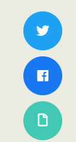
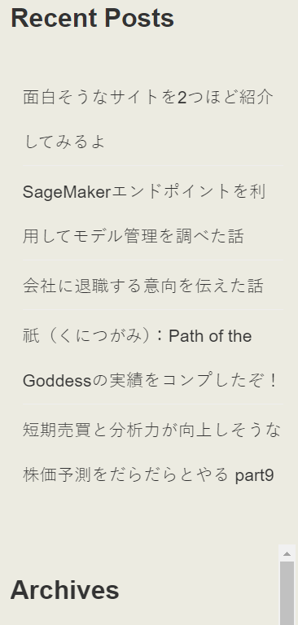
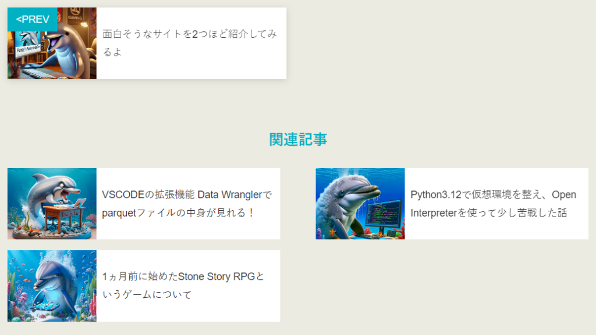

サイトを一部修正して固定ページを追加しました！

理由としてはアドセンスの合格に挑戦しようと思ったからです！でも合格したからと言って収益が入るわけではないみたいです(´；ω；\`)

というわけで変わった個所は以下になります。

1. 共有ボタンの追加

3. コメント表示の削除

5. 関連記事の追加

このように見やすくしたり不要なものを削除しただけですので、気になったらコメントしていただければと思います。

次に固定ページの追加ですね。wordpressの便利機能に固定ページの追加がありますので入れてみました。

今のところ必要なので入れてます。こんな感じ。

最後に最新記事の一覧を入れてます。ここらへんは内部リンクの追加も考慮して入れてます。こんな感じ

固定ページと記事一覧は全ての記事に追加する予定です。修正は大変ですがやっていきますよ！

それからカテゴリーを一旦雑談だけにしましたが、もう少し分割します。

それから株価予測はいつ再開できるかわかりません。副業が始まってしまったので…

その分副業で学んだことを書いていこうと思います。

というわけでいろいろとサイトの改善をしてる話でした。ではでは。
