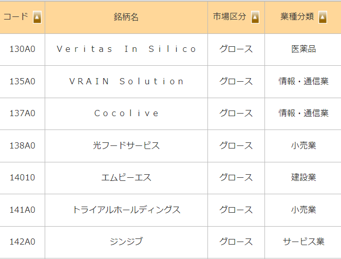
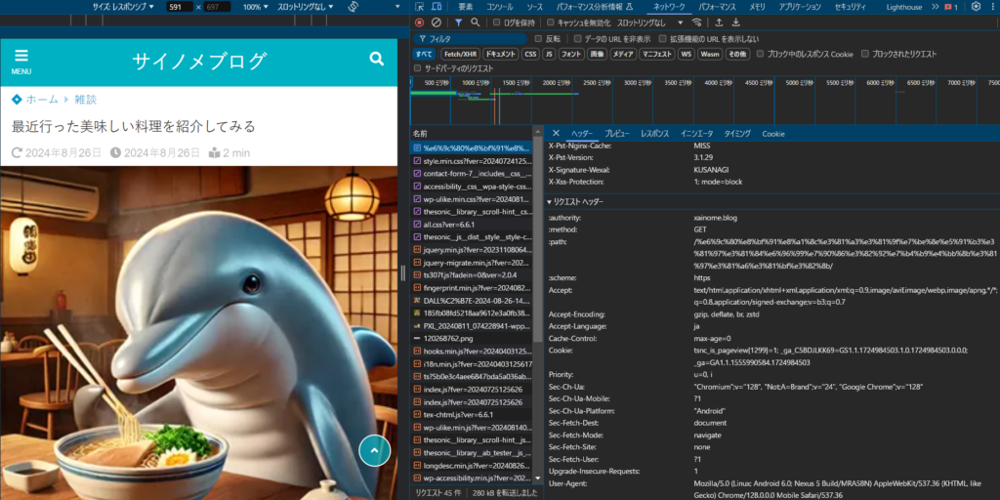

## 前提：利用規約に違反しないこと

前提として**利用規約**に違反する行為はやめたほうが良いと考えています。

法的に訴えられても文句は言えないですし。

多くの人が利用している[amazonなども利用規約](https://www.amazon.co.jp/gp/help/customer/display.html?nodeId=GLSBYFE9MGKKQXXM)で禁止しているので、スクレイピングをする際はしっかりと利用規約を読んだうえで行ってください。許可が下りれば問題ないとは思いますが。

### サイト側のスクレイピング対策

本題に入ります。

サイト側でスクレイピングを弾く設定がいくつか存在します。例えばユーザーっぽくないふるまいでサイトにアクセスした場合。あるいは特定のサイトを経由しないと見れないURLに直接アクセスした場合。ゆうまでもなく連続でいろんなURLにアクセスした場合。

連続でアクセスされるとサーバーに負荷がかかるので、これが弾かれるのは想像に難くないと思います。

### スクレイピング対策を避ける方法

ただ、スクレイピングするされた場合、上記のような特徴が存在します。

この辺はアクセスログを監視すると見れるかと思います。おそらくですが。

では人間っぽくふるまうにはどうしたらよいか調べた中で書いてみます。

一応言語はpythonを使います。他の言語でもできるかと思うので参考程度にはなるかと思います。

### Pythonでのスクレイピング基礎

一般的にpythonでのスクレイピングではrequestsモジュールを使います。他にもseleniumやpyppeteerなどがありますが、一旦requestsを使っていきます。

インストールはpipを使います。

```
pip install requests
```

もしpythonのバージョンなどで分けてる場合はこちら

```
py -3.12 -m pip install requests
```

インストールが終わったらアクセスしてみましょう。今回は私のサイトにアクセスしてみます。

```
import requests

response = requests.get('https://xainome.blog/’)
print(response.text)
```

こうするとHTMLの中身を取得することができます。

そこから取得したい情報があればBeautifulSoupを使って要素を取り出してみましょう。まずはインストール

```
pip install beautifulsoup4
```

### 実際のアクセスとHTMLの解析

インストールができたらHTMLを解析します。

```
from bs4 import BeautifulSoup

soup = BeautifulSoup(html_parse, 'html.parser')
```

これで解析の準備ができました。解析の話は本題とそれますのでここまでにしようと思います。

解析やHTMLの情報取得に興味があれば調べてもいいですし、生成AIに聞いてみるでもいいと思います。このようなコード、銘柄、市場などが一覧で取得することができます。もちろんAPIを使うという手もありますが。



### リクエストヘッダーの設定

実は通常のリクエストを送る場合ユーザーではなく、言語別のリクエストを送っていることになります。

リクエストにはRequests Headersというものが設定できます。これは私たちがPCやスマホでサイトにアクセスするときも送信されています。

まずは設定してみます。

```
headers = {
    'User-agent' = 'Mozilla/5.0 (Linux; Android 6.0; Nexus 5 Build/MRA58N) AppleWebKit/537.36 (KHTML, like Gecko) Chrome/128.0.0.0 Mobile Safari/537.36'
}
response = requests.get(search_url, headers=headers)
```

こんな感じで設定します。特に何も設定しなかった場合、'python-requests/2.25.1'という設定で送られるみたいです。恐らくjsやGoとかでも似たような設定になるかと思います。

### 実際のサイトでの確認

これで使っているブラウザやOSの設定が完了しました。headersは他にもあるので実際のサイトを見て確認してみます。一旦私のサイトを開発者ツールで見てみます。



私のブログを開発者ツール(F12)を開いてネットワークタブで確認します。そこにリクエストヘッダーという項目があるのでそこを確認します。

そうするとUser-agent以外にも様々な項目があります。細かい項目は詳しく説明しませんが、Accept以下の項目を設定します。そうするとこんな感じ。

```
HEADERS = {
"accept": "text/html,application/xhtml+xml,application/xml;q=0.9,image/avif,image/webp,image/apng,*/*;q=0.8,application/signed-exchange;v=b3;q=0.7"
"accept-encoding": "gzip, deflate, br, zstd"
"accept-language": "ja"
"cache-control": "max-age=0"
"cookie": "tsnc_is_pageview[1299]=1; _ga=GA1.1.545418727.1724984745; _ga_C5BDJLKK69=GS1.1.1724984744.1.1.1724984746.0.0.0"
"priority": "u=0, i"
"referer": "https://xainome.blog/"
"User-Agent": "Mozilla/5.0 (Linux; Android 6.0; Nexus 5 Build/MRA58N) AppleWebKit/537.36 (KHTML, like Gecko) Chrome/128.0.0.0 Mobile Safari/537.36",
"sec-fetch-dest": "document",
"sec-fetch-mode": "navigate",
"sec-fetch-site": "none",
"sec-fetch-user": "?1",
"sec-ch-ua": '"Chromium";v="128", "Not;A=Brand";v="24", "Google Chrome";v="128"',
"sec-ch-ua-mobile": "?1",
"sec-ch-ua-platform": '"Android"',
"Upgrade-Insecure-Requests": "1",
}
```

Cookieはセッションによって変わったりしますので、設定してもあまり意味はないかと思います。accept系やcacheもなくても大丈夫だと思います。私的にはrefererという項目が大事な要素かと思います。

refererは本来**referrer**のはずですが間違って作られたみたいです。refererは参照元のURLを意味します。このサイトに訪れる前に訪れたサイトのことです。

本来私のサイトに訪れる場合、[こちら](/posts/2023/11/parquet-vscode-data-wrangler/)のサイトに直接アクセスすることは少ないかと思います。

一般的には[元のページ](https://xainome.blog/page/10/)をみて訪れることになります。つまり直接訪れるようなリクエストはおかしいという判断ができます。そこで想定されていないURLからアクセスした場合は弾くということができます。

なので必要に応じてリファラーを取得してから目的のサイトにアクセスするということが必要になります。

### セッション管理と待機時間の重要性

最後の長時間のアクセスをすると中にはアクセス拒否をされることもあります。それはクッキーなどで判断できると思います。

拒否された場合はセッションを開け閉めしてリクエストを投げることになると思います。こんなかんじですね。

```
session = requests.Session()
for _ in range(1000):
    try:
        response = session.get('https://xainome.blog/', headers=headers)
        time.sleep(3)
    except requests.exceptions.ConnectionError as e:
        session.close()
        session = requests.Session()
```

伝え忘れましたが何回もリクエストを投げる際は待機時間を入れましょう。連続でリクエストを投げるとサーバーに負荷をかけることになります。そうなると同じIPではアクセスできなくなったり、サイバー攻撃とみなされる可能性もありますので。

### まとめ

これで以上になります。何度もお伝えしてますが、利用規約に反するスクレイピングはやめることをおすすめします。何かあってからでは遅いので。ではでは。
