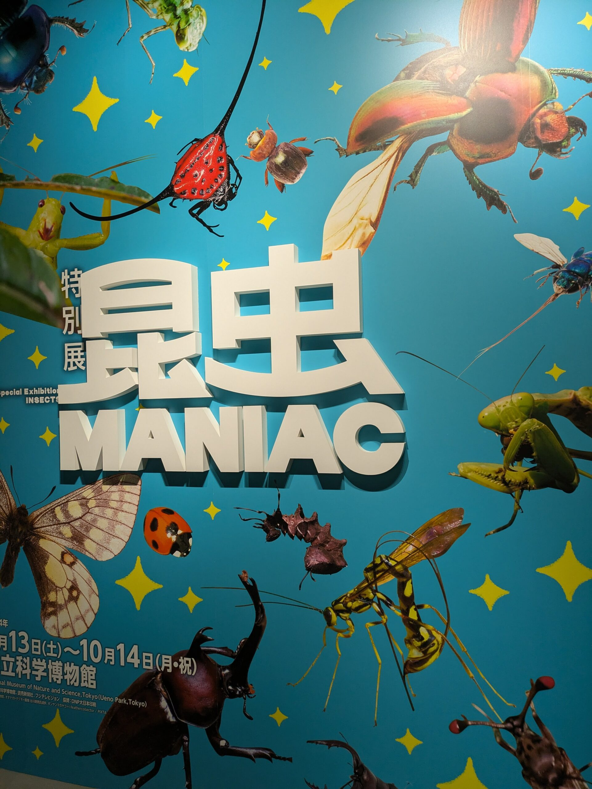
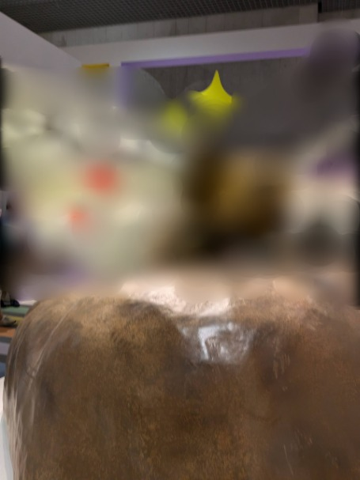
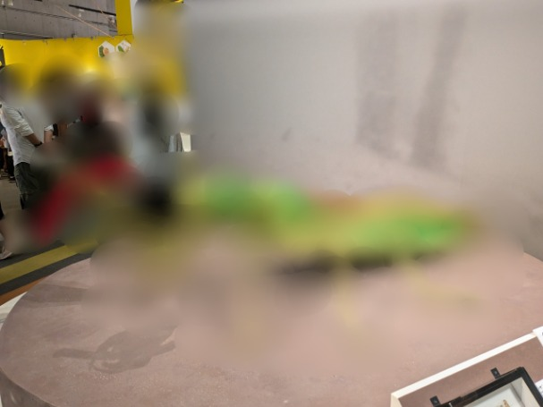
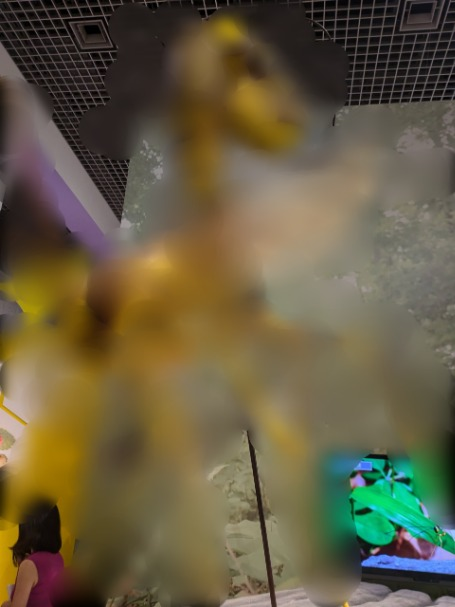
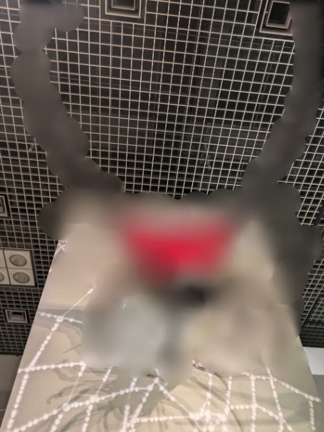
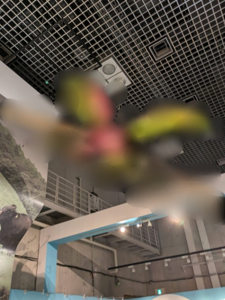
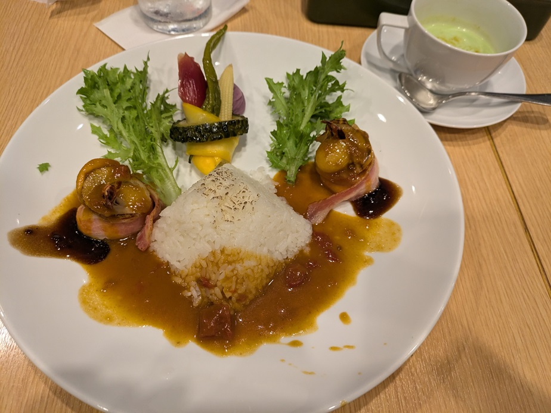
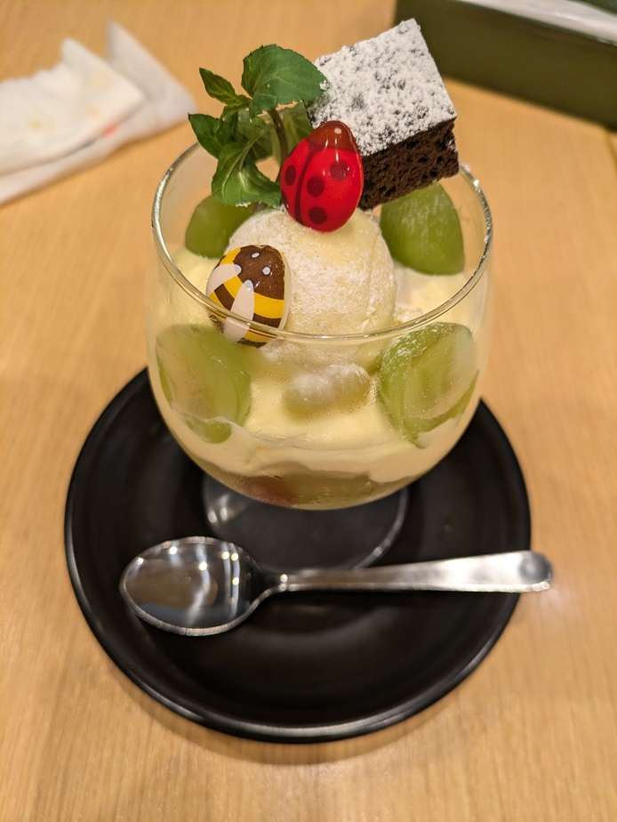

## 昆虫展\_注意事項

注意ですが、虫の模型の写真を載せてますので苦手な方はスルーしてください。

## 昆虫展\_国立科学博物館へ再訪

[前回](/posts/2024/08/toyo-bunko-museum/)東洋文化ミュージアムという博物館の一種に行きました。今回は国立科学博物館に行ってきました。

実は1年前くらいにも行ったのですが、全て周れなかったので再度見に行きました。

### 昆虫展の感想

今は特別展で[昆虫展](https://www.konchuten.jp/)をやっています。昆虫とは言ってますが、昆虫に加えて蜘蛛や多足類も出てきます。

ただ、時期が悪かったのか家族が多く来ていました。人混みでしんどかったですね…

大人は￥2,100ですが小学生は￥600、小学生未満は無料だったのでそこもありそうです。

### 昆虫展の見どころ

一応ざっくりと見ましたが、標本はじっくりと見ることはできなかったです。

内容的には知ってるものもありましたが、知らないことも多かったです。フォトニック結晶という言葉は初めて知りました。何かに使えそうですけど使ってるものはあるんですかね？

後は、コガネムシ科にカブトムシなどが属してるのは知ってましたが、フンコロガシ系も属してるとか。言われて見れば似た姿をしてますね。

それから、日本最大のムカデは2021年、ヤスデは2023年に見つかったみたいです。結構最近ですね。動かなければまじまじと見られますが、動いてるとぞわっとします…

### 昆虫展で学んだ新しい知識

もう一つ、DNAの塩基配列のデータベースがあるみたいです。新種かもと思ったらアクセスして似たような塩基配列を見つける作業をしてるみたいです。

### 写真とお土産

最後に写真を載せておきます。標本写真は撮らなかったので模型だけになります。一応モザイクをかけてますが、クリックで見れます。

昆虫展ではその場だけのお土産が買えます。[こちら](https://www.konchuten.jp/goods/)ですね。ちなみに前売りのチケットでしかもらえないものもあったみたいです。

私としては**完全変態Tシャツ**が欲しかったのですが、すでに大人用は売り切れてました。残念…

### 昆虫展後のランチ

昆虫展の後はご飯ですね。人が多いこともあって90分ほど待ち時間がありました。

12:30ぐらいに券売機で発見してもらったので、14:00に食べました。食べたものはこちら

メインディッシュの味はカレーではないです。タレっぽい感じですね。ホタテとエビは普通のおいしさです。野菜系も普通ですね。美味しかったですが、次も食べるという感じではないです。

デザートはかなり美味しかったです。ムースの甘さとマスカットの酸味がいいバランスでした。チョコの甘さとコクも控えめでちょうどよかったです。これは次も食べたいですね。

### 地球館の展示を見学

昼食後は地球館へと行きました。日本館前回ある程度周ったのですが、地球館はまだ行ってないので軽く見てきました。

### 1階：生物系の展示

1回は生物系ですね。地球の成り立ちやどんな生物がいるか、あるいは植物が生息しているか等が展示されていました。

マッコウクジラの模型とかありましたね。でかかったです。人類の歴史とかはある程度分かっていたのでふーんぐらいでしたね。

アホウドリの繁殖が成功しているとか、菌類の繁殖は実は簡単という話は驚きでした。まだまだ知らないことがあるんだなと思いました。

### 2階：科学技術の展示

2階は人類の科学の歩みと科学技術について展示されてました。

情報量が多く科学技術はあまり見ずに帰っちゃいました。科学の歩みは潜水艦の模型や、蒸気機関車、ライト、コンデンサー等色んなものが見れました。

人類ってすごいなーと同時に弊害もいろいろあるんだろうなーと感じました。うまく使えば便利なんでしょうけど…

### 最後に

今回はこんなとこですね。日本間で見たことも忘れてる部分はありますので、もう一回行って全て見回りたいですね。人がいないときに。

実は他に東京国立博物館や古代オリエント博物館も買ったのですが、台風やら人の多さで辞めました。

どっかで休みを取るか、朝早く行ってみようと思います。ではでは。
